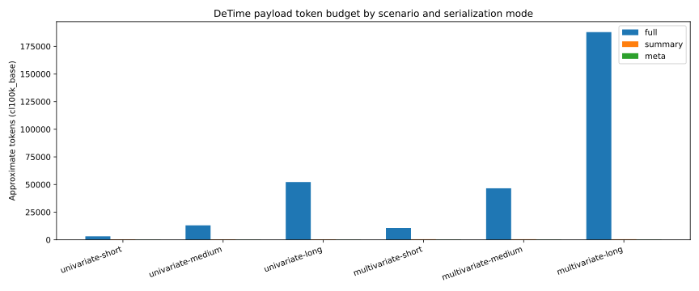

# Token Benchmarks

DeTime's compact result modes are meant to lower context cost for machine
consumers. This page tracks that claim with a reproducible tokenizer-specific
benchmark rather than anecdotal wording.

This is auxiliary evidence for compact serialization. It is not part of the
main release-quality claim, which is the decomposition API, CLI, schemas,
result object, metadata, artifacts, and validation boundary.

## Method

- tokenizer: `tiktoken` `cl100k_base`
- scenarios:
  - univariate short / medium / long
  - multivariate short / medium / long
- modes:
  - `full`
  - `summary`
  - `meta`

Regenerate the benchmark with:

```bash
python benchmarks/token_benchmarks/generate_token_benchmarks.py
```

Generated artifacts:

- `docs/assets/generated/evidence/token_benchmarks.json`
- `docs/assets/generated/evidence/token_benchmarks.csv`
- `docs/assets/generated/evidence/token_benchmarks.svg`

## What to expect

The benchmark is designed to show two stable directional results:

- `summary` is materially cheaper than `full`
- `meta` is materially cheaper than `summary`

The exact counts depend on the payload structure and the chosen tokenizer, so
the benchmark should be read as a bounded-cost proxy rather than a universal
token law.

## Figure



## Reading the results

- Use `full` only when downstream logic truly needs raw arrays.
- Use `summary` when diagnostics and array-shape statistics are enough.
- Use `meta` for routing, provenance, backend checks, and bounded-context
  reporting.
