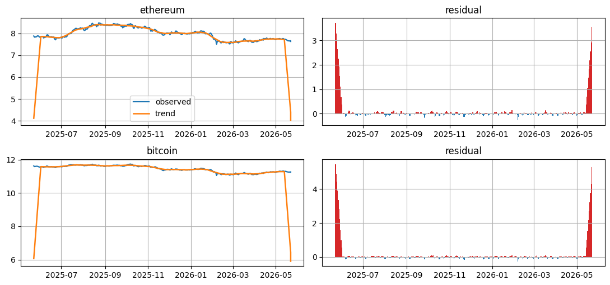
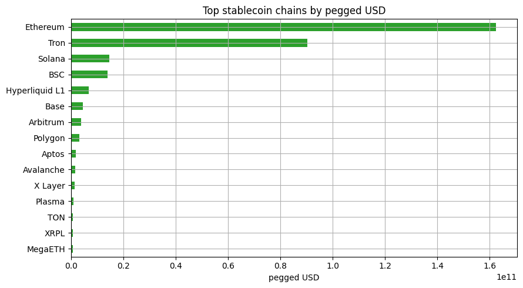

<!-- Generated by scripts/generate_column_notebook_pages.py; do not edit manually. -->
# Crypto and Stablecoin Liquidity Pulse

<div class="gallery-note notebook-transcript-note">
  <strong>Rendered notebook transcript.</strong> This page is generated from <a href="https://github.com/systems-mechanobiology/De-Time/blob/main/examples/notebooks/hot_trends/06_crypto_stablecoin_liquidity_pulse.ipynb"><code>examples/notebooks/hot_trends/06_crypto_stablecoin_liquidity_pulse.ipynb</code></a> and includes code cells plus captured outputs from the committed notebook.
</div>

This notebook asks whether BTC/ETH price residuals line up with current stablecoin liquidity context. It is a market-structure read, not a trading model.

The output is a CoinGecko source card, price decomposition, edge-trimmed residual events, and a current DeFiLlama stablecoin chain context table.

<div class="notebook-cell">
<div class="notebook-input-label">In [1]</div>

```python
from pathlib import Path
import os

import matplotlib.pyplot as plt
import numpy as np
import pandas as pd

from examples.hot_trends.data import (
    HotTrendDataError,
    append_real_snapshot,
    build_arxiv_monthly_counts,
    fetch_coingecko_market_chart,
    fetch_defillama_stablecoin_chains,
    fetch_github_repo_metadata,
    fetch_github_stargazers,
    fetch_huggingface_models,
    fetch_wikipedia_pageviews,
    source_audit_table,
)
from examples.hot_trends.decomposition import (
    component_summary,
    decompose_table,
    editorial_priority,
    residual_event_table,
)
from examples.hot_trends.scoring import article_publication_phrasing

pd.set_option("display.max_columns", 80)
pd.set_option("display.max_rows", 80)
plt.rcParams.update({"axes.grid": True})

CACHE_DIR = Path("examples/hot_trends/cache")
OUTPUT_DIR = Path("examples/hot_trends/outputs")
CACHE_DIR.mkdir(parents=True, exist_ok=True)
OUTPUT_DIR.mkdir(parents=True, exist_ok=True)

def save_table(df, name):
    path = OUTPUT_DIR / f"{name}.csv"
    df.to_csv(path, index=False)
    print(f"saved: {path.as_posix()}")
```
</div>

## 1. Fetch BTC and ETH market charts

<div class="notebook-cell">
<div class="notebook-input-label">In [2]</div>

```python
coins = ["bitcoin", "ethereum"]
frames = [fetch_coingecko_market_chart(c, days=365) for c in coins]
prices = pd.concat(frames, ignore_index=True)
prices.head(20)
```

<div class="gallery-out notebook-output">
<div class="notebook-output-label">text/html</div>
<div class="notebook-html-output">
<div>
<style scoped>
    .dataframe tbody tr th:only-of-type {
        vertical-align: middle;
    }

    .dataframe tbody tr th {
        vertical-align: top;
    }

    .dataframe thead th {
        text-align: right;
    }
</style>
<table border="1" class="dataframe">
  <thead>
    <tr style="text-align: right;">
      <th></th>
      <th>date</th>
      <th>coin_id</th>
      <th>price</th>
      <th>source</th>
      <th>data_quality</th>
    </tr>
  </thead>
  <tbody>
    <tr>
      <th>0</th>
      <td>2025-05-23</td>
      <td>bitcoin</td>
      <td>111560.356938</td>
      <td>CoinGecko API</td>
      <td>public_api_snapshot</td>
    </tr>
    <tr>
      <th>1</th>
      <td>2025-05-24</td>
      <td>bitcoin</td>
      <td>107216.668569</td>
      <td>CoinGecko API</td>
      <td>public_api_snapshot</td>
    </tr>
    <tr>
      <th>2</th>
      <td>2025-05-25</td>
      <td>bitcoin</td>
      <td>107831.363744</td>
      <td>CoinGecko API</td>
      <td>public_api_snapshot</td>
    </tr>
    <tr>
      <th>3</th>
      <td>2025-05-26</td>
      <td>bitcoin</td>
      <td>108861.810377</td>
      <td>CoinGecko API</td>
      <td>public_api_snapshot</td>
    </tr>
    <tr>
      <th>4</th>
      <td>2025-05-27</td>
      <td>bitcoin</td>
      <td>109377.715133</td>
      <td>CoinGecko API</td>
      <td>public_api_snapshot</td>
    </tr>
    <tr>
      <th>5</th>
      <td>2025-05-28</td>
      <td>bitcoin</td>
      <td>109068.456949</td>
      <td>CoinGecko API</td>
      <td>public_api_snapshot</td>
    </tr>
    <tr>
      <th>6</th>
      <td>2025-05-29</td>
      <td>bitcoin</td>
      <td>107838.184311</td>
      <td>CoinGecko API</td>
      <td>public_api_snapshot</td>
    </tr>
    <tr>
      <th>7</th>
      <td>2025-05-30</td>
      <td>bitcoin</td>
      <td>105745.416604</td>
      <td>CoinGecko API</td>
      <td>public_api_snapshot</td>
    </tr>
    <tr>
      <th>8</th>
      <td>2025-05-31</td>
      <td>bitcoin</td>
      <td>104010.919562</td>
      <td>CoinGecko API</td>
      <td>public_api_snapshot</td>
    </tr>
    <tr>
      <th>9</th>
      <td>2025-06-01</td>
      <td>bitcoin</td>
      <td>104687.507429</td>
      <td>CoinGecko API</td>
      <td>public_api_snapshot</td>
    </tr>
    <tr>
      <th>10</th>
      <td>2025-06-02</td>
      <td>bitcoin</td>
      <td>105710.005938</td>
      <td>CoinGecko API</td>
      <td>public_api_snapshot</td>
    </tr>
    <tr>
      <th>11</th>
      <td>2025-06-03</td>
      <td>bitcoin</td>
      <td>105884.742632</td>
      <td>CoinGecko API</td>
      <td>public_api_snapshot</td>
    </tr>
    <tr>
      <th>12</th>
      <td>2025-06-04</td>
      <td>bitcoin</td>
      <td>105434.477451</td>
      <td>CoinGecko API</td>
      <td>public_api_snapshot</td>
    </tr>
    <tr>
      <th>13</th>
      <td>2025-06-05</td>
      <td>bitcoin</td>
      <td>104812.918219</td>
      <td>CoinGecko API</td>
      <td>public_api_snapshot</td>
    </tr>
    <tr>
      <th>14</th>
      <td>2025-06-06</td>
      <td>bitcoin</td>
      <td>101650.738755</td>
      <td>CoinGecko API</td>
      <td>public_api_snapshot</td>
    </tr>
    <tr>
      <th>15</th>
      <td>2025-06-07</td>
      <td>bitcoin</td>
      <td>104409.749680</td>
      <td>CoinGecko API</td>
      <td>public_api_snapshot</td>
    </tr>
    <tr>
      <th>16</th>
      <td>2025-06-08</td>
      <td>bitcoin</td>
      <td>105681.454614</td>
      <td>CoinGecko API</td>
      <td>public_api_snapshot</td>
    </tr>
    <tr>
      <th>17</th>
      <td>2025-06-09</td>
      <td>bitcoin</td>
      <td>105692.247407</td>
      <td>CoinGecko API</td>
      <td>public_api_snapshot</td>
    </tr>
    <tr>
      <th>18</th>
      <td>2025-06-10</td>
      <td>bitcoin</td>
      <td>110261.574859</td>
      <td>CoinGecko API</td>
      <td>public_api_snapshot</td>
    </tr>
    <tr>
      <th>19</th>
      <td>2025-06-11</td>
      <td>bitcoin</td>
      <td>110212.732521</td>
      <td>CoinGecko API</td>
      <td>public_api_snapshot</td>
    </tr>
  </tbody>
</table>
</div>
</div>
</div>
</div>

## 2. Source card and price audit

<div class="notebook-cell">
<div class="notebook-input-label">In [3]</div>

```python
audit = source_audit_table(prices, value_col="price", entity_col="coin_id", time_col="date")
source_card = pd.DataFrame([{
    "source": "CoinGecko API",
    "endpoint": "https://api.coingecko.com/api/v3/coins/{coin_id}/market_chart",
    "access_date": pd.Timestamp.today().date().isoformat(),
    "query_params": f"coins={','.join(coins)}; vs_currency=usd; days=365",
    "time_range": f"{prices['date'].min()} to {prices['date'].max()}",
    "cache_path": "not cached; outputs saved to examples/hot_trends/outputs",
    "interpretation_scope": "public BTC/ETH price history for market-structure context; not a trading signal",
}])
display(source_card)
audit
```

<div class="gallery-out notebook-output">
<div class="notebook-output-label">text/html</div>
<div class="notebook-html-output">
<div>
<style scoped>
    .dataframe tbody tr th:only-of-type {
        vertical-align: middle;
    }

    .dataframe tbody tr th {
        vertical-align: top;
    }

    .dataframe thead th {
        text-align: right;
    }
</style>
<table border="1" class="dataframe">
  <thead>
    <tr style="text-align: right;">
      <th></th>
      <th>source</th>
      <th>endpoint</th>
      <th>access_date</th>
      <th>query_params</th>
      <th>time_range</th>
      <th>cache_path</th>
      <th>interpretation_scope</th>
    </tr>
  </thead>
  <tbody>
    <tr>
      <th>0</th>
      <td>CoinGecko API</td>
      <td>https://api.coingecko.com/api/v3/coins/{coin_i...</td>
      <td>2026-05-22</td>
      <td>coins=bitcoin,ethereum; vs_currency=usd; days=365</td>
      <td>2025-05-23 to 2026-05-22</td>
      <td>not cached; outputs saved to examples/hot_tren...</td>
      <td>public BTC/ETH price history for market-struct...</td>
    </tr>
  </tbody>
</table>
</div>
</div>
<div class="notebook-output-label">text/html</div>
<div class="notebook-html-output">
<div>
<style scoped>
    .dataframe tbody tr th:only-of-type {
        vertical-align: middle;
    }

    .dataframe tbody tr th {
        vertical-align: top;
    }

    .dataframe thead th {
        text-align: right;
    }
</style>
<table border="1" class="dataframe">
  <thead>
    <tr style="text-align: right;">
      <th></th>
      <th>series</th>
      <th>first_timestamp</th>
      <th>last_timestamp</th>
      <th>observations</th>
      <th>missing_ratio</th>
      <th>min_value</th>
      <th>max_value</th>
    </tr>
  </thead>
  <tbody>
    <tr>
      <th>0</th>
      <td>bitcoin</td>
      <td>2025-05-23 00:00:00</td>
      <td>2026-05-22 00:00:00</td>
      <td>366</td>
      <td>0.0</td>
      <td>62853.690384</td>
      <td>124773.508231</td>
    </tr>
    <tr>
      <th>1</th>
      <td>ethereum</td>
      <td>2025-05-23 00:00:00</td>
      <td>2026-05-22 00:00:00</td>
      <td>366</td>
      <td>0.0</td>
      <td>1820.569322</td>
      <td>4829.225542</td>
    </tr>
  </tbody>
</table>
</div>
</div>
</div>
</div>

## 3. Decompose crypto price series

<div class="notebook-cell">
<div class="notebook-input-label">In [4]</div>

```python
components = decompose_table(prices, entity_col="coin_id", time_col="date", value_col="price", method="MA_BASELINE", period=7, trend_window=21, transform="log")
summary = editorial_priority(component_summary(components, entity_col="coin_id", time_col="date"), entity_col="coin_id")
summary
```

<div class="gallery-out notebook-output">
<div class="notebook-output-label">text/html</div>
<div class="notebook-html-output">
<div>
<style scoped>
    .dataframe tbody tr th:only-of-type {
        vertical-align: middle;
    }

    .dataframe tbody tr th {
        vertical-align: top;
    }

    .dataframe thead th {
        text-align: right;
    }
</style>
<table border="1" class="dataframe">
  <thead>
    <tr style="text-align: right;">
      <th></th>
      <th>coin_id</th>
      <th>observations</th>
      <th>first_timestamp</th>
      <th>last_timestamp</th>
      <th>trend_last</th>
      <th>trend_slope_per_step</th>
      <th>cycle_strength_proxy</th>
      <th>residual_std</th>
      <th>max_abs_residual_z</th>
      <th>method</th>
      <th>trend_slope_per_step_rank_pct</th>
      <th>cycle_strength_proxy_rank_pct</th>
      <th>max_abs_residual_z_rank_pct</th>
      <th>editorial_priority_score</th>
    </tr>
  </thead>
  <tbody>
    <tr>
      <th>1</th>
      <td>ethereum</td>
      <td>366</td>
      <td>2025-05-23 00:00:00</td>
      <td>2026-05-22 00:00:00</td>
      <td>4.024828</td>
      <td>-0.001398</td>
      <td>-2.723404</td>
      <td>0.523068</td>
      <td>64.310751</td>
      <td>MA_BASELINE</td>
      <td>1.0</td>
      <td>1.0</td>
      <td>0.5</td>
      <td>0.775</td>
    </tr>
    <tr>
      <th>0</th>
      <td>bitcoin</td>
      <td>366</td>
      <td>2025-05-23 00:00:00</td>
      <td>2026-05-22 00:00:00</td>
      <td>5.901470</td>
      <td>-0.001547</td>
      <td>-14.428352</td>
      <td>0.770613</td>
      <td>125.749236</td>
      <td>MA_BASELINE</td>
      <td>0.5</td>
      <td>0.5</td>
      <td>1.0</td>
      <td>0.725</td>
    </tr>
  </tbody>
</table>
</div>
</div>
</div>
</div>

## Visualization: crypto price components

The left panels plot transformed observed price and trend by coin. The right panels plot residuals from the smooth baseline. Large bars mark dates for follow-up research; they are not entry or exit rules.

<div class="notebook-cell">
<div class="notebook-input-label">In [5]</div>

```python
coins_to_plot = summary["coin_id"].tolist()
fig, axes = plt.subplots(len(coins_to_plot), 2, figsize=(11, max(3.0, 2.6 * len(coins_to_plot))), squeeze=False)
for row, coin_id in enumerate(coins_to_plot):
    panel = components.loc[components["coin_id"].eq(coin_id)].sort_values("date").copy()
    panel["date"] = pd.to_datetime(panel["date"])
    axes[row, 0].plot(panel["date"], panel["observed"], label="observed", linewidth=1.6)
    axes[row, 0].plot(panel["date"], panel["trend"], label="trend", linewidth=1.8)
    axes[row, 0].set_title(coin_id)
    axes[row, 1].bar(panel["date"], panel["residual"], color=np.where(panel["residual"] >= 0, "tab:red", "tab:blue"), width=1.0)
    axes[row, 1].set_title("residual")
axes[0, 0].legend(loc="best")
plt.tight_layout()
plt.show()
```

<div class="gallery-out notebook-output">
<div class="notebook-output-label">image/png</div>

</div>
</div>

## 4. Residual events

<div class="notebook-cell">
<div class="notebook-input-label">In [6]</div>

```python
events = residual_event_table(components, entity_col="coin_id", time_col="date", top_n=20, trim_edges=21)
events
```

<div class="gallery-out notebook-output">
<div class="notebook-output-label">text/html</div>
<div class="notebook-html-output">
<div>
<style scoped>
    .dataframe tbody tr th:only-of-type {
        vertical-align: middle;
    }

    .dataframe tbody tr th {
        vertical-align: top;
    }

    .dataframe thead th {
        text-align: right;
    }
</style>
<table border="1" class="dataframe">
  <thead>
    <tr style="text-align: right;">
      <th></th>
      <th>date</th>
      <th>coin_id</th>
      <th>observed</th>
      <th>trend</th>
      <th>season</th>
      <th>residual</th>
      <th>residual_z</th>
      <th>abs_residual_z</th>
      <th>method</th>
    </tr>
  </thead>
  <tbody>
    <tr>
      <th>0</th>
      <td>2026-02-06</td>
      <td>bitcoin</td>
      <td>11.048565</td>
      <td>11.217366</td>
      <td>0.080617</td>
      <td>-0.249418</td>
      <td>-5.836389</td>
      <td>5.836389</td>
      <td>MA_BASELINE</td>
    </tr>
    <tr>
      <th>1</th>
      <td>2026-02-06</td>
      <td>ethereum</td>
      <td>7.506905</td>
      <td>7.724144</td>
      <td>0.052559</td>
      <td>-0.269798</td>
      <td>-4.931441</td>
      <td>4.931441</td>
      <td>MA_BASELINE</td>
    </tr>
    <tr>
      <th>2</th>
      <td>2025-11-22</td>
      <td>bitcoin</td>
      <td>11.351016</td>
      <td>11.423804</td>
      <td>0.079376</td>
      <td>-0.152163</td>
      <td>-3.705549</td>
      <td>3.705549</td>
      <td>MA_BASELINE</td>
    </tr>
    <tr>
      <th>3</th>
      <td>2025-11-21</td>
      <td>bitcoin</td>
      <td>11.369632</td>
      <td>11.433564</td>
      <td>0.080617</td>
      <td>-0.144549</td>
      <td>-3.538715</td>
      <td>3.538715</td>
      <td>MA_BASELINE</td>
    </tr>
    <tr>
      <th>4</th>
      <td>2025-09-26</td>
      <td>bitcoin</td>
      <td>11.598769</td>
      <td>11.656836</td>
      <td>0.080617</td>
      <td>-0.138685</td>
      <td>-3.410229</td>
      <td>3.410229</td>
      <td>MA_BASELINE</td>
    </tr>
    <tr>
      <th>5</th>
      <td>2025-09-27</td>
      <td>bitcoin</td>
      <td>11.605598</td>
      <td>11.660556</td>
      <td>0.079376</td>
      <td>-0.134334</td>
      <td>-3.314907</td>
      <td>3.314907</td>
      <td>MA_BASELINE</td>
    </tr>
    <tr>
      <th>6</th>
      <td>2025-10-18</td>
      <td>bitcoin</td>
      <td>11.575371</td>
      <td>11.630168</td>
      <td>0.079376</td>
      <td>-0.134173</td>
      <td>-3.311382</td>
      <td>3.311382</td>
      <td>MA_BASELINE</td>
    </tr>
    <tr>
      <th>7</th>
      <td>2025-10-17</td>
      <td>bitcoin</td>
      <td>11.590597</td>
      <td>11.634392</td>
      <td>0.080617</td>
      <td>-0.124412</td>
      <td>-3.097521</td>
      <td>3.097521</td>
      <td>MA_BASELINE</td>
    </tr>
    <tr>
      <th>8</th>
      <td>2026-02-13</td>
      <td>bitcoin</td>
      <td>11.100203</td>
      <td>11.143801</td>
      <td>0.080617</td>
      <td>-0.124215</td>
      <td>-3.093204</td>
      <td>3.093204</td>
      <td>MA_BASELINE</td>
    </tr>
    <tr>
      <th>9</th>
      <td>2025-09-26</td>
      <td>ethereum</td>
      <td>8.259216</td>
      <td>8.371748</td>
      <td>0.052559</td>
      <td>-0.165091</td>
      <td>-3.043532</td>
      <td>3.043532</td>
      <td>MA_BASELINE</td>
    </tr>
    <tr>
      <th>10</th>
      <td>2026-02-07</td>
      <td>bitcoin</td>
      <td>11.163708</td>
      <td>11.205553</td>
      <td>0.079376</td>
      <td>-0.121221</td>
      <td>-3.027601</td>
      <td>3.027601</td>
      <td>MA_BASELINE</td>
    </tr>
    <tr>
      <th>11</th>
      <td>2025-12-19</td>
      <td>bitcoin</td>
      <td>11.355691</td>
      <td>11.391919</td>
      <td>0.080617</td>
      <td>-0.116846</td>
      <td>-2.931733</td>
      <td>2.931733</td>
      <td>MA_BASELINE</td>
    </tr>
    <tr>
      <th>12</th>
      <td>2026-03-28</td>
      <td>bitcoin</td>
      <td>11.102262</td>
      <td>11.138202</td>
      <td>0.079376</td>
      <td>-0.115315</td>
      <td>-2.898206</td>
      <td>2.898206</td>
      <td>MA_BASELINE</td>
    </tr>
    <tr>
      <th>13</th>
      <td>2026-04-04</td>
      <td>bitcoin</td>
      <td>11.111547</td>
      <td>11.146993</td>
      <td>0.079376</td>
      <td>-0.114821</td>
      <td>-2.887373</td>
      <td>2.887373</td>
      <td>MA_BASELINE</td>
    </tr>
    <tr>
      <th>14</th>
      <td>2026-04-03</td>
      <td>bitcoin</td>
      <td>11.110830</td>
      <td>11.144620</td>
      <td>0.080617</td>
      <td>-0.114407</td>
      <td>-2.878312</td>
      <td>2.878312</td>
      <td>MA_BASELINE</td>
    </tr>
    <tr>
      <th>15</th>
      <td>2025-08-02</td>
      <td>bitcoin</td>
      <td>11.637217</td>
      <td>11.668642</td>
      <td>0.079376</td>
      <td>-0.110801</td>
      <td>-2.799291</td>
      <td>2.799291</td>
      <td>MA_BASELINE</td>
    </tr>
    <tr>
      <th>16</th>
      <td>2025-11-07</td>
      <td>bitcoin</td>
      <td>11.526065</td>
      <td>11.555237</td>
      <td>0.080617</td>
      <td>-0.109789</td>
      <td>-2.777114</td>
      <td>2.777114</td>
      <td>MA_BASELINE</td>
    </tr>
    <tr>
      <th>17</th>
      <td>2026-05-01</td>
      <td>bitcoin</td>
      <td>11.242252</td>
      <td>11.270734</td>
      <td>0.080617</td>
      <td>-0.109099</td>
      <td>-2.762009</td>
      <td>2.762009</td>
      <td>MA_BASELINE</td>
    </tr>
    <tr>
      <th>18</th>
      <td>2025-08-30</td>
      <td>bitcoin</td>
      <td>11.594324</td>
      <td>11.622299</td>
      <td>0.079376</td>
      <td>-0.107350</td>
      <td>-2.723693</td>
      <td>2.723693</td>
      <td>MA_BASELINE</td>
    </tr>
    <tr>
      <th>19</th>
      <td>2025-06-21</td>
      <td>bitcoin</td>
      <td>11.545297</td>
      <td>11.570234</td>
      <td>0.079376</td>
      <td>-0.104313</td>
      <td>-2.657139</td>
      <td>2.657139</td>
      <td>MA_BASELINE</td>
    </tr>
  </tbody>
</table>
</div>
</div>
</div>
</div>

## 5. Fetch current stablecoin context from DeFiLlama

This cell reads the current DeFiLlama stablecoin endpoint schema and records the table used for the liquidity context. It does not measure historical stablecoin-supply change.

<div class="notebook-cell">
<div class="notebook-input-label">In [7]</div>

```python
stablecoin_source_card = pd.DataFrame([{
    "source": "DeFiLlama stablecoin API",
    "endpoint": "https://stablecoins.llama.fi/stablecoins?includePrices=true",
    "access_date": pd.Timestamp.today().date().isoformat(),
    "query_params": "includePrices=true",
    "time_range": "current endpoint snapshot",
    "cache_path": "not cached; outputs saved to examples/hot_trends/outputs",
    "interpretation_scope": "current stablecoin chain supply context; not executable liquidity or a trading signal",
}])
stable_chains = fetch_defillama_stablecoin_chains()
display(stablecoin_source_card)
stable_chains.head(20)
```

<div class="gallery-out notebook-output">
<div class="notebook-output-label">text/html</div>
<div class="notebook-html-output">
<div>
<style scoped>
    .dataframe tbody tr th:only-of-type {
        vertical-align: middle;
    }

    .dataframe tbody tr th {
        vertical-align: top;
    }

    .dataframe thead th {
        text-align: right;
    }
</style>
<table border="1" class="dataframe">
  <thead>
    <tr style="text-align: right;">
      <th></th>
      <th>source</th>
      <th>endpoint</th>
      <th>access_date</th>
      <th>query_params</th>
      <th>time_range</th>
      <th>cache_path</th>
      <th>interpretation_scope</th>
    </tr>
  </thead>
  <tbody>
    <tr>
      <th>0</th>
      <td>DeFiLlama stablecoin API</td>
      <td>https://stablecoins.llama.fi/stablecoins?inclu...</td>
      <td>2026-05-22</td>
      <td>includePrices=true</td>
      <td>current endpoint snapshot</td>
      <td>not cached; outputs saved to examples/hot_tren...</td>
      <td>current stablecoin chain supply context; not e...</td>
    </tr>
  </tbody>
</table>
</div>
</div>
<div class="notebook-output-label">text/html</div>
<div class="notebook-html-output">
<div>
<style scoped>
    .dataframe tbody tr th:only-of-type {
        vertical-align: middle;
    }

    .dataframe tbody tr th {
        vertical-align: top;
    }

    .dataframe thead th {
        text-align: right;
    }
</style>
<table border="1" class="dataframe">
  <thead>
    <tr style="text-align: right;">
      <th></th>
      <th>totalCirculatingUSD</th>
      <th>name</th>
    </tr>
  </thead>
  <tbody>
    <tr>
      <th>0</th>
      <td>{'peggedUSD': 7231293.297661571}</td>
      <td>Manta</td>
    </tr>
    <tr>
      <th>1</th>
      <td>{'peggedUSD': 475472.9230870892}</td>
      <td>ThunderCore</td>
    </tr>
    <tr>
      <th>2</th>
      <td>{'peggedUSD': 39708611.36492221}</td>
      <td>Movement</td>
    </tr>
    <tr>
      <th>3</th>
      <td>{'peggedUSD': 32717.41461544214}</td>
      <td>Shiden</td>
    </tr>
    <tr>
      <th>4</th>
      <td>{'peggedUSD': 138869.81749023663}</td>
      <td>Corn</td>
    </tr>
    <tr>
      <th>5</th>
      <td>{'peggedUSD': 346081964.99845433}</td>
      <td>Starknet</td>
    </tr>
    <tr>
      <th>6</th>
      <td>{'peggedUSD': 90328483811.95787, 'peggedREAL':...</td>
      <td>Tron</td>
    </tr>
    <tr>
      <th>7</th>
      <td>{'peggedUSD': 3539355.889837592}</td>
      <td>CORE</td>
    </tr>
    <tr>
      <th>8</th>
      <td>{'peggedUSD': 285081.514346732}</td>
      <td>ApeChain</td>
    </tr>
    <tr>
      <th>9</th>
      <td>{'peggedUSD': 3776681.058702138, 'peggedSGD': ...</td>
      <td>Zilliqa</td>
    </tr>
    <tr>
      <th>10</th>
      <td>{'peggedUSD': 1064183.4439790852}</td>
      <td>Peaq</td>
    </tr>
    <tr>
      <th>11</th>
      <td>{'peggedUSD': 0}</td>
      <td>Evmos</td>
    </tr>
    <tr>
      <th>12</th>
      <td>{'peggedUSD': 0}</td>
      <td>Milkomeda C1 (Deprecated)</td>
    </tr>
    <tr>
      <th>13</th>
      <td>{'peggedUSD': 407198921.19447505}</td>
      <td>Monad</td>
    </tr>
    <tr>
      <th>14</th>
      <td>{'peggedUSD': 0}</td>
      <td>SX Network</td>
    </tr>
    <tr>
      <th>15</th>
      <td>{'peggedUSD': 1825106351.7395616}</td>
      <td>Aptos</td>
    </tr>
    <tr>
      <th>16</th>
      <td>{'peggedUSD': 54455011.663982846, 'peggedCHF':...</td>
      <td>Tezos</td>
    </tr>
    <tr>
      <th>17</th>
      <td>{'peggedUSD': 33546534.18344099}</td>
      <td>PulseChain</td>
    </tr>
    <tr>
      <th>18</th>
      <td>{'peggedUSD': 239458.1044466233}</td>
      <td>Kusama</td>
    </tr>
    <tr>
      <th>19</th>
      <td>{'peggedUSD': 11658640.89012045}</td>
      <td>Immutable zkEVM</td>
    </tr>
  </tbody>
</table>
</div>
</div>
</div>
</div>

## Visualization: current stablecoin chain context

The x-axis is current pegged USD by chain from DeFiLlama. Use it to size the liquidity backdrop around BTC/ETH residual dates; do not read it as historical flow or available execution depth.

<div class="notebook-cell">
<div class="notebook-input-label">In [8]</div>

```python
def _pegged_usd(value):
    if isinstance(value, dict):
        return float(value.get("peggedUSD") or 0.0)
    return float(value or 0.0)

stable_context = stable_chains.assign(pegged_usd=stable_chains["totalCirculatingUSD"].map(_pegged_usd))
stable_context = stable_context.sort_values("pegged_usd", ascending=False).head(15).sort_values("pegged_usd")
ax = stable_context.plot(kind="barh", x="name", y="pegged_usd", figsize=(9, 5), color="tab:green", legend=False, title="Top stablecoin chains by pegged USD")
ax.set_xlabel("pegged USD")
ax.set_ylabel("")
plt.tight_layout()
plt.show()
```

<div class="gallery-out notebook-output">
<div class="notebook-output-label">image/png</div>

</div>
</div>

## 6. Publication language

<div class="notebook-cell">
<div class="notebook-input-label">In [9]</div>

```python
phrasing = article_publication_phrasing()
phrasing
```

<div class="gallery-out notebook-output">
<div class="notebook-output-label">text/html</div>
<div class="notebook-html-output">
<div>
<style scoped>
    .dataframe tbody tr th:only-of-type {
        vertical-align: middle;
    }

    .dataframe tbody tr th {
        vertical-align: top;
    }

    .dataframe thead th {
        text-align: right;
    }
</style>
<table border="1" class="dataframe">
  <thead>
    <tr style="text-align: right;">
      <th></th>
      <th>draft_claim</th>
      <th>evidence_based_phrasing</th>
    </tr>
  </thead>
  <tbody>
    <tr>
      <th>0</th>
      <td>This trend predicts the next price move.</td>
      <td>This trend summarizes the observed public seri...</td>
    </tr>
    <tr>
      <th>1</th>
      <td>This model is better because it has more downl...</td>
      <td>Downloads are a public adoption proxy interpre...</td>
    </tr>
    <tr>
      <th>2</th>
      <td>This repo is winning because stars are rising.</td>
      <td>Star velocity measures developer attention for...</td>
    </tr>
    <tr>
      <th>3</th>
      <td>This pageview spike shows the topic matters most.</td>
      <td>Pageviews measure public attention during the ...</td>
    </tr>
    <tr>
      <th>4</th>
      <td>This residual is a buy signal.</td>
      <td>This residual marks an event-like deviation fr...</td>
    </tr>
  </tbody>
</table>
</div>
</div>
</div>
</div>

<div class="notebook-cell">
<div class="notebook-input-label">In [10]</div>

```python
save_table(source_card, "06_coingecko_source_card")
save_table(stablecoin_source_card, "06_defillama_source_card")
save_table(audit, "06_crypto_price_audit")
save_table(summary, "06_crypto_price_summary")
save_table(events, "06_crypto_price_residual_events")
save_table(stable_chains, "06_defillama_stablecoin_context")
save_table(phrasing, "06_crypto_publication_phrasing")
```

<div class="gallery-out notebook-output">
<div class="notebook-output-label">stdout</div>
```text
saved: examples/hot_trends/outputs/06_coingecko_source_card.csv
saved: examples/hot_trends/outputs/06_defillama_source_card.csv
saved: examples/hot_trends/outputs/06_crypto_price_audit.csv
saved: examples/hot_trends/outputs/06_crypto_price_summary.csv
saved: examples/hot_trends/outputs/06_crypto_price_residual_events.csv
saved: examples/hot_trends/outputs/06_defillama_stablecoin_context.csv
saved: examples/hot_trends/outputs/06_crypto_publication_phrasing.csv
```
</div>
</div>
