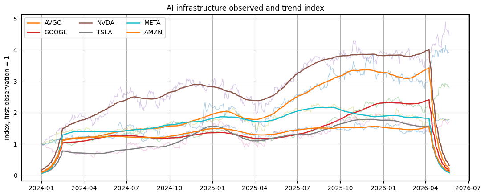
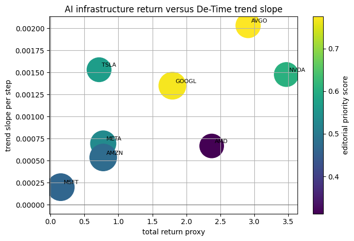
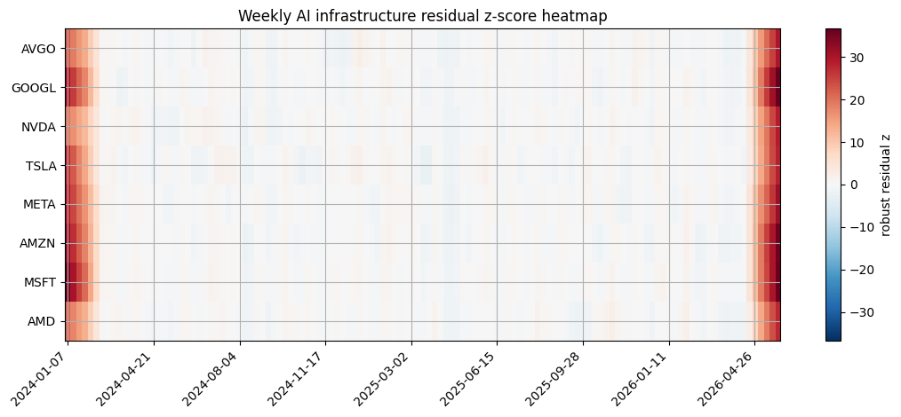

<!-- Generated by scripts/generate_column_notebook_pages.py; do not edit manually. -->
# AI Infrastructure Market Pulse

<div class="gallery-note notebook-transcript-note">
  <strong>Executed tutorial notebook.</strong> This page is generated from <a href="https://github.com/systems-mechanobiology/De-Time/blob/main/examples/notebooks/hot_trends/07_ai_infrastructure_market_pulse.ipynb"><code>examples/notebooks/hot_trends/07_ai_infrastructure_market_pulse.ipynb</code></a> and includes markdown cells, code cells, stdout, tables, and captured figures from the committed notebook.
</div>

## Executed Notebook

This notebook asks how a defined AI-infrastructure market-price basket moved over the selected window. The basket is a public price proxy for attention around compute, cloud, chips, platforms, and adjacent high-interest names.

The output is a basket definition, a source card, trend-index figures, return-versus-trend comparison, and edge-trimmed residual events. Revenue, capex, margins, and valuation require official financial data.

<div class="notebook-cell">
<div class="notebook-input-label">In [1]</div>

```python
from pathlib import Path
import os

import matplotlib.pyplot as plt
import numpy as np
import pandas as pd

from examples.hot_trends.data import (
    HotTrendDataError,
    append_real_snapshot,
    build_arxiv_monthly_counts,
    fetch_coingecko_market_chart,
    fetch_defillama_stablecoin_chains,
    fetch_github_repo_metadata,
    fetch_github_stargazers,
    fetch_huggingface_models,
    fetch_wikipedia_pageviews,
    source_audit_table,
)
from examples.hot_trends.decomposition import (
    component_summary,
    decompose_table,
    editorial_priority,
    residual_event_table,
)
from examples.hot_trends.scoring import article_publication_phrasing

pd.set_option("display.max_columns", 80)
pd.set_option("display.max_rows", 80)
plt.rcParams.update({"axes.grid": True})

CACHE_DIR = Path("examples/hot_trends/cache")
OUTPUT_DIR = Path("examples/hot_trends/outputs")
CACHE_DIR.mkdir(parents=True, exist_ok=True)
OUTPUT_DIR.mkdir(parents=True, exist_ok=True)

def save_table(df, name):
    path = OUTPUT_DIR / f"{name}.csv"
    df.to_csv(path, index=False)
    print(f"saved: {path.as_posix()}")
```
</div>

## 1. Fetch prices through yfinance

<div class="notebook-cell">
<div class="notebook-input-label">In [2]</div>

```python
try:
    import yfinance as yf
except Exception as exc:
    raise ImportError("Install yfinance to run this notebook: python -m pip install yfinance") from exc

basket_definition = pd.DataFrame([
    {"ticker": "NVDA", "role": "GPU accelerator supplier", "boundary": "large-cap chip proxy, not pure infrastructure revenue"},
    {"ticker": "AMD", "role": "GPU/CPU accelerator challenger", "boundary": "mixed client, data-center, and gaming exposure"},
    {"ticker": "AVGO", "role": "networking and custom silicon", "boundary": "diversified semiconductor and software exposure"},
    {"ticker": "MSFT", "role": "cloud and AI platform", "boundary": "large diversified software/cloud company"},
    {"ticker": "GOOGL", "role": "cloud, TPU, and AI platform", "boundary": "advertising remains a major business line"},
    {"ticker": "AMZN", "role": "cloud infrastructure", "boundary": "retail and marketplace exposure included"},
    {"ticker": "META", "role": "AI compute demand and model deployment", "boundary": "advertising platform, not infrastructure vendor"},
    {"ticker": "TSLA", "role": "AI narrative and autonomous systems proxy", "boundary": "auto and energy exposure dominates fundamentals"},
])
tickers = basket_definition["ticker"].tolist()
start_date = "2024-01-01"
raw = yf.download(tickers, start=start_date, progress=False, auto_adjust=True)["Close"]
if raw.empty:
    raise HotTrendDataError("yfinance returned no market data")
prices = raw.reset_index().melt(id_vars="Date", var_name="ticker", value_name="price").rename(columns={"Date": "date"})
prices = prices.dropna(subset=["price"])
display(basket_definition)
prices.head(20)
```

<div class="gallery-out notebook-output">
<div class="notebook-output-label">text/html</div>
<div class="notebook-html-output">
<div>
<style scoped>
    .dataframe tbody tr th:only-of-type {
        vertical-align: middle;
    }

    .dataframe tbody tr th {
        vertical-align: top;
    }

    .dataframe thead th {
        text-align: right;
    }
</style>
<table border="1" class="dataframe">
  <thead>
    <tr style="text-align: right;">
      <th></th>
      <th>ticker</th>
      <th>role</th>
      <th>boundary</th>
    </tr>
  </thead>
  <tbody>
    <tr>
      <th>0</th>
      <td>NVDA</td>
      <td>GPU accelerator supplier</td>
      <td>large-cap chip proxy, not pure infrastructure ...</td>
    </tr>
    <tr>
      <th>1</th>
      <td>AMD</td>
      <td>GPU/CPU accelerator challenger</td>
      <td>mixed client, data-center, and gaming exposure</td>
    </tr>
    <tr>
      <th>2</th>
      <td>AVGO</td>
      <td>networking and custom silicon</td>
      <td>diversified semiconductor and software exposure</td>
    </tr>
    <tr>
      <th>3</th>
      <td>MSFT</td>
      <td>cloud and AI platform</td>
      <td>large diversified software/cloud company</td>
    </tr>
    <tr>
      <th>4</th>
      <td>GOOGL</td>
      <td>cloud, TPU, and AI platform</td>
      <td>advertising remains a major business line</td>
    </tr>
    <tr>
      <th>5</th>
      <td>AMZN</td>
      <td>cloud infrastructure</td>
      <td>retail and marketplace exposure included</td>
    </tr>
    <tr>
      <th>6</th>
      <td>META</td>
      <td>AI compute demand and model deployment</td>
      <td>advertising platform, not infrastructure vendor</td>
    </tr>
    <tr>
      <th>7</th>
      <td>TSLA</td>
      <td>AI narrative and autonomous systems proxy</td>
      <td>auto and energy exposure dominates fundamentals</td>
    </tr>
  </tbody>
</table>
</div>
</div>
<div class="notebook-output-label">text/html</div>
<div class="notebook-html-output">
<div>
<style scoped>
    .dataframe tbody tr th:only-of-type {
        vertical-align: middle;
    }

    .dataframe tbody tr th {
        vertical-align: top;
    }

    .dataframe thead th {
        text-align: right;
    }
</style>
<table border="1" class="dataframe">
  <thead>
    <tr style="text-align: right;">
      <th></th>
      <th>date</th>
      <th>ticker</th>
      <th>price</th>
    </tr>
  </thead>
  <tbody>
    <tr>
      <th>0</th>
      <td>2024-01-02</td>
      <td>AMD</td>
      <td>138.580002</td>
    </tr>
    <tr>
      <th>1</th>
      <td>2024-01-03</td>
      <td>AMD</td>
      <td>135.320007</td>
    </tr>
    <tr>
      <th>2</th>
      <td>2024-01-04</td>
      <td>AMD</td>
      <td>136.009995</td>
    </tr>
    <tr>
      <th>3</th>
      <td>2024-01-05</td>
      <td>AMD</td>
      <td>138.580002</td>
    </tr>
    <tr>
      <th>4</th>
      <td>2024-01-08</td>
      <td>AMD</td>
      <td>146.179993</td>
    </tr>
    <tr>
      <th>5</th>
      <td>2024-01-09</td>
      <td>AMD</td>
      <td>149.259995</td>
    </tr>
    <tr>
      <th>6</th>
      <td>2024-01-10</td>
      <td>AMD</td>
      <td>148.539993</td>
    </tr>
    <tr>
      <th>7</th>
      <td>2024-01-11</td>
      <td>AMD</td>
      <td>148.020004</td>
    </tr>
    <tr>
      <th>8</th>
      <td>2024-01-12</td>
      <td>AMD</td>
      <td>146.559998</td>
    </tr>
    <tr>
      <th>9</th>
      <td>2024-01-16</td>
      <td>AMD</td>
      <td>158.740005</td>
    </tr>
    <tr>
      <th>10</th>
      <td>2024-01-17</td>
      <td>AMD</td>
      <td>160.169998</td>
    </tr>
    <tr>
      <th>11</th>
      <td>2024-01-18</td>
      <td>AMD</td>
      <td>162.669998</td>
    </tr>
    <tr>
      <th>12</th>
      <td>2024-01-19</td>
      <td>AMD</td>
      <td>174.229996</td>
    </tr>
    <tr>
      <th>13</th>
      <td>2024-01-22</td>
      <td>AMD</td>
      <td>168.179993</td>
    </tr>
    <tr>
      <th>14</th>
      <td>2024-01-23</td>
      <td>AMD</td>
      <td>168.419998</td>
    </tr>
    <tr>
      <th>15</th>
      <td>2024-01-24</td>
      <td>AMD</td>
      <td>178.289993</td>
    </tr>
    <tr>
      <th>16</th>
      <td>2024-01-25</td>
      <td>AMD</td>
      <td>180.330002</td>
    </tr>
    <tr>
      <th>17</th>
      <td>2024-01-26</td>
      <td>AMD</td>
      <td>177.250000</td>
    </tr>
    <tr>
      <th>18</th>
      <td>2024-01-29</td>
      <td>AMD</td>
      <td>177.830002</td>
    </tr>
    <tr>
      <th>19</th>
      <td>2024-01-30</td>
      <td>AMD</td>
      <td>172.059998</td>
    </tr>
  </tbody>
</table>
</div>
</div>
</div>
</div>

## 2. Source card and price audit

<div class="notebook-cell">
<div class="notebook-input-label">In [3]</div>

```python
audit = source_audit_table(prices, value_col="price", entity_col="ticker", time_col="date")
source_card = pd.DataFrame([{
    "source": "Yahoo Finance through yfinance",
    "endpoint": "yfinance.download",
    "access_date": pd.Timestamp.today().date().isoformat(),
    "query_params": f"tickers={','.join(tickers)}; start={start_date}; auto_adjust=True; field=Close",
    "time_range": f"{pd.to_datetime(prices['date']).min().date()} to {pd.to_datetime(prices['date']).max().date()}",
    "cache_path": "not cached; outputs saved to examples/hot_trends/outputs",
    "interpretation_scope": "public market-price proxy for a defined basket; not fundamentals, valuation, or investment advice",
}])
display(source_card)
audit
```

<div class="gallery-out notebook-output">
<div class="notebook-output-label">text/html</div>
<div class="notebook-html-output">
<div>
<style scoped>
    .dataframe tbody tr th:only-of-type {
        vertical-align: middle;
    }

    .dataframe tbody tr th {
        vertical-align: top;
    }

    .dataframe thead th {
        text-align: right;
    }
</style>
<table border="1" class="dataframe">
  <thead>
    <tr style="text-align: right;">
      <th></th>
      <th>source</th>
      <th>endpoint</th>
      <th>access_date</th>
      <th>query_params</th>
      <th>time_range</th>
      <th>cache_path</th>
      <th>interpretation_scope</th>
    </tr>
  </thead>
  <tbody>
    <tr>
      <th>0</th>
      <td>Yahoo Finance through yfinance</td>
      <td>yfinance.download</td>
      <td>2026-05-22</td>
      <td>tickers=NVDA,AMD,AVGO,MSFT,GOOGL,AMZN,META,TSL...</td>
      <td>2024-01-02 to 2026-05-22</td>
      <td>not cached; outputs saved to examples/hot_tren...</td>
      <td>public market-price proxy for a defined basket...</td>
    </tr>
  </tbody>
</table>
</div>
</div>
<div class="notebook-output-label">text/html</div>
<div class="notebook-html-output">
<div>
<style scoped>
    .dataframe tbody tr th:only-of-type {
        vertical-align: middle;
    }

    .dataframe tbody tr th {
        vertical-align: top;
    }

    .dataframe thead th {
        text-align: right;
    }
</style>
<table border="1" class="dataframe">
  <thead>
    <tr style="text-align: right;">
      <th></th>
      <th>series</th>
      <th>first_timestamp</th>
      <th>last_timestamp</th>
      <th>observations</th>
      <th>missing_ratio</th>
      <th>min_value</th>
      <th>max_value</th>
    </tr>
  </thead>
  <tbody>
    <tr>
      <th>0</th>
      <td>AMD</td>
      <td>2024-01-02 00:00:00</td>
      <td>2026-05-22 00:00:00</td>
      <td>600</td>
      <td>0.0</td>
      <td>78.209999</td>
      <td>467.510010</td>
    </tr>
    <tr>
      <th>1</th>
      <td>AMZN</td>
      <td>2024-01-02 00:00:00</td>
      <td>2026-05-22 00:00:00</td>
      <td>600</td>
      <td>0.0</td>
      <td>144.570007</td>
      <td>274.989990</td>
    </tr>
    <tr>
      <th>2</th>
      <td>AVGO</td>
      <td>2024-01-02 00:00:00</td>
      <td>2026-05-22 00:00:00</td>
      <td>600</td>
      <td>0.0</td>
      <td>102.365158</td>
      <td>439.790009</td>
    </tr>
    <tr>
      <th>3</th>
      <td>GOOGL</td>
      <td>2024-01-02 00:00:00</td>
      <td>2026-05-22 00:00:00</td>
      <td>600</td>
      <td>0.0</td>
      <td>130.322876</td>
      <td>402.619995</td>
    </tr>
    <tr>
      <th>4</th>
      <td>META</td>
      <td>2024-01-02 00:00:00</td>
      <td>2026-05-22 00:00:00</td>
      <td>600</td>
      <td>0.0</td>
      <td>341.787811</td>
      <td>788.148987</td>
    </tr>
    <tr>
      <th>5</th>
      <td>MSFT</td>
      <td>2024-01-02 00:00:00</td>
      <td>2026-05-22 00:00:00</td>
      <td>600</td>
      <td>0.0</td>
      <td>351.105774</td>
      <td>538.658508</td>
    </tr>
    <tr>
      <th>6</th>
      <td>NVDA</td>
      <td>2024-01-02 00:00:00</td>
      <td>2026-05-22 00:00:00</td>
      <td>600</td>
      <td>0.0</td>
      <td>47.539936</td>
      <td>235.740005</td>
    </tr>
    <tr>
      <th>7</th>
      <td>TSLA</td>
      <td>2024-01-02 00:00:00</td>
      <td>2026-05-22 00:00:00</td>
      <td>600</td>
      <td>0.0</td>
      <td>142.050003</td>
      <td>489.880005</td>
    </tr>
  </tbody>
</table>
</div>
</div>
</div>
</div>

## 3. Decompose normalized log prices

<div class="notebook-cell">
<div class="notebook-input-label">In [4]</div>

```python
components = decompose_table(prices, entity_col="ticker", time_col="date", value_col="price", method="MA_BASELINE", period=21, trend_window=63, transform="log")
summary = editorial_priority(component_summary(components, entity_col="ticker", time_col="date"), entity_col="ticker")
summary
```

<div class="gallery-out notebook-output">
<div class="notebook-output-label">text/html</div>
<div class="notebook-html-output">
<div>
<style scoped>
    .dataframe tbody tr th:only-of-type {
        vertical-align: middle;
    }

    .dataframe tbody tr th {
        vertical-align: top;
    }

    .dataframe thead th {
        text-align: right;
    }
</style>
<table border="1" class="dataframe">
  <thead>
    <tr style="text-align: right;">
      <th></th>
      <th>ticker</th>
      <th>observations</th>
      <th>first_timestamp</th>
      <th>last_timestamp</th>
      <th>trend_last</th>
      <th>trend_slope_per_step</th>
      <th>cycle_strength_proxy</th>
      <th>residual_std</th>
      <th>max_abs_residual_z</th>
      <th>method</th>
      <th>trend_slope_per_step_rank_pct</th>
      <th>cycle_strength_proxy_rank_pct</th>
      <th>max_abs_residual_z_rank_pct</th>
      <th>editorial_priority_score</th>
    </tr>
  </thead>
  <tbody>
    <tr>
      <th>2</th>
      <td>AVGO</td>
      <td>600</td>
      <td>2024-01-02 00:00:00</td>
      <td>2026-05-22 00:00:00</td>
      <td>3.056002</td>
      <td>0.002033</td>
      <td>-0.515611</td>
      <td>0.492248</td>
      <td>31.542094</td>
      <td>MA_BASELINE</td>
      <td>1.000</td>
      <td>1.000</td>
      <td>0.500</td>
      <td>0.77500</td>
    </tr>
    <tr>
      <th>3</th>
      <td>GOOGL</td>
      <td>600</td>
      <td>2024-01-02 00:00:00</td>
      <td>2026-05-22 00:00:00</td>
      <td>2.996327</td>
      <td>0.001351</td>
      <td>-1.894425</td>
      <td>0.500717</td>
      <td>38.908369</td>
      <td>MA_BASELINE</td>
      <td>0.625</td>
      <td>0.500</td>
      <td>1.000</td>
      <td>0.76875</td>
    </tr>
    <tr>
      <th>6</th>
      <td>NVDA</td>
      <td>600</td>
      <td>2024-01-02 00:00:00</td>
      <td>2026-05-22 00:00:00</td>
      <td>2.710889</td>
      <td>0.001477</td>
      <td>-0.730896</td>
      <td>0.425016</td>
      <td>30.472988</td>
      <td>MA_BASELINE</td>
      <td>0.750</td>
      <td>0.875</td>
      <td>0.375</td>
      <td>0.60625</td>
    </tr>
    <tr>
      <th>7</th>
      <td>TSLA</td>
      <td>600</td>
      <td>2024-01-02 00:00:00</td>
      <td>2026-05-22 00:00:00</td>
      <td>3.037916</td>
      <td>0.001532</td>
      <td>-1.559972</td>
      <td>0.528218</td>
      <td>30.440903</td>
      <td>MA_BASELINE</td>
      <td>0.875</td>
      <td>0.750</td>
      <td>0.250</td>
      <td>0.56875</td>
    </tr>
    <tr>
      <th>4</th>
      <td>META</td>
      <td>600</td>
      <td>2024-01-02 00:00:00</td>
      <td>2026-05-22 00:00:00</td>
      <td>3.277547</td>
      <td>0.000695</td>
      <td>-8.994860</td>
      <td>0.545159</td>
      <td>34.034109</td>
      <td>MA_BASELINE</td>
      <td>0.500</td>
      <td>0.375</td>
      <td>0.625</td>
      <td>0.53125</td>
    </tr>
    <tr>
      <th>1</th>
      <td>AMZN</td>
      <td>600</td>
      <td>2024-01-02 00:00:00</td>
      <td>2026-05-22 00:00:00</td>
      <td>2.824287</td>
      <td>0.000536</td>
      <td>-12.700004</td>
      <td>0.479970</td>
      <td>38.328541</td>
      <td>MA_BASELINE</td>
      <td>0.250</td>
      <td>0.250</td>
      <td>0.750</td>
      <td>0.47500</td>
    </tr>
    <tr>
      <th>5</th>
      <td>MSFT</td>
      <td>600</td>
      <td>2024-01-02 00:00:00</td>
      <td>2026-05-22 00:00:00</td>
      <td>3.058471</td>
      <td>0.000199</td>
      <td>-28.797940</td>
      <td>0.536863</td>
      <td>38.792840</td>
      <td>MA_BASELINE</td>
      <td>0.125</td>
      <td>0.125</td>
      <td>0.875</td>
      <td>0.46250</td>
    </tr>
    <tr>
      <th>0</th>
      <td>AMD</td>
      <td>600</td>
      <td>2024-01-02 00:00:00</td>
      <td>2026-05-22 00:00:00</td>
      <td>2.973933</td>
      <td>0.000667</td>
      <td>-1.836756</td>
      <td>0.521744</td>
      <td>29.756925</td>
      <td>MA_BASELINE</td>
      <td>0.375</td>
      <td>0.625</td>
      <td>0.125</td>
      <td>0.31250</td>
    </tr>
  </tbody>
</table>
</div>
</div>
</div>
</div>

## Visualization: AI infrastructure price trend index

The y-axis is an index with each ticker starting at 1. Solid trend lines make basket movement comparable across different share prices. This is a price-proxy view; benchmark and financial-statement evidence are needed before performance or valuation claims.

<div class="notebook-cell">
<div class="notebook-input-label">In [5]</div>

```python
top_tickers = summary["ticker"].head(6).tolist()
fig, ax = plt.subplots(figsize=(11, 4.5))
for ticker in top_tickers:
    panel = components.loc[components["ticker"].eq(ticker)].sort_values("date").copy()
    panel["date"] = pd.to_datetime(panel["date"])
    base = float(panel["observed"].iloc[0])
    observed_index = np.exp(panel["observed"] - base)
    trend_index = np.exp(panel["trend"] - base)
    ax.plot(panel["date"], observed_index, linewidth=1.0, alpha=0.35)
    ax.plot(panel["date"], trend_index, linewidth=1.8, label=ticker)
ax.set_title("AI infrastructure observed and trend index")
ax.set_ylabel("index, first observation = 1")
ax.legend(ncol=3, loc="best")
plt.tight_layout()
plt.show()
```

<div class="gallery-out notebook-output">
<div class="notebook-output-label">image/png</div>

</div>
</div>

## 4. Cross-sectional AI infrastructure table

<div class="notebook-cell">
<div class="notebook-input-label">In [6]</div>

```python
latest = prices.sort_values("date").groupby("ticker").tail(1).rename(columns={"price": "latest_price"})
first = prices.sort_values("date").groupby("ticker").head(1).rename(columns={"price": "first_price"})[["ticker", "first_price"]]
returns = latest.merge(first, on="ticker", how="left")
returns["total_return_proxy"] = returns["latest_price"] / returns["first_price"] - 1.0
returns.sort_values("total_return_proxy", ascending=False)
```

<div class="gallery-out notebook-output">
<div class="notebook-output-label">text/html</div>
<div class="notebook-html-output">
<div>
<style scoped>
    .dataframe tbody tr th:only-of-type {
        vertical-align: middle;
    }

    .dataframe tbody tr th {
        vertical-align: top;
    }

    .dataframe thead th {
        text-align: right;
    }
</style>
<table border="1" class="dataframe">
  <thead>
    <tr style="text-align: right;">
      <th></th>
      <th>date</th>
      <th>ticker</th>
      <th>latest_price</th>
      <th>first_price</th>
      <th>total_return_proxy</th>
    </tr>
  </thead>
  <tbody>
    <tr>
      <th>6</th>
      <td>2026-05-22</td>
      <td>NVDA</td>
      <td>215.330002</td>
      <td>48.138569</td>
      <td>3.473128</td>
    </tr>
    <tr>
      <th>3</th>
      <td>2026-05-22</td>
      <td>AVGO</td>
      <td>414.140015</td>
      <td>105.914253</td>
      <td>2.910144</td>
    </tr>
    <tr>
      <th>5</th>
      <td>2026-05-22</td>
      <td>AMD</td>
      <td>467.510010</td>
      <td>138.580002</td>
      <td>2.373575</td>
    </tr>
    <tr>
      <th>0</th>
      <td>2026-05-22</td>
      <td>GOOGL</td>
      <td>382.970001</td>
      <td>137.037384</td>
      <td>1.794639</td>
    </tr>
    <tr>
      <th>4</th>
      <td>2026-05-22</td>
      <td>AMZN</td>
      <td>266.320007</td>
      <td>149.929993</td>
      <td>0.776296</td>
    </tr>
    <tr>
      <th>2</th>
      <td>2026-05-22</td>
      <td>META</td>
      <td>610.260010</td>
      <td>343.593658</td>
      <td>0.776110</td>
    </tr>
    <tr>
      <th>7</th>
      <td>2026-05-22</td>
      <td>TSLA</td>
      <td>426.010010</td>
      <td>248.419998</td>
      <td>0.714878</td>
    </tr>
    <tr>
      <th>1</th>
      <td>2026-05-22</td>
      <td>MSFT</td>
      <td>418.570007</td>
      <td>363.801514</td>
      <td>0.150545</td>
    </tr>
  </tbody>
</table>
</div>
</div>
</div>
</div>

## Visualization: return versus trend slope

The x-axis is simple total return over the sampled window. The y-axis is De-Time trend slope; marker size reflects residual shock magnitude. Read the scatter as a basket diagnostic, not as a recommendation.

<div class="notebook-cell">
<div class="notebook-input-label">In [7]</div>

```python
scatter_data = returns.merge(summary[["ticker", "trend_slope_per_step", "max_abs_residual_z", "editorial_priority_score"]], on="ticker", how="left")
fig, ax = plt.subplots(figsize=(7.2, 4.8))
sc = ax.scatter(
    scatter_data["total_return_proxy"],
    scatter_data["trend_slope_per_step"],
    s=80 + scatter_data["max_abs_residual_z"].fillna(0) * 35,
    c=scatter_data["editorial_priority_score"],
    cmap="viridis",
)
for _, row in scatter_data.iterrows():
    ax.annotate(str(row["ticker"]), (row["total_return_proxy"], row["trend_slope_per_step"]), fontsize=8, xytext=(4, 4), textcoords="offset points")
ax.axvline(0, color="0.45", linewidth=0.8)
ax.axhline(0, color="0.45", linewidth=0.8)
ax.set_xlabel("total return proxy")
ax.set_ylabel("trend slope per step")
ax.set_title("AI infrastructure return versus De-Time trend slope")
fig.colorbar(sc, ax=ax, label="editorial priority score")
plt.tight_layout()
plt.show()
```

<div class="gallery-out notebook-output">
<div class="notebook-output-label">image/png</div>

</div>
</div>

## 5. Residual events

<div class="notebook-cell">
<div class="notebook-input-label">In [8]</div>

```python
events = residual_event_table(components, entity_col="ticker", time_col="date", top_n=25, trim_edges=63)
events
```

<div class="gallery-out notebook-output">
<div class="notebook-output-label">text/html</div>
<div class="notebook-html-output">
<div>
<style scoped>
    .dataframe tbody tr th:only-of-type {
        vertical-align: middle;
    }

    .dataframe tbody tr th {
        vertical-align: top;
    }

    .dataframe thead th {
        text-align: right;
    }
</style>
<table border="1" class="dataframe">
  <thead>
    <tr style="text-align: right;">
      <th></th>
      <th>date</th>
      <th>ticker</th>
      <th>observed</th>
      <th>trend</th>
      <th>season</th>
      <th>residual</th>
      <th>residual_z</th>
      <th>abs_residual_z</th>
      <th>method</th>
    </tr>
  </thead>
  <tbody>
    <tr>
      <th>0</th>
      <td>2025-04-04</td>
      <td>AVGO</td>
      <td>4.977521</td>
      <td>5.241958</td>
      <td>0.014480</td>
      <td>-0.278917</td>
      <td>-3.450883</td>
      <td>3.450883</td>
      <td>MA_BASELINE</td>
    </tr>
    <tr>
      <th>1</th>
      <td>2025-03-10</td>
      <td>TSLA</td>
      <td>5.403353</td>
      <td>5.674217</td>
      <td>0.017037</td>
      <td>-0.287901</td>
      <td>-3.276988</td>
      <td>3.276988</td>
      <td>MA_BASELINE</td>
    </tr>
    <tr>
      <th>2</th>
      <td>2025-04-08</td>
      <td>AMD</td>
      <td>4.359398</td>
      <td>4.608465</td>
      <td>0.031801</td>
      <td>-0.280868</td>
      <td>-3.153715</td>
      <td>3.153715</td>
      <td>MA_BASELINE</td>
    </tr>
    <tr>
      <th>3</th>
      <td>2025-10-29</td>
      <td>AMD</td>
      <td>5.577198</td>
      <td>5.362060</td>
      <td>-0.050298</td>
      <td>0.265437</td>
      <td>3.070146</td>
      <td>3.070146</td>
      <td>MA_BASELINE</td>
    </tr>
    <tr>
      <th>4</th>
      <td>2025-10-27</td>
      <td>AMD</td>
      <td>5.559412</td>
      <td>5.352499</td>
      <td>-0.053735</td>
      <td>0.260648</td>
      <td>3.015589</td>
      <td>3.015589</td>
      <td>MA_BASELINE</td>
    </tr>
    <tr>
      <th>5</th>
      <td>2025-04-21</td>
      <td>META</td>
      <td>6.180333</td>
      <td>6.374351</td>
      <td>0.038095</td>
      <td>-0.232114</td>
      <td>-2.988468</td>
      <td>2.988468</td>
      <td>MA_BASELINE</td>
    </tr>
    <tr>
      <th>6</th>
      <td>2025-04-21</td>
      <td>NVDA</td>
      <td>4.573547</td>
      <td>4.756973</td>
      <td>0.037131</td>
      <td>-0.220557</td>
      <td>-2.987761</td>
      <td>2.987761</td>
      <td>MA_BASELINE</td>
    </tr>
    <tr>
      <th>7</th>
      <td>2025-03-18</td>
      <td>TSLA</td>
      <td>5.417477</td>
      <td>5.640343</td>
      <td>0.039234</td>
      <td>-0.262100</td>
      <td>-2.980770</td>
      <td>2.980770</td>
      <td>MA_BASELINE</td>
    </tr>
    <tr>
      <th>8</th>
      <td>2024-12-26</td>
      <td>AVGO</td>
      <td>5.491635</td>
      <td>5.313243</td>
      <td>-0.052179</td>
      <td>0.230571</td>
      <td>2.932011</td>
      <td>2.932011</td>
      <td>MA_BASELINE</td>
    </tr>
    <tr>
      <th>9</th>
      <td>2025-04-07</td>
      <td>AVGO</td>
      <td>5.029791</td>
      <td>5.242214</td>
      <td>0.021533</td>
      <td>-0.233956</td>
      <td>-2.887612</td>
      <td>2.887612</td>
      <td>MA_BASELINE</td>
    </tr>
    <tr>
      <th>10</th>
      <td>2025-03-11</td>
      <td>TSLA</td>
      <td>5.440598</td>
      <td>5.666866</td>
      <td>0.025627</td>
      <td>-0.251895</td>
      <td>-2.863608</td>
      <td>2.863608</td>
      <td>MA_BASELINE</td>
    </tr>
    <tr>
      <th>11</th>
      <td>2025-10-28</td>
      <td>AMD</td>
      <td>5.552998</td>
      <td>5.357799</td>
      <td>-0.051031</td>
      <td>0.246231</td>
      <td>2.851335</td>
      <td>2.851335</td>
      <td>MA_BASELINE</td>
    </tr>
    <tr>
      <th>12</th>
      <td>2025-04-22</td>
      <td>NVDA</td>
      <td>4.593772</td>
      <td>4.760719</td>
      <td>0.043200</td>
      <td>-0.210147</td>
      <td>-2.847072</td>
      <td>2.847072</td>
      <td>MA_BASELINE</td>
    </tr>
    <tr>
      <th>13</th>
      <td>2025-11-03</td>
      <td>AMD</td>
      <td>5.559335</td>
      <td>5.374082</td>
      <td>-0.059731</td>
      <td>0.244983</td>
      <td>2.837123</td>
      <td>2.837123</td>
      <td>MA_BASELINE</td>
    </tr>
    <tr>
      <th>14</th>
      <td>2025-04-21</td>
      <td>TSLA</td>
      <td>5.427150</td>
      <td>5.630702</td>
      <td>0.045379</td>
      <td>-0.248931</td>
      <td>-2.829580</td>
      <td>2.829580</td>
      <td>MA_BASELINE</td>
    </tr>
    <tr>
      <th>15</th>
      <td>2025-04-08</td>
      <td>AVGO</td>
      <td>5.041978</td>
      <td>5.243101</td>
      <td>0.027997</td>
      <td>-0.229120</td>
      <td>-2.827026</td>
      <td>2.827026</td>
      <td>MA_BASELINE</td>
    </tr>
    <tr>
      <th>16</th>
      <td>2024-12-27</td>
      <td>AVGO</td>
      <td>5.476813</td>
      <td>5.317668</td>
      <td>-0.058443</td>
      <td>0.217588</td>
      <td>2.769348</td>
      <td>2.769348</td>
      <td>MA_BASELINE</td>
    </tr>
    <tr>
      <th>17</th>
      <td>2024-08-07</td>
      <td>NVDA</td>
      <td>4.593728</td>
      <td>4.769571</td>
      <td>0.025590</td>
      <td>-0.201433</td>
      <td>-2.729309</td>
      <td>2.729309</td>
      <td>MA_BASELINE</td>
    </tr>
    <tr>
      <th>18</th>
      <td>2025-10-24</td>
      <td>AMD</td>
      <td>5.533073</td>
      <td>5.346906</td>
      <td>-0.049174</td>
      <td>0.235340</td>
      <td>2.727268</td>
      <td>2.727268</td>
      <td>MA_BASELINE</td>
    </tr>
    <tr>
      <th>19</th>
      <td>2025-04-21</td>
      <td>AMZN</td>
      <td>5.119908</td>
      <td>5.262709</td>
      <td>0.032507</td>
      <td>-0.175308</td>
      <td>-2.700299</td>
      <td>2.700299</td>
      <td>MA_BASELINE</td>
    </tr>
    <tr>
      <th>20</th>
      <td>2026-01-23</td>
      <td>AMD</td>
      <td>5.559450</td>
      <td>5.373623</td>
      <td>-0.045048</td>
      <td>0.230875</td>
      <td>2.676396</td>
      <td>2.676396</td>
      <td>MA_BASELINE</td>
    </tr>
    <tr>
      <th>21</th>
      <td>2024-12-24</td>
      <td>AVGO</td>
      <td>5.468213</td>
      <td>5.309195</td>
      <td>-0.050958</td>
      <td>0.209977</td>
      <td>2.673997</td>
      <td>2.673997</td>
      <td>MA_BASELINE</td>
    </tr>
    <tr>
      <th>22</th>
      <td>2025-05-27</td>
      <td>TSLA</td>
      <td>5.894100</td>
      <td>5.719977</td>
      <td>-0.055374</td>
      <td>0.229497</td>
      <td>2.663114</td>
      <td>2.663114</td>
      <td>MA_BASELINE</td>
    </tr>
    <tr>
      <th>23</th>
      <td>2025-04-04</td>
      <td>NVDA</td>
      <td>4.546352</td>
      <td>4.743817</td>
      <td>-0.001253</td>
      <td>-0.196213</td>
      <td>-2.658758</td>
      <td>2.658758</td>
      <td>MA_BASELINE</td>
    </tr>
    <tr>
      <th>24</th>
      <td>2025-04-08</td>
      <td>NVDA</td>
      <td>4.567233</td>
      <td>4.742659</td>
      <td>0.020547</td>
      <td>-0.195974</td>
      <td>-2.655528</td>
      <td>2.655528</td>
      <td>MA_BASELINE</td>
    </tr>
  </tbody>
</table>
</div>
</div>
</div>
</div>

## Visualization: AI infrastructure residual heatmap

The heatmap shows weekly residual z-scores by ticker after decomposition. Clusters suggest dates worth matching against launches, earnings, or macro events; edge-trimmed residual tables reduce first/last-window artifacts.

<div class="notebook-cell">
<div class="notebook-input-label">In [9]</div>

```python
residual_grid = components.copy()
residual_grid["residual_z"] = residual_grid.groupby("ticker")["residual"].transform(lambda s: (s - s.median()) / (1.4826 * (s - s.median()).abs().median() + 1e-12))
heat = residual_grid.pivot_table(index="ticker", columns="date", values="residual_z", aggfunc="mean").reindex(summary["ticker"].tolist()).dropna(how="all")
heat = heat.T
heat.index = pd.to_datetime(heat.index)
heat = heat.resample("W").mean().T
values = heat.to_numpy(dtype=float)
absmax = float(np.nanmax(np.abs(values))) if np.isfinite(values).any() else 1.0
fig, ax = plt.subplots(figsize=(11, 4.8))
im = ax.imshow(values, aspect="auto", cmap="RdBu_r", vmin=-absmax, vmax=absmax)
ax.set_yticks(range(len(heat.index)))
ax.set_yticklabels(heat.index)
tick_step = max(1, len(heat.columns) // 8)
xticks = list(range(0, len(heat.columns), tick_step))
ax.set_xticks(xticks)
ax.set_xticklabels([heat.columns[i].strftime("%Y-%m-%d") for i in xticks], rotation=45, ha="right")
ax.set_title("Weekly AI infrastructure residual z-score heatmap")
fig.colorbar(im, ax=ax, label="robust residual z")
plt.tight_layout()
plt.show()
```

<div class="gallery-out notebook-output">
<div class="notebook-output-label">image/png</div>

</div>
</div>

## 6. Publication language

<div class="notebook-cell">
<div class="notebook-input-label">In [10]</div>

```python
phrasing = article_publication_phrasing()
phrasing
```

<div class="gallery-out notebook-output">
<div class="notebook-output-label">text/html</div>
<div class="notebook-html-output">
<div>
<style scoped>
    .dataframe tbody tr th:only-of-type {
        vertical-align: middle;
    }

    .dataframe tbody tr th {
        vertical-align: top;
    }

    .dataframe thead th {
        text-align: right;
    }
</style>
<table border="1" class="dataframe">
  <thead>
    <tr style="text-align: right;">
      <th></th>
      <th>draft_claim</th>
      <th>evidence_based_phrasing</th>
    </tr>
  </thead>
  <tbody>
    <tr>
      <th>0</th>
      <td>This trend predicts the next price move.</td>
      <td>This trend summarizes the observed public seri...</td>
    </tr>
    <tr>
      <th>1</th>
      <td>This model is better because it has more downl...</td>
      <td>Downloads are a public adoption proxy interpre...</td>
    </tr>
    <tr>
      <th>2</th>
      <td>This repo is winning because stars are rising.</td>
      <td>Star velocity measures developer attention for...</td>
    </tr>
    <tr>
      <th>3</th>
      <td>This pageview spike shows the topic matters most.</td>
      <td>Pageviews measure public attention during the ...</td>
    </tr>
    <tr>
      <th>4</th>
      <td>This residual is a buy signal.</td>
      <td>This residual marks an event-like deviation fr...</td>
    </tr>
  </tbody>
</table>
</div>
</div>
</div>
</div>

<div class="notebook-cell">
<div class="notebook-input-label">In [11]</div>

```python
save_table(source_card, "07_ai_infra_source_card")
save_table(basket_definition, "07_ai_infra_basket_definition")
save_table(audit, "07_ai_infra_market_audit")
save_table(summary, "07_ai_infra_component_summary")
save_table(returns, "07_ai_infra_return_proxy")
save_table(events, "07_ai_infra_residual_events")
save_table(phrasing, "07_ai_infra_publication_phrasing")
```

<div class="gallery-out notebook-output">
<div class="notebook-output-label">stdout</div>
```text
saved: examples/hot_trends/outputs/07_ai_infra_source_card.csv
saved: examples/hot_trends/outputs/07_ai_infra_basket_definition.csv
saved: examples/hot_trends/outputs/07_ai_infra_market_audit.csv
saved: examples/hot_trends/outputs/07_ai_infra_component_summary.csv
saved: examples/hot_trends/outputs/07_ai_infra_return_proxy.csv
saved: examples/hot_trends/outputs/07_ai_infra_residual_events.csv
saved: examples/hot_trends/outputs/07_ai_infra_publication_phrasing.csv
```
</div>
</div>
