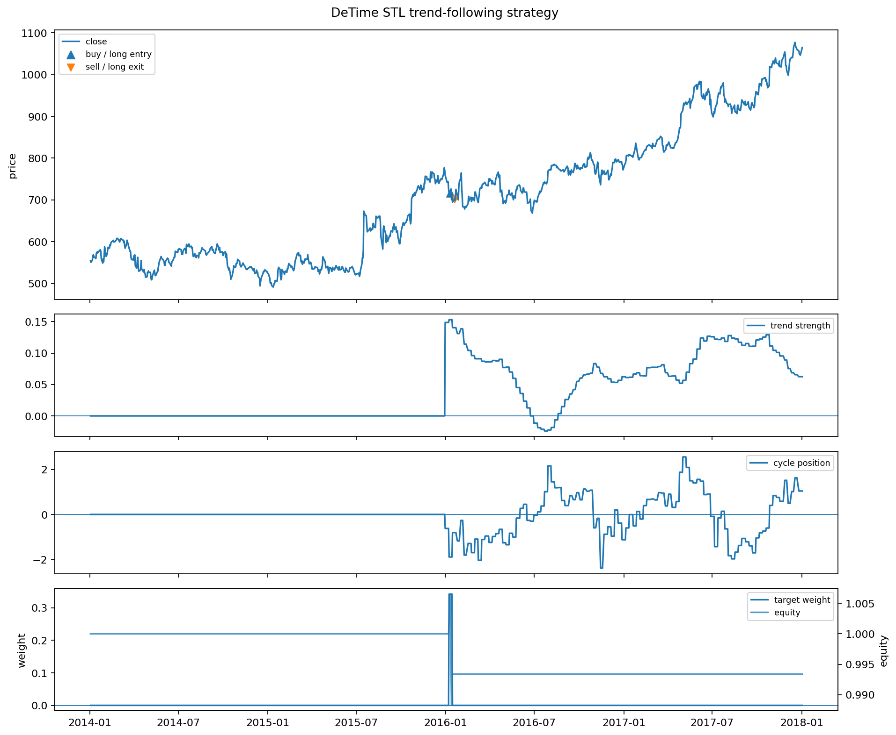

<!-- Generated by scripts/generate_column_notebook_pages.py; do not edit manually. -->
# Strategy Lab 01 - Trend-following strategy

<div class="gallery-note notebook-transcript-note">
  <strong>Executed tutorial notebook.</strong> This page is generated from <a href="https://github.com/systems-mechanobiology/DeTime/blob/main/examples/notebooks/quant_trading/01_detime_trend_following_strategy_lab.ipynb"><code>examples/notebooks/quant_trading/01_detime_trend_following_strategy_lab.ipynb</code></a> and includes markdown cells, code cells, stdout, tables, and captured figures from the committed notebook.
</div>

## Tutorial Navigation

| Track | Tutorial notebook |
|---|---|
| Roadmap | [Tutorial 00 - Roadmap](00_decomposition_first_quant_trading_roadmap.md) |
| Strategy Lab | **01 Trend-Following Lab** |
| Tutorial Sequence | [01 Real Market Data and Feature Factory](01_market_data_and_decomposition_feature_factory.md) |
| Tutorial Sequence | [02 Decomposition-aware MA and MACD](02_decomposition_aware_moving_average_macd.md) |
| Strategy Lab | [02 Oscillation-Reversion Lab](02_detime_oscillation_reversion_strategy_lab.md) |
| Strategy Expansion | [03 Method-Specific Variants](03_detime_method_specific_strategy_variants.md) |
| Tutorial Sequence | [03 Residual Mean Reversion](03_residual_mean_reversion_rsi_bollinger.md) |
| Strategy Expansion | [04 Component Pair Trading](04_detime_component_pair_trading_cointegration.md) |
| Tutorial Sequence | [04 Donchian Breakout](04_turtle_donchian_breakout_volume_confirmation.md) |
| Tutorial Sequence | [05 Pair-Spread Stat-Arb](05_pairs_spread_decomposition_stat_arb.md) |
| Tutorial Sequence | [06 Cross-Sectional Rotation](06_cross_sectional_rotation_portfolio.md) |
| Native SSA Replay | [07 Native SSA High-Return / Low-Drawdown](07_native_ssa_high_return_low_drawdown_tutorial.md) |

## Executed Notebook

这篇只做一件事：用 DeTime 分解出来的 `trend` 直接产生交易信号。

策略逻辑：

1. `trend_slope > 0` 且 `trend_strength` 足够强，说明进入上涨趋势状态。
2. `cycle_position` 不在过热区，避免在周期顶部追进去。
3. `residual_abs_z` 不过大，避免追到结构外的异常拉伸。
4. 如果有成交量分解，则用 `volume_trend_slope / volume_residual_z` 确认参与度。
5. 信号在第 t 根 bar 结束后生成，回测用下一根 bar 的开盘价成交。

<div class="notebook-cell">
<div class="notebook-input-label">In [1]</div>

```python
from pathlib import Path

import pandas as pd
from IPython.display import Image, display
from quant_trading.data import load_sample_goog_ohlcv
from quant_trading.decomposition_features import walkforward_price_volume_features
from quant_trading.strategy_lab import (
    TrendFollowingConfig,
    OscillationReversionConfig,
    backtest_signal_set,
    execution_price_panel,
    decomposition_trend_following_signals,
    decomposition_oscillation_reversion_signals,
    plot_signal_analysis,
    stats_table,
)
from quant_trading.strategy_baselines import (
    buy_and_hold_weights,
    dual_moving_average_weights,
    bollinger_mean_reversion_weights,
)
from quant_trading.strategy_lab import backtest_target_weights_next_bar

CHART_DIR = Path("examples/quant_trading/reports/strategy_lab/charts")
```
</div>

<div class="notebook-cell">
<div class="notebook-input-label">In [2]</div>

```python
ohlcv = load_sample_goog_ohlcv(trim_start="2014-01-01")
symbol = "GOOG"
close = ohlcv["Close"].rename(symbol).to_frame()
volume = ohlcv["Volume"].rename(symbol).to_frame()
execution_prices = execution_price_panel(ohlcv, field="Open", next_bar=True)
execution_prices.columns = [symbol]

features = walkforward_price_volume_features(
    close, volume, method="STL", period=126, train_window=504, step=5, z_window=63
)
list(features)[:8]
```

<div class="gallery-out notebook-output">
<div class="notebook-output-label">text/plain</div>
```text
['trend',
 'cycle',
 'residual',
 'trend_slope',
 'trend_acceleration',
 'trend_strength',
 'trend_gap',
 'cycle_z']
```
</div>
</div>

<div class="notebook-cell">
<div class="notebook-input-label">In [3]</div>

```python
signal = decomposition_trend_following_signals(
    close,
    features,
    config=TrendFollowingConfig(
        entry_trend_strength=0.15,
        exit_trend_strength=0.02,
        max_entry_cycle_position=1.25,
        max_entry_residual_abs_z=2.5,
        use_volume_confirmation=True,
        allow_short=False,
    ),
    name="detime_STL_trend_following",
)

bt = backtest_signal_set(
    close, signal, execution_prices=execution_prices, fee_bps=5, slippage_bps=2, periods_per_year=252
)

baselines = {
    "buy_hold": buy_and_hold_weights(close),
    "classic_sma_20_100": dual_moving_average_weights(close, fast=20, slow=100),
}
results = {signal.name: bt}
for name, weights in baselines.items():
    results[name] = backtest_target_weights_next_bar(
        close, weights, execution_prices=execution_prices, fee_bps=5, slippage_bps=2, periods_per_year=252, name=name
    )

stats_table(results)
```

<div class="gallery-out notebook-output">
<div class="notebook-output-label">text/html</div>
<div class="notebook-html-output">
<div>
<style scoped>
    .dataframe tbody tr th:only-of-type {
        vertical-align: middle;
    }

    .dataframe tbody tr th {
        vertical-align: top;
    }

    .dataframe thead th {
        text-align: right;
    }
</style>
<table border="1" class="dataframe">
  <thead>
    <tr style="text-align: right;">
      <th></th>
      <th>strategy</th>
      <th>total_return</th>
      <th>cagr</th>
      <th>sharpe</th>
      <th>max_drawdown</th>
      <th>calmar</th>
      <th>volatility</th>
      <th>hit_rate</th>
      <th>trade_win_rate</th>
      <th>average_trade_directional_return</th>
      <th>orders</th>
      <th>round_trips</th>
      <th>median_bars_held</th>
      <th>average_turnover</th>
      <th>average_gross_exposure</th>
      <th>fee_bps</th>
      <th>slippage_bps</th>
      <th>periods_per_year</th>
      <th>execution_model</th>
    </tr>
  </thead>
  <tbody>
    <tr>
      <th>1</th>
      <td>buy_hold</td>
      <td>0.887479</td>
      <td>0.172116</td>
      <td>0.799165</td>
      <td>-0.192787</td>
      <td>0.892778</td>
      <td>0.232171</td>
      <td>0.524802</td>
      <td>NaN</td>
      <td>NaN</td>
      <td>1.0</td>
      <td>0.0</td>
      <td>NaN</td>
      <td>0.000000</td>
      <td>1.000000</td>
      <td>5.0</td>
      <td>2.0</td>
      <td>252.0</td>
      <td>signal_on_bar_t_fill_next_bar_open_or_proxy</td>
    </tr>
    <tr>
      <th>2</th>
      <td>classic_sma_20_100</td>
      <td>0.010232</td>
      <td>0.002548</td>
      <td>0.107019</td>
      <td>-0.297157</td>
      <td>0.008576</td>
      <td>0.187310</td>
      <td>0.332341</td>
      <td>0.25</td>
      <td>-0.002942</td>
      <td>17.0</td>
      <td>8.0</td>
      <td>67.0</td>
      <td>0.016865</td>
      <td>0.630952</td>
      <td>5.0</td>
      <td>2.0</td>
      <td>252.0</td>
      <td>signal_on_bar_t_fill_next_bar_open_or_proxy</td>
    </tr>
    <tr>
      <th>0</th>
      <td>detime_STL_trend_following</td>
      <td>-0.006633</td>
      <td>-0.001663</td>
      <td>-0.213044</td>
      <td>-0.018183</td>
      <td>-0.091433</td>
      <td>0.007671</td>
      <td>0.002976</td>
      <td>0.00</td>
      <td>-0.018574</td>
      <td>2.0</td>
      <td>1.0</td>
      <td>5.0</td>
      <td>0.000678</td>
      <td>0.001696</td>
      <td>5.0</td>
      <td>2.0</td>
      <td>252.0</td>
      <td>signal_on_bar_t_fill_next_bar_open_or_proxy</td>
    </tr>
  </tbody>
</table>
</div>
</div>
</div>
</div>

<div class="notebook-cell">
<div class="notebook-input-label">In [4]</div>

```python
bt.orders.tail(10)
```

<div class="gallery-out notebook-output">
<div class="notebook-output-label">text/html</div>
<div class="notebook-html-output">
<div>
<style scoped>
    .dataframe tbody tr th:only-of-type {
        vertical-align: middle;
    }

    .dataframe tbody tr th {
        vertical-align: top;
    }

    .dataframe thead th {
        text-align: right;
    }
</style>
<table border="1" class="dataframe">
  <thead>
    <tr style="text-align: right;">
      <th></th>
      <th>asset</th>
      <th>signal_date</th>
      <th>fill_date</th>
      <th>action</th>
      <th>previous_weight</th>
      <th>new_weight</th>
      <th>delta_weight</th>
      <th>fill_price</th>
    </tr>
  </thead>
  <tbody>
    <tr>
      <th>0</th>
      <td>GOOG</td>
      <td>2016-01-08</td>
      <td>2016-01-11</td>
      <td>buy</td>
      <td>0.000000</td>
      <td>0.341871</td>
      <td>0.341871</td>
      <td>716.609985</td>
    </tr>
    <tr>
      <th>1</th>
      <td>GOOG</td>
      <td>2016-01-15</td>
      <td>2016-01-19</td>
      <td>sell</td>
      <td>0.341871</td>
      <td>0.000000</td>
      <td>-0.341871</td>
      <td>703.299988</td>
    </tr>
  </tbody>
</table>
</div>
</div>
</div>
</div>

<div class="notebook-cell">
<div class="notebook-input-label">In [5]</div>

```python
bt.trades.tail(10)
```

<div class="gallery-out notebook-output">
<div class="notebook-output-label">text/html</div>
<div class="notebook-html-output">
<div>
<style scoped>
    .dataframe tbody tr th:only-of-type {
        vertical-align: middle;
    }

    .dataframe tbody tr th {
        vertical-align: top;
    }

    .dataframe thead th {
        text-align: right;
    }
</style>
<table border="1" class="dataframe">
  <thead>
    <tr style="text-align: right;">
      <th></th>
      <th>asset</th>
      <th>side</th>
      <th>entry_signal_date</th>
      <th>entry_fill_date</th>
      <th>exit_signal_date</th>
      <th>exit_fill_date</th>
      <th>entry_price</th>
      <th>exit_price</th>
      <th>bars_held</th>
      <th>entry_weight</th>
      <th>directional_return</th>
      <th>approx_weighted_return_after_cost</th>
    </tr>
  </thead>
  <tbody>
    <tr>
      <th>0</th>
      <td>GOOG</td>
      <td>long</td>
      <td>2016-01-08</td>
      <td>2016-01-11</td>
      <td>2016-01-15</td>
      <td>2016-01-19</td>
      <td>716.609985</td>
      <td>703.299988</td>
      <td>5</td>
      <td>0.341871</td>
      <td>-0.018574</td>
      <td>-0.006589</td>
    </tr>
  </tbody>
</table>
</div>
</div>
</div>
</div>

<div class="notebook-cell">
<div class="notebook-input-label">In [6]</div>

```python
out = CHART_DIR / "notebook_01_trend_following.png"
plot_signal_analysis(ohlcv, signal, bt, asset=symbol, output_path=out, title="DeTime STL trend-following strategy")
display(Image(filename=str(out)))
out.as_posix()
```

<div class="gallery-out notebook-output">
<div class="notebook-output-label">image/png</div>

<div class="notebook-output-label">text/plain</div>
```text
'examples/quant_trading/reports/strategy_lab/charts/notebook_01_trend_following.png'
```
</div>
</div>
