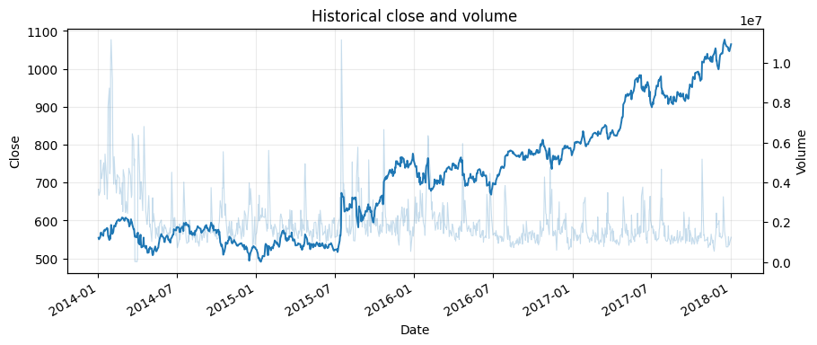
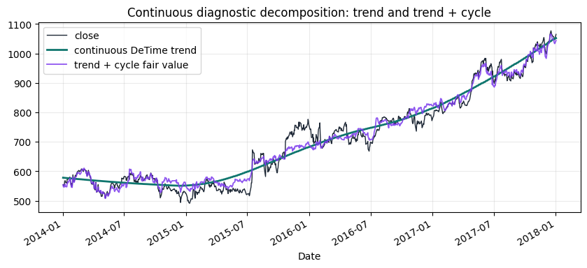
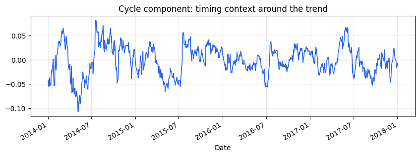
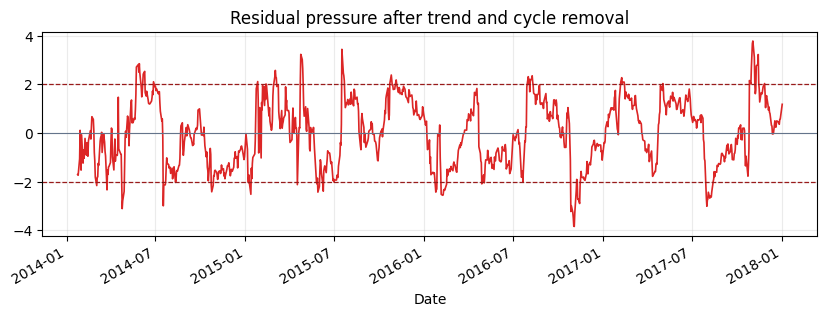
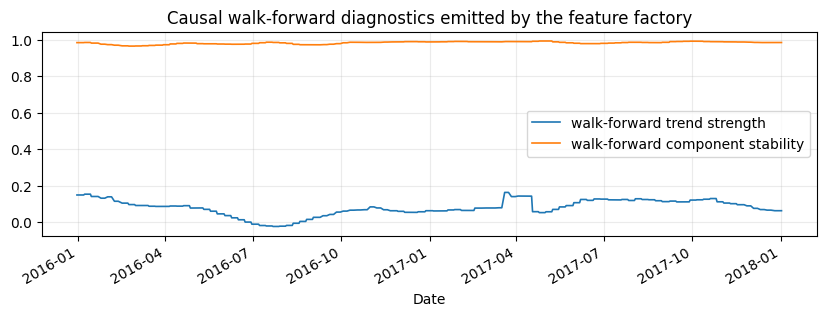
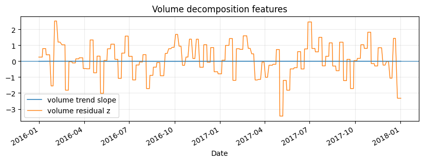
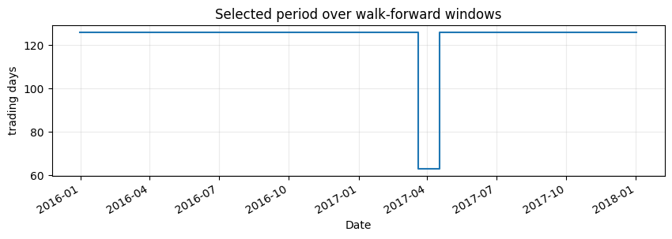

<!-- Generated by scripts/generate_column_notebook_pages.py; do not edit manually. -->
# Tutorial 01 - Real market data and the DeTime feature factory

<div class="gallery-note notebook-transcript-note">
  <strong>Executed tutorial notebook.</strong> This page is generated from <a href="https://github.com/systems-mechanobiology/DeTime/blob/main/examples/notebooks/quant_trading/01_market_data_and_decomposition_feature_factory.ipynb"><code>examples/notebooks/quant_trading/01_market_data_and_decomposition_feature_factory.ipynb</code></a> and includes markdown cells, code cells, stdout, tables, and captured figures from the committed notebook.
</div>

## Tutorial Navigation

| Track | Tutorial notebook |
|---|---|
| Roadmap | [Tutorial 00 - Roadmap](00_decomposition_first_quant_trading_roadmap.md) |
| Strategy Lab | [01 Trend-Following Lab](01_detime_trend_following_strategy_lab.md) |
| Tutorial Sequence | **01 Real Market Data and Feature Factory** |
| Tutorial Sequence | [02 Decomposition-aware MA and MACD](02_decomposition_aware_moving_average_macd.md) |
| Strategy Lab | [02 Oscillation-Reversion Lab](02_detime_oscillation_reversion_strategy_lab.md) |
| Strategy Expansion | [03 Method-Specific Variants](03_detime_method_specific_strategy_variants.md) |
| Tutorial Sequence | [03 Residual Mean Reversion](03_residual_mean_reversion_rsi_bollinger.md) |
| Strategy Expansion | [04 Component Pair Trading](04_detime_component_pair_trading_cointegration.md) |
| Tutorial Sequence | [04 Donchian Breakout](04_turtle_donchian_breakout_volume_confirmation.md) |
| Tutorial Sequence | [05 Pair-Spread Stat-Arb](05_pairs_spread_decomposition_stat_arb.md) |
| Tutorial Sequence | [06 Cross-Sectional Rotation](06_cross_sectional_rotation_portfolio.md) |
| Native SSA Replay | [07 Native SSA High-Return / Low-Drawdown](07_native_ssa_high_return_low_drawdown_tutorial.md) |

## Executed Notebook

This tutorial builds the data and feature layer used by the rest of the quant tutorial. The working idea is simple: a price or volume series is decomposed into trend, cycle and residual structure, then each component becomes a trading feature with a clear job.

The rendered notebook uses the bundled historical GOOG Yahoo Finance sample from the reference algorithmic-trading material. The same functions also support Yahoo Finance downloads through `yfinance`; the downloader script writes cached OHLCV panels for larger universes.

Two views are intentionally separated: a continuous diagnostic decomposition for visual intuition, and a causal walk-forward feature table for backtests. Sparse walk-forward features should not be judged as a smooth trend plot.

<div class="notebook-cell">
<div class="notebook-input-label">In [1]</div>

```python
from pathlib import Path

import matplotlib.pyplot as plt
import numpy as np
import pandas as pd
from IPython.display import display

from examples.quant_trading.data import (
    load_sample_goog_ohlcv,
    market_data_manifest,
    ohlcv_audit_report,
)
from examples.quant_trading.decomposition_features import (
    build_feature_table,
    estimate_dominant_period,
    feature_coverage_report,
)
from examples.quant_trading.features import decompose_one_series, walkforward_decompose_ohlcv
from examples.quant_trading.validation import write_run_audit

pd.set_option("display.max_columns", 20)
REPORT_DIR = Path("examples/quant_trading/reports")
REPORT_DIR.mkdir(parents=True, exist_ok=True)
```
</div>

## 1. Load an auditable OHLCV table

For the documentation build we use a historical GOOG OHLCV table already stored in the repository. A live run can replace this object with `fetch_yahoo_ohlcv_panel([...])` or the command-line downloader.

<div class="notebook-cell">
<div class="notebook-input-label">In [2]</div>

```python
ohlcv_single = load_sample_goog_ohlcv(trim_start="2014-01-01")
ticker = ohlcv_single.attrs.get("symbol", "GOOG")
ohlcv = {
    field: ohlcv_single[[field]].rename(columns={field: ticker})
    for field in ["Open", "High", "Low", "Close", "Volume"]
}
close = ohlcv["Close"]
volume = ohlcv["Volume"]

audit = ohlcv_audit_report(ohlcv)
manifest = market_data_manifest(
    tickers=[ticker],
    start=str(close.index.min().date()),
    end=str(close.index.max().date()),
    interval="1d",
    source=ohlcv_single.attrs.get("source", "bundled historical OHLCV sample"),
)

display(audit)
display(manifest)
```

<div class="gallery-out notebook-output">
<div class="notebook-output-label">text/html</div>
<div class="notebook-html-output">
<div>
<style scoped>
    .dataframe tbody tr th:only-of-type {
        vertical-align: middle;
    }

    .dataframe tbody tr th {
        vertical-align: top;
    }

    .dataframe thead th {
        text-align: right;
    }
</style>
<table border="1" class="dataframe">
  <thead>
    <tr style="text-align: right;">
      <th></th>
      <th>ticker</th>
      <th>first_timestamp</th>
      <th>last_timestamp</th>
      <th>observations</th>
      <th>close_missing_ratio</th>
      <th>volume_missing_ratio</th>
      <th>zero_volume_ratio</th>
      <th>min_close</th>
      <th>max_close</th>
      <th>median_volume</th>
    </tr>
  </thead>
  <tbody>
    <tr>
      <th>0</th>
      <td>GOOG</td>
      <td>2014-01-02</td>
      <td>2018-01-02</td>
      <td>1008</td>
      <td>0.0</td>
      <td>0.0</td>
      <td>0.0</td>
      <td>491.201416</td>
      <td>1077.140015</td>
      <td>1624450.0</td>
    </tr>
  </tbody>
</table>
</div>
</div>
<div class="notebook-output-label">text/html</div>
<div class="notebook-html-output">
<div>
<style scoped>
    .dataframe tbody tr th:only-of-type {
        vertical-align: middle;
    }

    .dataframe tbody tr th {
        vertical-align: top;
    }

    .dataframe thead th {
        text-align: right;
    }
</style>
<table border="1" class="dataframe">
  <thead>
    <tr style="text-align: right;">
      <th></th>
      <th>source</th>
      <th>tickers</th>
      <th>start</th>
      <th>end</th>
      <th>interval</th>
      <th>auto_adjust</th>
      <th>archived_or_vendor_market_data</th>
      <th>research_note</th>
    </tr>
  </thead>
  <tbody>
    <tr>
      <th>0</th>
      <td>Learn-Algorithmic-Trading GOOG Yahoo Finance e...</td>
      <td>GOOG</td>
      <td>2014-01-02</td>
      <td>2018-01-02</td>
      <td>1d</td>
      <td>True</td>
      <td>True</td>
      <td>Educational source; replace with licensed poin...</td>
    </tr>
  </tbody>
</table>
</div>
</div>
</div>
</div>

<div class="notebook-cell">
<div class="notebook-input-label">In [3]</div>

```python
fig, ax1 = plt.subplots(figsize=(10, 4))
close[ticker].plot(ax=ax1, linewidth=1.4, label="close")
ax1.set_title("Historical close and volume")
ax1.set_ylabel("Close")
ax2 = ax1.twinx()
volume[ticker].plot(ax=ax2, alpha=0.25, linewidth=0.8, label="volume")
ax2.set_ylabel("Volume")
ax1.grid(True, alpha=0.25)
plt.show()
```

<div class="gallery-out notebook-output">
<div class="notebook-output-label">image/png</div>

</div>
</div>

## 2. Estimate the dominant trading horizon

The period estimator chooses from interpretable trading horizons. The selected value is a feature, not a tuning secret: it is written into the audit table and shown in the notebook. The candidate set focuses on quarter, half-year, and one-year trading horizons so the tutorial does not mistake short oscillatory noise for a stable market cycle.

<div class="notebook-cell">
<div class="notebook-input-label">In [4]</div>

```python
period_estimate = estimate_dominant_period(close[ticker], candidates=(63, 126, 252), use_log=True)
period_summary = pd.DataFrame([period_estimate.__dict__])
display(period_summary)
```

<div class="gallery-out notebook-output">
<div class="notebook-output-label">text/html</div>
<div class="notebook-html-output">
<div>
<style scoped>
    .dataframe tbody tr th:only-of-type {
        vertical-align: middle;
    }

    .dataframe tbody tr th {
        vertical-align: top;
    }

    .dataframe thead th {
        text-align: right;
    }
</style>
<table border="1" class="dataframe">
  <thead>
    <tr style="text-align: right;">
      <th></th>
      <th>period</th>
      <th>score</th>
      <th>source</th>
      <th>candidates</th>
    </tr>
  </thead>
  <tbody>
    <tr>
      <th>0</th>
      <td>252</td>
      <td>13.916399</td>
      <td>acf_periodogram_candidates</td>
      <td>(63, 126, 252)</td>
    </tr>
  </tbody>
</table>
</div>
</div>
</div>
</div>

## 3. Build walk-forward price and volume features

The feature factory recomputes decomposition on rolling training windows and carries the latest component state forward until the next recomputation date. Price and volume are handled with the same component vocabulary.

For daily bars, this tutorial uses a two-year training window and weekly recomputation. A monthly stride is faster, but it creates too few emitted feature points for explanatory plots and can make the trend look like a staircase. The backtest feature table remains causal because every row is generated from trailing data only.

<div class="notebook-cell">
<div class="notebook-input-label">In [5]</div>

```python
features = walkforward_decompose_ohlcv(
    ohlcv,
    method="STL",
    period="auto",
    period_candidates=(63, 126, 252),
    train_window=504,
    step=5,
    z_window=63,
)
coverage = feature_coverage_report(features)
display(coverage.sort_values(["feature", "asset"]).head(18))
```

<div class="gallery-out notebook-output">
<div class="notebook-output-label">text/html</div>
<div class="notebook-html-output">
<div>
<style scoped>
    .dataframe tbody tr th:only-of-type {
        vertical-align: middle;
    }

    .dataframe tbody tr th {
        vertical-align: top;
    }

    .dataframe thead th {
        text-align: right;
    }
</style>
<table border="1" class="dataframe">
  <thead>
    <tr style="text-align: right;">
      <th></th>
      <th>feature</th>
      <th>asset</th>
      <th>observations</th>
      <th>non_null</th>
      <th>coverage</th>
      <th>first_valid</th>
      <th>last_valid</th>
    </tr>
  </thead>
  <tbody>
    <tr>
      <th>16</th>
      <td>component_stability</td>
      <td>GOOG</td>
      <td>1008</td>
      <td>505</td>
      <td>0.500992</td>
      <td>2015-12-31</td>
      <td>2018-01-02</td>
    </tr>
    <tr>
      <th>1</th>
      <td>cycle</td>
      <td>GOOG</td>
      <td>1008</td>
      <td>505</td>
      <td>0.500992</td>
      <td>2015-12-31</td>
      <td>2018-01-02</td>
    </tr>
    <tr>
      <th>9</th>
      <td>cycle_amplitude</td>
      <td>GOOG</td>
      <td>1008</td>
      <td>505</td>
      <td>0.500992</td>
      <td>2015-12-31</td>
      <td>2018-01-02</td>
    </tr>
    <tr>
      <th>10</th>
      <td>cycle_position</td>
      <td>GOOG</td>
      <td>1008</td>
      <td>505</td>
      <td>0.500992</td>
      <td>2015-12-31</td>
      <td>2018-01-02</td>
    </tr>
    <tr>
      <th>8</th>
      <td>cycle_slope</td>
      <td>GOOG</td>
      <td>1008</td>
      <td>505</td>
      <td>0.500992</td>
      <td>2015-12-31</td>
      <td>2018-01-02</td>
    </tr>
    <tr>
      <th>11</th>
      <td>cycle_turn_up</td>
      <td>GOOG</td>
      <td>1008</td>
      <td>505</td>
      <td>0.500992</td>
      <td>2015-12-31</td>
      <td>2018-01-02</td>
    </tr>
    <tr>
      <th>7</th>
      <td>cycle_z</td>
      <td>GOOG</td>
      <td>1008</td>
      <td>505</td>
      <td>0.500992</td>
      <td>2015-12-31</td>
      <td>2018-01-02</td>
    </tr>
    <tr>
      <th>15</th>
      <td>reconstruction_error</td>
      <td>GOOG</td>
      <td>1008</td>
      <td>505</td>
      <td>0.500992</td>
      <td>2015-12-31</td>
      <td>2018-01-02</td>
    </tr>
    <tr>
      <th>2</th>
      <td>residual</td>
      <td>GOOG</td>
      <td>1008</td>
      <td>505</td>
      <td>0.500992</td>
      <td>2015-12-31</td>
      <td>2018-01-02</td>
    </tr>
    <tr>
      <th>13</th>
      <td>residual_abs_z</td>
      <td>GOOG</td>
      <td>1008</td>
      <td>505</td>
      <td>0.500992</td>
      <td>2015-12-31</td>
      <td>2018-01-02</td>
    </tr>
    <tr>
      <th>14</th>
      <td>residual_vol</td>
      <td>GOOG</td>
      <td>1008</td>
      <td>505</td>
      <td>0.500992</td>
      <td>2015-12-31</td>
      <td>2018-01-02</td>
    </tr>
    <tr>
      <th>12</th>
      <td>residual_z</td>
      <td>GOOG</td>
      <td>1008</td>
      <td>505</td>
      <td>0.500992</td>
      <td>2015-12-31</td>
      <td>2018-01-02</td>
    </tr>
    <tr>
      <th>38</th>
      <td>season</td>
      <td>GOOG</td>
      <td>1008</td>
      <td>505</td>
      <td>0.500992</td>
      <td>2015-12-31</td>
      <td>2018-01-02</td>
    </tr>
    <tr>
      <th>39</th>
      <td>season_slope</td>
      <td>GOOG</td>
      <td>1008</td>
      <td>505</td>
      <td>0.500992</td>
      <td>2015-12-31</td>
      <td>2018-01-02</td>
    </tr>
    <tr>
      <th>40</th>
      <td>season_z</td>
      <td>GOOG</td>
      <td>1008</td>
      <td>505</td>
      <td>0.500992</td>
      <td>2015-12-31</td>
      <td>2018-01-02</td>
    </tr>
    <tr>
      <th>17</th>
      <td>selected_period</td>
      <td>GOOG</td>
      <td>1008</td>
      <td>505</td>
      <td>0.500992</td>
      <td>2015-12-31</td>
      <td>2018-01-02</td>
    </tr>
    <tr>
      <th>0</th>
      <td>trend</td>
      <td>GOOG</td>
      <td>1008</td>
      <td>505</td>
      <td>0.500992</td>
      <td>2015-12-31</td>
      <td>2018-01-02</td>
    </tr>
    <tr>
      <th>4</th>
      <td>trend_acceleration</td>
      <td>GOOG</td>
      <td>1008</td>
      <td>505</td>
      <td>0.500992</td>
      <td>2015-12-31</td>
      <td>2018-01-02</td>
    </tr>
  </tbody>
</table>
</div>
</div>
</div>
</div>

<div class="notebook-cell">
<div class="notebook-input-label">In [6]</div>

```python
feature_table = build_feature_table(close, features)
latest = feature_table.tail(5)
display(latest)
```

<div class="gallery-out notebook-output">
<div class="notebook-output-label">text/html</div>
<div class="notebook-html-output">
<div>
<style scoped>
    .dataframe tbody tr th:only-of-type {
        vertical-align: middle;
    }

    .dataframe tbody tr th {
        vertical-align: top;
    }

    .dataframe thead tr th {
        text-align: left;
    }

    .dataframe thead tr:last-of-type th {
        text-align: right;
    }
</style>
<table border="1" class="dataframe">
  <thead>
    <tr>
      <th></th>
      <th>component_stability</th>
      <th>cycle</th>
      <th>cycle_amplitude</th>
      <th>cycle_position</th>
      <th>cycle_slope</th>
      <th>cycle_turn_up</th>
      <th>cycle_z</th>
      <th>realized_vol_20</th>
      <th>reconstruction_error</th>
      <th>residual</th>
      <th>...</th>
      <th>volume_residual_abs_z</th>
      <th>volume_residual_vol</th>
      <th>volume_residual_z</th>
      <th>volume_selected_period</th>
      <th>volume_shock</th>
      <th>volume_trend</th>
      <th>volume_trend_acceleration</th>
      <th>volume_trend_gap</th>
      <th>volume_trend_slope</th>
      <th>volume_trend_strength</th>
    </tr>
    <tr>
      <th></th>
      <th>GOOG</th>
      <th>GOOG</th>
      <th>GOOG</th>
      <th>GOOG</th>
      <th>GOOG</th>
      <th>GOOG</th>
      <th>GOOG</th>
      <th>GOOG</th>
      <th>GOOG</th>
      <th>GOOG</th>
      <th>...</th>
      <th>GOOG</th>
      <th>GOOG</th>
      <th>GOOG</th>
      <th>GOOG</th>
      <th>GOOG</th>
      <th>GOOG</th>
      <th>GOOG</th>
      <th>GOOG</th>
      <th>GOOG</th>
      <th>GOOG</th>
    </tr>
    <tr>
      <th>Date</th>
      <th></th>
      <th></th>
      <th></th>
      <th></th>
      <th></th>
      <th></th>
      <th></th>
      <th></th>
      <th></th>
      <th></th>
      <th></th>
      <th></th>
      <th></th>
      <th></th>
      <th></th>
      <th></th>
      <th></th>
      <th></th>
      <th></th>
      <th></th>
      <th></th>
    </tr>
  </thead>
  <tbody>
    <tr>
      <th>2017-12-26</th>
      <td>0.985298</td>
      <td>0.045595</td>
      <td>0.04378</td>
      <td>1.041448</td>
      <td>-0.005057</td>
      <td>0.0</td>
      <td>0.613782</td>
      <td>0.151519</td>
      <td>0.0</td>
      <td>0.000369</td>
      <td>...</td>
      <td>2.325871</td>
      <td>0.124344</td>
      <td>-2.325871</td>
      <td>126.0</td>
      <td>2.325871</td>
      <td>14.055874</td>
      <td>-0.000003</td>
      <td>-0.51401</td>
      <td>-0.00112</td>
      <td>-0.003147</td>
    </tr>
    <tr>
      <th>2017-12-27</th>
      <td>0.985298</td>
      <td>0.045595</td>
      <td>0.04378</td>
      <td>1.041448</td>
      <td>-0.005057</td>
      <td>0.0</td>
      <td>0.613782</td>
      <td>0.151818</td>
      <td>0.0</td>
      <td>0.000369</td>
      <td>...</td>
      <td>2.325871</td>
      <td>0.124344</td>
      <td>-2.325871</td>
      <td>126.0</td>
      <td>2.325871</td>
      <td>14.055874</td>
      <td>-0.000003</td>
      <td>-0.51401</td>
      <td>-0.00112</td>
      <td>-0.003147</td>
    </tr>
    <tr>
      <th>2017-12-28</th>
      <td>0.985298</td>
      <td>0.045595</td>
      <td>0.04378</td>
      <td>1.041448</td>
      <td>-0.005057</td>
      <td>0.0</td>
      <td>0.613782</td>
      <td>0.122569</td>
      <td>0.0</td>
      <td>0.000369</td>
      <td>...</td>
      <td>2.325871</td>
      <td>0.124344</td>
      <td>-2.325871</td>
      <td>126.0</td>
      <td>2.325871</td>
      <td>14.055874</td>
      <td>-0.000003</td>
      <td>-0.51401</td>
      <td>-0.00112</td>
      <td>-0.003147</td>
    </tr>
    <tr>
      <th>2017-12-29</th>
      <td>0.985298</td>
      <td>0.045595</td>
      <td>0.04378</td>
      <td>1.041448</td>
      <td>-0.005057</td>
      <td>0.0</td>
      <td>0.613782</td>
      <td>0.122892</td>
      <td>0.0</td>
      <td>0.000369</td>
      <td>...</td>
      <td>2.325871</td>
      <td>0.124344</td>
      <td>-2.325871</td>
      <td>126.0</td>
      <td>2.325871</td>
      <td>14.055874</td>
      <td>-0.000003</td>
      <td>-0.51401</td>
      <td>-0.00112</td>
      <td>-0.003147</td>
    </tr>
    <tr>
      <th>2018-01-02</th>
      <td>0.985298</td>
      <td>0.045595</td>
      <td>0.04378</td>
      <td>1.041448</td>
      <td>-0.005057</td>
      <td>0.0</td>
      <td>0.613782</td>
      <td>0.127032</td>
      <td>0.0</td>
      <td>0.000369</td>
      <td>...</td>
      <td>2.325871</td>
      <td>0.124344</td>
      <td>-2.325871</td>
      <td>126.0</td>
      <td>2.325871</td>
      <td>14.055874</td>
      <td>-0.000003</td>
      <td>-0.51401</td>
      <td>-0.00112</td>
      <td>-0.003147</td>
    </tr>
  </tbody>
</table>
<p>5 rows × 44 columns</p>
</div>
</div>
</div>
</div>

## 4. Inspect the structural components

The plots below use a continuous diagnostic decomposition on the same GOOG series. They are for visual interpretation of trend, cycle, and residual structure. The walk-forward feature table above is the causal input used by strategy notebooks.

<div class="notebook-cell">
<div class="notebook-input-label">In [7]</div>

```python
diagnostic = decompose_one_series(
    close[ticker],
    method="STL",
    period=int(period_estimate.period),
    z_window=63,
    transform="log",
)
trend_price = np.exp(diagnostic["trend"])
fair_value = np.exp(diagnostic["trend"] + diagnostic["cycle"])

fig, ax = plt.subplots(figsize=(10, 4))
close[ticker].plot(ax=ax, linewidth=1.0, color="#1f2937", label="close")
trend_price.plot(ax=ax, linewidth=2.0, color="#0f766e", label="continuous DeTime trend")
fair_value.plot(ax=ax, linewidth=1.3, color="#7c3aed", alpha=0.85, label="trend + cycle fair value")
ax.set_title("Continuous diagnostic decomposition: trend and trend + cycle")
ax.legend()
ax.grid(True, alpha=0.25)
plt.show()
```

<div class="gallery-out notebook-output">
<div class="notebook-output-label">image/png</div>

</div>
</div>

<div class="notebook-cell">
<div class="notebook-input-label">In [8]</div>

```python
fig, ax = plt.subplots(figsize=(10, 3))
diagnostic["cycle"].plot(ax=ax, linewidth=1.2, color="#2563eb")
ax.axhline(0, linewidth=0.8, color="#64748b")
ax.set_title("Cycle component: timing context around the trend")
ax.grid(True, alpha=0.25)
plt.show()
```

<div class="gallery-out notebook-output">
<div class="notebook-output-label">image/png</div>

</div>
</div>

<div class="notebook-cell">
<div class="notebook-input-label">In [9]</div>

```python
fig, ax = plt.subplots(figsize=(10, 3))
diagnostic["residual_z"].plot(ax=ax, linewidth=1.2, color="#dc2626")
ax.axhline(2.0, linestyle="--", linewidth=0.9, color="#991b1b")
ax.axhline(-2.0, linestyle="--", linewidth=0.9, color="#991b1b")
ax.axhline(0, linewidth=0.8, color="#64748b")
ax.set_title("Residual pressure after trend and cycle removal")
ax.grid(True, alpha=0.25)
plt.show()
```

<div class="gallery-out notebook-output">
<div class="notebook-output-label">image/png</div>

</div>
</div>

<div class="notebook-cell">
<div class="notebook-input-label">In [10]</div>

```python
fig, ax = plt.subplots(figsize=(10, 3))
features["trend_strength"][ticker].plot(ax=ax, linewidth=1.2, label="walk-forward trend strength")
features["component_stability"][ticker].plot(ax=ax, linewidth=1.2, label="walk-forward component stability")
ax.set_title("Causal walk-forward diagnostics emitted by the feature factory")
ax.legend()
ax.grid(True, alpha=0.25)
plt.show()
```

<div class="gallery-out notebook-output">
<div class="notebook-output-label">image/png</div>

</div>
</div>

<div class="notebook-cell">
<div class="notebook-input-label">In [11]</div>

```python
fig, ax = plt.subplots(figsize=(10, 3))
features["volume_trend_slope"][ticker].plot(ax=ax, linewidth=1.1, label="volume trend slope")
features["volume_residual_z"][ticker].plot(ax=ax, linewidth=1.0, label="volume residual z")
ax.axhline(0, linewidth=0.8)
ax.set_title("Volume decomposition features")
ax.legend()
ax.grid(True, alpha=0.25)
plt.show()
```

<div class="gallery-out notebook-output">
<div class="notebook-output-label">image/png</div>

</div>
</div>

<div class="notebook-cell">
<div class="notebook-input-label">In [12]</div>

```python
fig, ax = plt.subplots(figsize=(10, 2.8))
features["selected_period"][ticker].dropna().plot(ax=ax, drawstyle="steps-post")
ax.set_title("Selected period over walk-forward windows")
ax.set_ylabel("trading days")
ax.grid(True, alpha=0.25)
plt.show()
```

<div class="gallery-out notebook-output">
<div class="notebook-output-label">image/png</div>

</div>
</div>

## 5. Persist the audit outputs

Tutorial 01 writes compact CSV files that later notebooks can reuse: a market-data manifest, a data-audit table and a tail sample of the feature table.

<div class="notebook-cell">
<div class="notebook-input-label">In [13]</div>

```python
feature_table.tail(60).to_csv(REPORT_DIR / "column_01_feature_table_tail.csv")
paths = write_run_audit(
    REPORT_DIR,
    data_manifest=manifest,
    audit=audit,
    strategy_stats=None,
    prefix="column_01",
)
summary = pd.DataFrame({"artifact": list(paths), "path": [str(p) for p in paths.values()]})
display(summary)
```

<div class="gallery-out notebook-output">
<div class="notebook-output-label">text/html</div>
<div class="notebook-html-output">
<div>
<style scoped>
    .dataframe tbody tr th:only-of-type {
        vertical-align: middle;
    }

    .dataframe tbody tr th {
        vertical-align: top;
    }

    .dataframe thead th {
        text-align: right;
    }
</style>
<table border="1" class="dataframe">
  <thead>
    <tr style="text-align: right;">
      <th></th>
      <th>artifact</th>
      <th>path</th>
    </tr>
  </thead>
  <tbody>
    <tr>
      <th>0</th>
      <td>manifest</td>
      <td>examples\quant_trading\reports\column_01_marke...</td>
    </tr>
    <tr>
      <th>1</th>
      <td>data_audit</td>
      <td>examples\quant_trading\reports\column_01_data_...</td>
    </tr>
  </tbody>
</table>
</div>
</div>
</div>
</div>
