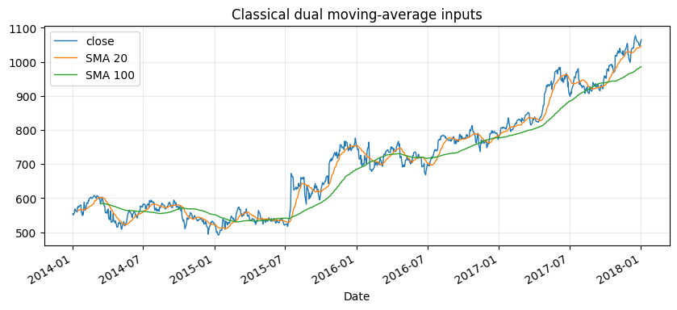
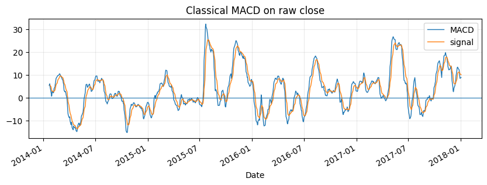
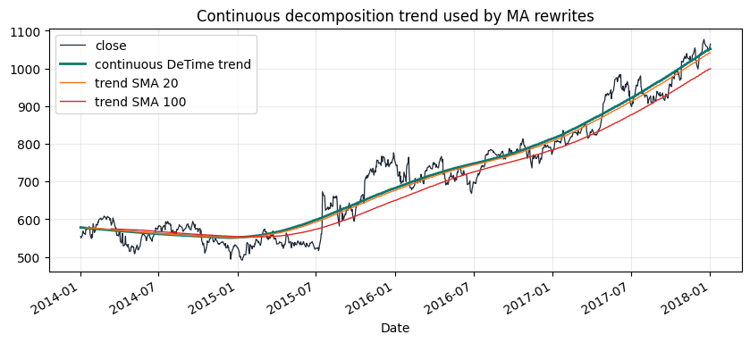
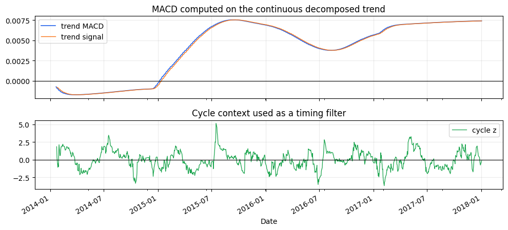
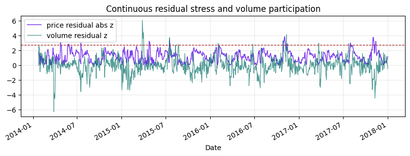
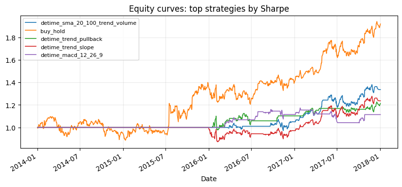
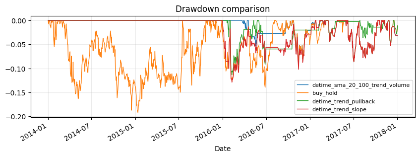
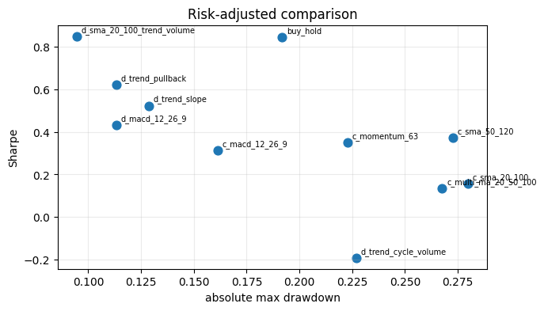
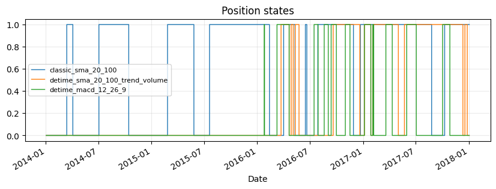

<!-- Generated by scripts/generate_column_notebook_pages.py; do not edit manually. -->
# Tutorial 02 - Moving averages and MACD through decomposition

<div class="gallery-note notebook-transcript-note">
  <strong>Executed tutorial notebook.</strong> This page is generated from <a href="https://github.com/systems-mechanobiology/De-Time/blob/main/examples/notebooks/quant_trading/02_decomposition_aware_moving_average_macd.ipynb"><code>examples/notebooks/quant_trading/02_decomposition_aware_moving_average_macd.ipynb</code></a> and includes markdown cells, code cells, stdout, tables, and captured figures from the committed notebook.
</div>

## Tutorial Navigation

| Track | Tutorial notebook |
|---|---|
| Roadmap | [Tutorial 00 - Roadmap](00_decomposition_first_quant_trading_roadmap.md) |
| Strategy Lab | [01 Trend-Following Lab](01_detime_trend_following_strategy_lab.md) |
| Tutorial Sequence | [01 Real Market Data and Feature Factory](01_market_data_and_decomposition_feature_factory.md) |
| Tutorial Sequence | **02 Decomposition-aware MA and MACD** |
| Strategy Lab | [02 Oscillation-Reversion Lab](02_detime_oscillation_reversion_strategy_lab.md) |
| Strategy Expansion | [03 Method-Specific Variants](03_detime_method_specific_strategy_variants.md) |
| Tutorial Sequence | [03 Residual Mean Reversion](03_residual_mean_reversion_rsi_bollinger.md) |
| Strategy Expansion | [04 Component Pair Trading](04_detime_component_pair_trading_cointegration.md) |
| Tutorial Sequence | [04 Donchian Breakout](04_turtle_donchian_breakout_volume_confirmation.md) |
| Tutorial Sequence | [05 Pair-Spread Stat-Arb](05_pairs_spread_decomposition_stat_arb.md) |
| Tutorial Sequence | [06 Cross-Sectional Rotation](06_cross_sectional_rotation_portfolio.md) |

## Executed Notebook

This tutorial starts from familiar timing strategies-buy and hold, dual moving averages, multi-moving-average alignment, MACD and momentum-then rewrites the signal inputs through De-Time components.

The point is to make the hidden structure explicit: moving averages estimate trend, MACD measures trend acceleration, residual features measure structural overextension, and volume decomposition checks participation.

<div class="notebook-cell">
<div class="notebook-input-label">In [1]</div>

```python
from pathlib import Path

import matplotlib.pyplot as plt
import numpy as np
import pandas as pd
from IPython.display import display

from examples.quant_trading.data import load_sample_goog_ohlcv, market_data_manifest, ohlcv_audit_report
from examples.quant_trading.classic_indicators import macd, sma
from examples.quant_trading.features import walkforward_decompose_ohlcv
from examples.quant_trading.strategy_baselines import make_classic_baseline_weight_grid, run_classical_baselines
from examples.quant_trading.strategy_detime import (
    compare_classical_and_detime,
    make_detime_trend_weight_grid,
    run_detime_trend_baselines,
)
from examples.quant_trading.validation import compare_weight_strategies, write_run_audit

pd.set_option("display.max_columns", 20)
REPORT_DIR = Path("examples/quant_trading/reports")
REPORT_DIR.mkdir(parents=True, exist_ok=True)
```
</div>

## 1. Data and feature setup

The same GOOG OHLCV sample is used so that Tutorial 02 connects directly to the feature factory built in Tutorial 01.

<div class="notebook-cell">
<div class="notebook-input-label">In [2]</div>

```python
ohlcv_single = load_sample_goog_ohlcv(trim_start="2014-01-01")
ticker = ohlcv_single.attrs.get("symbol", "GOOG")
ohlcv = {field: ohlcv_single[[field]].rename(columns={field: ticker}) for field in ["Open", "High", "Low", "Close", "Volume"]}
prices = ohlcv["Close"]
features = walkforward_decompose_ohlcv(
    ohlcv,
    method="STL",
    period="auto",
    period_candidates=(21, 42, 63, 126),
    train_window=252,
    step=21,
    z_window=63,
)
prices.tail()
```

<div class="gallery-out notebook-output">
<div class="notebook-output-label">text/html</div>
<div class="notebook-html-output">
<div>
<style scoped>
    .dataframe tbody tr th:only-of-type {
        vertical-align: middle;
    }

    .dataframe tbody tr th {
        vertical-align: top;
    }

    .dataframe thead th {
        text-align: right;
    }
</style>
<table border="1" class="dataframe">
  <thead>
    <tr style="text-align: right;">
      <th></th>
      <th>GOOG</th>
    </tr>
    <tr>
      <th>Date</th>
      <th></th>
    </tr>
  </thead>
  <tbody>
    <tr>
      <th>2017-12-26</th>
      <td>1056.739990</td>
    </tr>
    <tr>
      <th>2017-12-27</th>
      <td>1049.369995</td>
    </tr>
    <tr>
      <th>2017-12-28</th>
      <td>1048.140015</td>
    </tr>
    <tr>
      <th>2017-12-29</th>
      <td>1046.400024</td>
    </tr>
    <tr>
      <th>2018-01-02</th>
      <td>1065.000000</td>
    </tr>
  </tbody>
</table>
</div>
</div>
</div>
</div>

## 2. Classical baselines first

The baseline layer is intentionally plain: buy-and-hold, dual SMA, MACD, multi-MA alignment and simple momentum. These strategies estimate market state directly from raw close prices.

<div class="notebook-cell">
<div class="notebook-input-label">In [3]</div>

```python
classical_weights = make_classic_baseline_weight_grid(prices)
classical_table, classical_results = compare_weight_strategies(prices, classical_weights, fee_bps=1.0, slippage_bps=2.0)
display(classical_table[["total_return", "cagr", "sharpe", "max_drawdown", "average_turnover"]].round(4))
```

<div class="gallery-out notebook-output">
<div class="notebook-output-label">text/html</div>
<div class="notebook-html-output">
<div>
<style scoped>
    .dataframe tbody tr th:only-of-type {
        vertical-align: middle;
    }

    .dataframe tbody tr th {
        vertical-align: top;
    }

    .dataframe thead th {
        text-align: right;
    }
</style>
<table border="1" class="dataframe">
  <thead>
    <tr style="text-align: right;">
      <th></th>
      <th>total_return</th>
      <th>cagr</th>
      <th>sharpe</th>
      <th>max_drawdown</th>
      <th>average_turnover</th>
    </tr>
    <tr>
      <th>strategy</th>
      <th></th>
      <th></th>
      <th></th>
      <th></th>
      <th></th>
    </tr>
  </thead>
  <tbody>
    <tr>
      <th>buy_hold</th>
      <td>0.9207</td>
      <td>0.1772</td>
      <td>0.8469</td>
      <td>-0.1918</td>
      <td>0.0000</td>
    </tr>
    <tr>
      <th>classic_sma_50_120</th>
      <td>0.2176</td>
      <td>0.0504</td>
      <td>0.3719</td>
      <td>-0.2727</td>
      <td>0.0129</td>
    </tr>
    <tr>
      <th>classic_momentum_63</th>
      <td>0.2095</td>
      <td>0.0487</td>
      <td>0.3515</td>
      <td>-0.2227</td>
      <td>0.0585</td>
    </tr>
    <tr>
      <th>classic_macd_12_26_9</th>
      <td>0.1582</td>
      <td>0.0374</td>
      <td>0.3132</td>
      <td>-0.1612</td>
      <td>0.0813</td>
    </tr>
    <tr>
      <th>classic_sma_20_100</th>
      <td>0.0512</td>
      <td>0.0126</td>
      <td>0.1581</td>
      <td>-0.2797</td>
      <td>0.0169</td>
    </tr>
    <tr>
      <th>classic_multi_ma_20_50_100</th>
      <td>0.0367</td>
      <td>0.0090</td>
      <td>0.1337</td>
      <td>-0.2677</td>
      <td>0.0248</td>
    </tr>
  </tbody>
</table>
</div>
</div>
</div>
</div>

<div class="notebook-cell">
<div class="notebook-input-label">In [4]</div>

```python
fig, ax = plt.subplots(figsize=(10, 4))
prices[ticker].plot(ax=ax, linewidth=1.0, label="close")
sma(prices, 20)[ticker].plot(ax=ax, linewidth=1.0, label="SMA 20")
sma(prices, 100)[ticker].plot(ax=ax, linewidth=1.0, label="SMA 100")
ax.set_title("Classical dual moving-average inputs")
ax.legend()
ax.grid(True, alpha=0.25)
plt.show()
```

<div class="gallery-out notebook-output">
<div class="notebook-output-label">image/png</div>

</div>
</div>

<div class="notebook-cell">
<div class="notebook-input-label">In [5]</div>

```python
classic_macd = macd(prices, fast=12, slow=26, signal=9)
fig, ax = plt.subplots(figsize=(10, 3))
classic_macd["macd"][ticker].plot(ax=ax, linewidth=1.0, label="MACD")
classic_macd["signal"][ticker].plot(ax=ax, linewidth=1.0, label="signal")
ax.axhline(0, linewidth=0.8)
ax.set_title("Classical MACD on raw close")
ax.legend()
ax.grid(True, alpha=0.25)
plt.show()
```

<div class="gallery-out notebook-output">
<div class="notebook-output-label">image/png</div>

</div>
</div>

## 3. De-Time rewrites

The De-Time strategy layer keeps the same trading vocabulary but changes the input object. Dual MA and MACD are calculated on the decomposed trend. Cycle and residual features filter entries that are late in the oscillation or structurally overextended. Volume trend and volume residual confirm participation.

<div class="notebook-cell">
<div class="notebook-input-label">In [6]</div>

```python
detime_weights = make_detime_trend_weight_grid(prices, features)
detime_table, detime_results = compare_weight_strategies(prices, detime_weights, fee_bps=1.0, slippage_bps=2.0)
display(detime_table[["total_return", "cagr", "sharpe", "max_drawdown", "average_turnover"]].round(4))
```

<div class="gallery-out notebook-output">
<div class="notebook-output-label">text/html</div>
<div class="notebook-html-output">
<div>
<style scoped>
    .dataframe tbody tr th:only-of-type {
        vertical-align: middle;
    }

    .dataframe tbody tr th {
        vertical-align: top;
    }

    .dataframe thead th {
        text-align: right;
    }
</style>
<table border="1" class="dataframe">
  <thead>
    <tr style="text-align: right;">
      <th></th>
      <th>total_return</th>
      <th>cagr</th>
      <th>sharpe</th>
      <th>max_drawdown</th>
      <th>average_turnover</th>
    </tr>
    <tr>
      <th>strategy</th>
      <th></th>
      <th></th>
      <th></th>
      <th></th>
      <th></th>
    </tr>
  </thead>
  <tbody>
    <tr>
      <th>detime_macd_12_26_9</th>
      <td>0.2229</td>
      <td>0.0516</td>
      <td>0.7077</td>
      <td>-0.1404</td>
      <td>0.0337</td>
    </tr>
    <tr>
      <th>detime_sma_20_100_trend_volume</th>
      <td>0.2156</td>
      <td>0.0500</td>
      <td>0.4191</td>
      <td>-0.1896</td>
      <td>0.0169</td>
    </tr>
    <tr>
      <th>detime_trend_slope</th>
      <td>0.2159</td>
      <td>0.0501</td>
      <td>0.4037</td>
      <td>-0.1612</td>
      <td>0.0149</td>
    </tr>
    <tr>
      <th>detime_trend_cycle_volume</th>
      <td>-0.0123</td>
      <td>-0.0031</td>
      <td>0.0037</td>
      <td>-0.1559</td>
      <td>0.0149</td>
    </tr>
    <tr>
      <th>detime_trend_pullback</th>
      <td>-0.0238</td>
      <td>-0.0060</td>
      <td>-0.0937</td>
      <td>-0.0920</td>
      <td>0.0069</td>
    </tr>
  </tbody>
</table>
</div>
</div>
</div>
</div>

<div class="notebook-cell">
<div class="notebook-input-label">In [7]</div>

```python
trend_price = np.exp(features["trend"])
fig, ax = plt.subplots(figsize=(10, 4))
prices[ticker].plot(ax=ax, linewidth=0.9, label="close")
trend_price[ticker].plot(ax=ax, linewidth=1.6, label="De-Time trend")
sma(trend_price, 20)[ticker].plot(ax=ax, linewidth=1.0, label="trend SMA 20")
sma(trend_price, 100)[ticker].plot(ax=ax, linewidth=1.0, label="trend SMA 100")
ax.set_title("Moving averages on the decomposed trend")
ax.legend()
ax.grid(True, alpha=0.25)
plt.show()
```

<div class="gallery-out notebook-output">
<div class="notebook-output-label">image/png</div>

</div>
</div>

<div class="notebook-cell">
<div class="notebook-input-label">In [8]</div>

```python
trend_macd = macd(features["trend"], fast=12, slow=26, signal=9)
fig, ax = plt.subplots(figsize=(10, 3))
trend_macd["macd"][ticker].plot(ax=ax, linewidth=1.0, label="trend MACD")
trend_macd["signal"][ticker].plot(ax=ax, linewidth=1.0, label="trend signal")
features["cycle_z"][ticker].plot(ax=ax, linewidth=0.8, alpha=0.45, label="cycle z")
ax.axhline(0, linewidth=0.8)
ax.set_title("MACD on trend plus cycle context")
ax.legend()
ax.grid(True, alpha=0.25)
plt.show()
```

<div class="gallery-out notebook-output">
<div class="notebook-output-label">image/png</div>

</div>
</div>

<div class="notebook-cell">
<div class="notebook-input-label">In [9]</div>

```python
fig, ax = plt.subplots(figsize=(10, 3))
features["residual_abs_z"][ticker].plot(ax=ax, linewidth=1.1, label="abs residual z")
features["volume_residual_z"][ticker].plot(ax=ax, linewidth=0.9, label="volume residual z")
ax.axhline(2.75, linestyle="--", linewidth=0.9)
ax.set_title("Residual stress and volume participation")
ax.legend()
ax.grid(True, alpha=0.25)
plt.show()
```

<div class="gallery-out notebook-output">
<div class="notebook-output-label">image/png</div>

</div>
</div>

## 4. Compare strategy curves

The comparison keeps every baseline visible, then adds the decomposition-aware strategies below the same cost assumptions.

<div class="notebook-cell">
<div class="notebook-input-label">In [10]</div>

```python
comparison = compare_classical_and_detime(
    run_classical_baselines(prices, fee_bps=1.0, slippage_bps=2.0),
    run_detime_trend_baselines(prices, features, fee_bps=1.0, slippage_bps=2.0),
)
display(comparison[["strategy_group", "total_return", "cagr", "sharpe", "max_drawdown", "average_turnover"]].round(4))
```

<div class="gallery-out notebook-output">
<div class="notebook-output-label">text/html</div>
<div class="notebook-html-output">
<div>
<style scoped>
    .dataframe tbody tr th:only-of-type {
        vertical-align: middle;
    }

    .dataframe tbody tr th {
        vertical-align: top;
    }

    .dataframe thead th {
        text-align: right;
    }
</style>
<table border="1" class="dataframe">
  <thead>
    <tr style="text-align: right;">
      <th></th>
      <th>strategy_group</th>
      <th>total_return</th>
      <th>cagr</th>
      <th>sharpe</th>
      <th>max_drawdown</th>
      <th>average_turnover</th>
    </tr>
    <tr>
      <th>strategy</th>
      <th></th>
      <th></th>
      <th></th>
      <th></th>
      <th></th>
      <th></th>
    </tr>
  </thead>
  <tbody>
    <tr>
      <th>buy_hold</th>
      <td>classical</td>
      <td>0.9207</td>
      <td>0.1772</td>
      <td>0.8469</td>
      <td>-0.1918</td>
      <td>0.0000</td>
    </tr>
    <tr>
      <th>detime_macd_12_26_9</th>
      <td>detime</td>
      <td>0.2229</td>
      <td>0.0516</td>
      <td>0.7077</td>
      <td>-0.1404</td>
      <td>0.0337</td>
    </tr>
    <tr>
      <th>detime_sma_20_100_trend_volume</th>
      <td>detime</td>
      <td>0.2156</td>
      <td>0.0500</td>
      <td>0.4191</td>
      <td>-0.1896</td>
      <td>0.0169</td>
    </tr>
    <tr>
      <th>detime_trend_slope</th>
      <td>detime</td>
      <td>0.2159</td>
      <td>0.0501</td>
      <td>0.4037</td>
      <td>-0.1612</td>
      <td>0.0149</td>
    </tr>
    <tr>
      <th>classic_sma_50_120</th>
      <td>classical</td>
      <td>0.2176</td>
      <td>0.0504</td>
      <td>0.3719</td>
      <td>-0.2727</td>
      <td>0.0129</td>
    </tr>
    <tr>
      <th>classic_momentum_63</th>
      <td>classical</td>
      <td>0.2095</td>
      <td>0.0487</td>
      <td>0.3515</td>
      <td>-0.2227</td>
      <td>0.0585</td>
    </tr>
    <tr>
      <th>classic_macd_12_26_9</th>
      <td>classical</td>
      <td>0.1582</td>
      <td>0.0374</td>
      <td>0.3132</td>
      <td>-0.1612</td>
      <td>0.0813</td>
    </tr>
    <tr>
      <th>classic_sma_20_100</th>
      <td>classical</td>
      <td>0.0512</td>
      <td>0.0126</td>
      <td>0.1581</td>
      <td>-0.2797</td>
      <td>0.0169</td>
    </tr>
    <tr>
      <th>classic_multi_ma_20_50_100</th>
      <td>classical</td>
      <td>0.0367</td>
      <td>0.0090</td>
      <td>0.1337</td>
      <td>-0.2677</td>
      <td>0.0248</td>
    </tr>
    <tr>
      <th>detime_trend_cycle_volume</th>
      <td>detime</td>
      <td>-0.0123</td>
      <td>-0.0031</td>
      <td>0.0037</td>
      <td>-0.1559</td>
      <td>0.0149</td>
    </tr>
    <tr>
      <th>detime_trend_pullback</th>
      <td>detime</td>
      <td>-0.0238</td>
      <td>-0.0060</td>
      <td>-0.0937</td>
      <td>-0.0920</td>
      <td>0.0069</td>
    </tr>
  </tbody>
</table>
</div>
</div>
</div>
</div>

<div class="notebook-cell">
<div class="notebook-input-label">In [11]</div>

```python
all_results = {**classical_results, **detime_results}
leaders = comparison.head(5).index.tolist()
fig, ax = plt.subplots(figsize=(10, 4))
for name in leaders:
    all_results[name].equity.plot(ax=ax, linewidth=1.2, label=name)
ax.set_title("Equity curves: top strategies by Sharpe")
ax.legend(loc="best", fontsize=8)
ax.grid(True, alpha=0.25)
plt.show()
```

<div class="gallery-out notebook-output">
<div class="notebook-output-label">image/png</div>

</div>
</div>

<div class="notebook-cell">
<div class="notebook-input-label">In [12]</div>

```python
fig, ax = plt.subplots(figsize=(10, 3))
for name in leaders[:4]:
    dd = all_results[name].equity / all_results[name].equity.cummax() - 1.0
    dd.plot(ax=ax, linewidth=1.0, label=name)
ax.set_title("Drawdown comparison")
ax.legend(loc="best", fontsize=8)
ax.grid(True, alpha=0.25)
plt.show()
```

<div class="gallery-out notebook-output">
<div class="notebook-output-label">image/png</div>

</div>
</div>

<div class="notebook-cell">
<div class="notebook-input-label">In [13]</div>

```python
plot_table = comparison.copy()
fig, ax = plt.subplots(figsize=(7, 4))
ax.scatter(plot_table["max_drawdown"].abs(), plot_table["sharpe"], s=60)
for name, row in plot_table.iterrows():
    ax.annotate(name.replace("classic_", "c_").replace("detime_", "d_"), (abs(row["max_drawdown"]), row["sharpe"]), fontsize=7, xytext=(4, 4), textcoords="offset points")
ax.set_xlabel("absolute max drawdown")
ax.set_ylabel("Sharpe")
ax.set_title("Risk-adjusted comparison")
ax.grid(True, alpha=0.25)
plt.show()
```

<div class="gallery-out notebook-output">
<div class="notebook-output-label">image/png</div>

</div>
</div>

<div class="notebook-cell">
<div class="notebook-input-label">In [14]</div>

```python
fig, ax = plt.subplots(figsize=(10, 3))
for name in ["classic_sma_20_100", "detime_sma_20_100_trend_volume", "detime_macd_12_26_9"]:
    weights = (classical_weights | detime_weights)[name]
    weights[ticker].plot(ax=ax, drawstyle="steps-post", linewidth=1.0, label=name)
ax.set_title("Position states")
ax.legend(loc="best", fontsize=8)
ax.grid(True, alpha=0.25)
plt.show()
```

<div class="gallery-out notebook-output">
<div class="notebook-output-label">image/png</div>

</div>
</div>

<div class="notebook-cell">
<div class="notebook-input-label">In [15]</div>

```python
paths = write_run_audit(
    REPORT_DIR,
    data_manifest=market_data_manifest(
        tickers=[ticker],
        start=str(prices.index.min().date()),
        end=str(prices.index.max().date()),
        interval="1d",
        source=ohlcv_single.attrs.get("source", "bundled historical OHLCV sample"),
    ),
    audit=ohlcv_audit_report(ohlcv),
    strategy_stats=comparison,
    prefix="column_02",
)
display(pd.DataFrame({"artifact": list(paths), "path": [str(p) for p in paths.values()]}))
```

<div class="gallery-out notebook-output">
<div class="notebook-output-label">text/html</div>
<div class="notebook-html-output">
<div>
<style scoped>
    .dataframe tbody tr th:only-of-type {
        vertical-align: middle;
    }

    .dataframe tbody tr th {
        vertical-align: top;
    }

    .dataframe thead th {
        text-align: right;
    }
</style>
<table border="1" class="dataframe">
  <thead>
    <tr style="text-align: right;">
      <th></th>
      <th>artifact</th>
      <th>path</th>
    </tr>
  </thead>
  <tbody>
    <tr>
      <th>0</th>
      <td>manifest</td>
      <td>examples\quant_trading\reports\column_02_marke...</td>
    </tr>
    <tr>
      <th>1</th>
      <td>data_audit</td>
      <td>examples\quant_trading\reports\column_02_data_...</td>
    </tr>
    <tr>
      <th>2</th>
      <td>strategy_stats</td>
      <td>examples\quant_trading\reports\column_02_strat...</td>
    </tr>
    <tr>
      <th>3</th>
      <td>run_manifest</td>
      <td>examples\quant_trading\reports\column_02_run_m...</td>
    </tr>
  </tbody>
</table>
</div>
</div>
</div>
</div>
