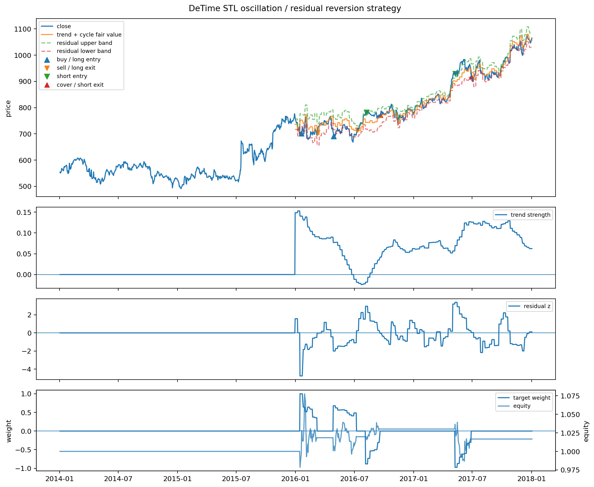

<!-- Generated by scripts/generate_column_notebook_pages.py; do not edit manually. -->
# Strategy Lab 02 - Oscillation / residual-reversion strategy

<div class="gallery-note notebook-transcript-note">
  <strong>Executed tutorial notebook.</strong> This page is generated from <a href="https://github.com/systems-mechanobiology/De-Time/blob/main/examples/notebooks/quant_trading/02_detime_oscillation_reversion_strategy_lab.ipynb"><code>examples/notebooks/quant_trading/02_detime_oscillation_reversion_strategy_lab.ipynb</code></a> and includes markdown cells, code cells, stdout, tables, and captured figures from the committed notebook.
</div>

## Tutorial Navigation

| Track | Tutorial notebook |
|---|---|
| Roadmap | [Tutorial 00 - Roadmap](00_decomposition_first_quant_trading_roadmap.md) |
| Strategy Lab | [01 Trend-Following Lab](01_detime_trend_following_strategy_lab.md) |
| Tutorial Sequence | [01 Real Market Data and Feature Factory](01_market_data_and_decomposition_feature_factory.md) |
| Tutorial Sequence | [02 Decomposition-aware MA and MACD](02_decomposition_aware_moving_average_macd.md) |
| Strategy Lab | **02 Oscillation-Reversion Lab** |
| Strategy Expansion | [03 Method-Specific Variants](03_detime_method_specific_strategy_variants.md) |
| Tutorial Sequence | [03 Residual Mean Reversion](03_residual_mean_reversion_rsi_bollinger.md) |
| Strategy Expansion | [04 Component Pair Trading](04_detime_component_pair_trading_cointegration.md) |
| Tutorial Sequence | [04 Donchian Breakout](04_turtle_donchian_breakout_volume_confirmation.md) |
| Tutorial Sequence | [05 Pair-Spread Stat-Arb](05_pairs_spread_decomposition_stat_arb.md) |
| Tutorial Sequence | [06 Cross-Sectional Rotation](06_cross_sectional_rotation_portfolio.md) |
| Native SSA Replay | [07 Native SSA High-Return / Low-Drawdown](07_native_ssa_high_return_low_drawdown_tutorial.md) |

## Executed Notebook

这篇只做震荡恢复。假设最近窗口里趋势不强，价格主要围绕 `trend + cycle` 波动。

策略逻辑：

1. 先用 `abs(trend_strength)` 判断是否是弱趋势/震荡环境。
2. `fair value = exp(trend + cycle)`。
3. `residual_z < -entry_z`：价格低于当前趋势+周期结构，做多或买入。
4. `residual_z > entry_z`：价格高于当前趋势+周期结构，卖出或做空。
5. 回到 `residual_z ≈ 0` 附近退出。
6. 信号在第 t 根 bar 结束后生成，回测用下一根 bar 的开盘价成交。

<div class="notebook-cell">
<div class="notebook-input-label">In [1]</div>

```python
from pathlib import Path

import pandas as pd
from IPython.display import Image, display
from quant_trading.data import load_sample_goog_ohlcv
from quant_trading.decomposition_features import walkforward_price_volume_features
from quant_trading.strategy_lab import (
    TrendFollowingConfig,
    OscillationReversionConfig,
    backtest_signal_set,
    execution_price_panel,
    decomposition_trend_following_signals,
    decomposition_oscillation_reversion_signals,
    plot_signal_analysis,
    stats_table,
)
from quant_trading.strategy_baselines import (
    buy_and_hold_weights,
    dual_moving_average_weights,
    bollinger_mean_reversion_weights,
)
from quant_trading.strategy_lab import backtest_target_weights_next_bar

CHART_DIR = Path("examples/quant_trading/reports/strategy_lab/charts")
```
</div>

<div class="notebook-cell">
<div class="notebook-input-label">In [2]</div>

```python
ohlcv = load_sample_goog_ohlcv(trim_start="2014-01-01")
symbol = "GOOG"
close = ohlcv["Close"].rename(symbol).to_frame()
volume = ohlcv["Volume"].rename(symbol).to_frame()
execution_prices = execution_price_panel(ohlcv, field="Open", next_bar=True)
execution_prices.columns = [symbol]

features = walkforward_price_volume_features(
    close, volume, method="STL", period=42, train_window=180, step=21, z_window=63
)
```
</div>

<div class="notebook-cell">
<div class="notebook-input-label">In [3]</div>

```python
signal = decomposition_oscillation_reversion_signals(
    close,
    features,
    config=OscillationReversionConfig(
        entry_residual_z=1.75,
        exit_residual_z=0.15,
        max_abs_trend_strength=0.35,
        require_cycle_turn=True,
        allow_short=True,
    ),
    name="detime_STL_oscillation_reversion",
)

bt = backtest_signal_set(
    close, signal, execution_prices=execution_prices, fee_bps=5, slippage_bps=2, periods_per_year=252
)

baselines = {
    "buy_hold": buy_and_hold_weights(close),
    "classic_bollinger_20_2": bollinger_mean_reversion_weights(close, window=20, entry_z=2.0, allow_short=True),
}
results = {signal.name: bt}
for name, weights in baselines.items():
    results[name] = backtest_target_weights_next_bar(
        close, weights, execution_prices=execution_prices, fee_bps=5, slippage_bps=2, periods_per_year=252, name=name
    )

stats_table(results)
```

<div class="gallery-out notebook-output">
<div class="notebook-output-label">text/html</div>
<div class="notebook-html-output">
<div>
<style scoped>
    .dataframe tbody tr th:only-of-type {
        vertical-align: middle;
    }

    .dataframe tbody tr th {
        vertical-align: top;
    }

    .dataframe thead th {
        text-align: right;
    }
</style>
<table border="1" class="dataframe">
  <thead>
    <tr style="text-align: right;">
      <th></th>
      <th>strategy</th>
      <th>total_return</th>
      <th>cagr</th>
      <th>sharpe</th>
      <th>max_drawdown</th>
      <th>calmar</th>
      <th>volatility</th>
      <th>hit_rate</th>
      <th>trade_win_rate</th>
      <th>average_trade_directional_return</th>
      <th>orders</th>
      <th>round_trips</th>
      <th>median_bars_held</th>
      <th>average_turnover</th>
      <th>average_gross_exposure</th>
      <th>fee_bps</th>
      <th>slippage_bps</th>
      <th>periods_per_year</th>
      <th>execution_model</th>
    </tr>
  </thead>
  <tbody>
    <tr>
      <th>1</th>
      <td>buy_hold</td>
      <td>0.887479</td>
      <td>0.172116</td>
      <td>0.799165</td>
      <td>-0.192787</td>
      <td>0.892778</td>
      <td>0.232171</td>
      <td>0.524802</td>
      <td>NaN</td>
      <td>NaN</td>
      <td>1.0</td>
      <td>0.0</td>
      <td>NaN</td>
      <td>0.000000</td>
      <td>1.000000</td>
      <td>5.0</td>
      <td>2.0</td>
      <td>252.0</td>
      <td>signal_on_bar_t_fill_next_bar_open_or_proxy</td>
    </tr>
    <tr>
      <th>2</th>
      <td>classic_bollinger_20_2</td>
      <td>0.323543</td>
      <td>0.072592</td>
      <td>0.478267</td>
      <td>-0.207060</td>
      <td>0.350584</td>
      <td>0.181238</td>
      <td>0.255952</td>
      <td>0.725</td>
      <td>0.009610</td>
      <td>79.0</td>
      <td>40.0</td>
      <td>9.5</td>
      <td>0.080357</td>
      <td>0.490079</td>
      <td>5.0</td>
      <td>2.0</td>
      <td>252.0</td>
      <td>signal_on_bar_t_fill_next_bar_open_or_proxy</td>
    </tr>
    <tr>
      <th>0</th>
      <td>detime_STL_oscillation_reversion</td>
      <td>0.063435</td>
      <td>0.015495</td>
      <td>0.372000</td>
      <td>-0.065752</td>
      <td>0.235656</td>
      <td>0.043914</td>
      <td>0.068452</td>
      <td>1.000</td>
      <td>0.070517</td>
      <td>9.0</td>
      <td>3.0</td>
      <td>42.0</td>
      <td>0.004347</td>
      <td>0.069338</td>
      <td>5.0</td>
      <td>2.0</td>
      <td>252.0</td>
      <td>signal_on_bar_t_fill_next_bar_open_or_proxy</td>
    </tr>
  </tbody>
</table>
</div>
</div>
</div>
</div>

<div class="notebook-cell">
<div class="notebook-input-label">In [4]</div>

```python
# residual_z is the actual traded deviation.  Negative values mean price is below trend+cycle.
pd.concat({
    "close": close[symbol],
    "fair_value": signal.diagnostics["fair_value"][symbol],
    "residual_z": signal.diagnostics["residual_z"][symbol],
    "weak_trend_regime": signal.diagnostics["weak_trend_regime"][symbol],
    "target_weight": signal.target_weights[symbol],
}, axis=1).tail(12)
```

<div class="gallery-out notebook-output">
<div class="notebook-output-label">text/html</div>
<div class="notebook-html-output">
<div>
<style scoped>
    .dataframe tbody tr th:only-of-type {
        vertical-align: middle;
    }

    .dataframe tbody tr th {
        vertical-align: top;
    }

    .dataframe thead th {
        text-align: right;
    }
</style>
<table border="1" class="dataframe">
  <thead>
    <tr style="text-align: right;">
      <th></th>
      <th>close</th>
      <th>fair_value</th>
      <th>residual_z</th>
      <th>weak_trend_regime</th>
      <th>target_weight</th>
    </tr>
    <tr>
      <th>Date</th>
      <th></th>
      <th></th>
      <th></th>
      <th></th>
      <th></th>
    </tr>
  </thead>
  <tbody>
    <tr>
      <th>2017-12-14</th>
      <td>1049.150024</td>
      <td>1029.967131</td>
      <td>0.725678</td>
      <td>1.0</td>
      <td>0.0</td>
    </tr>
    <tr>
      <th>2017-12-15</th>
      <td>1064.189941</td>
      <td>1029.967131</td>
      <td>0.725678</td>
      <td>1.0</td>
      <td>0.0</td>
    </tr>
    <tr>
      <th>2017-12-18</th>
      <td>1077.140015</td>
      <td>1078.319116</td>
      <td>-0.118095</td>
      <td>1.0</td>
      <td>0.0</td>
    </tr>
    <tr>
      <th>2017-12-19</th>
      <td>1070.680054</td>
      <td>1078.319116</td>
      <td>-0.118095</td>
      <td>1.0</td>
      <td>0.0</td>
    </tr>
    <tr>
      <th>2017-12-20</th>
      <td>1064.949951</td>
      <td>1078.319116</td>
      <td>-0.118095</td>
      <td>1.0</td>
      <td>0.0</td>
    </tr>
    <tr>
      <th>2017-12-21</th>
      <td>1063.630005</td>
      <td>1078.319116</td>
      <td>-0.118095</td>
      <td>1.0</td>
      <td>0.0</td>
    </tr>
    <tr>
      <th>2017-12-22</th>
      <td>1060.119995</td>
      <td>1078.319116</td>
      <td>-0.118095</td>
      <td>1.0</td>
      <td>0.0</td>
    </tr>
    <tr>
      <th>2017-12-26</th>
      <td>1056.739990</td>
      <td>1078.319116</td>
      <td>-0.118095</td>
      <td>1.0</td>
      <td>0.0</td>
    </tr>
    <tr>
      <th>2017-12-27</th>
      <td>1049.369995</td>
      <td>1078.319116</td>
      <td>-0.118095</td>
      <td>1.0</td>
      <td>0.0</td>
    </tr>
    <tr>
      <th>2017-12-28</th>
      <td>1048.140015</td>
      <td>1078.319116</td>
      <td>-0.118095</td>
      <td>1.0</td>
      <td>0.0</td>
    </tr>
    <tr>
      <th>2017-12-29</th>
      <td>1046.400024</td>
      <td>1078.319116</td>
      <td>-0.118095</td>
      <td>1.0</td>
      <td>0.0</td>
    </tr>
    <tr>
      <th>2018-01-02</th>
      <td>1065.000000</td>
      <td>1078.319116</td>
      <td>-0.118095</td>
      <td>1.0</td>
      <td>0.0</td>
    </tr>
  </tbody>
</table>
</div>
</div>
</div>
</div>

<div class="notebook-cell">
<div class="notebook-input-label">In [5]</div>

```python
bt.orders.tail(12)
```

<div class="gallery-out notebook-output">
<div class="notebook-output-label">text/html</div>
<div class="notebook-html-output">
<div>
<style scoped>
    .dataframe tbody tr th:only-of-type {
        vertical-align: middle;
    }

    .dataframe tbody tr th {
        vertical-align: top;
    }

    .dataframe thead th {
        text-align: right;
    }
</style>
<table border="1" class="dataframe">
  <thead>
    <tr style="text-align: right;">
      <th></th>
      <th>asset</th>
      <th>signal_date</th>
      <th>fill_date</th>
      <th>action</th>
      <th>previous_weight</th>
      <th>new_weight</th>
      <th>delta_weight</th>
      <th>fill_price</th>
    </tr>
  </thead>
  <tbody>
    <tr>
      <th>0</th>
      <td>GOOG</td>
      <td>2015-02-19</td>
      <td>2015-02-20</td>
      <td>sell_or_short</td>
      <td>0.000000</td>
      <td>-0.802886</td>
      <td>-0.802886</td>
      <td>541.642944</td>
    </tr>
    <tr>
      <th>1</th>
      <td>GOOG</td>
      <td>2015-03-20</td>
      <td>2015-03-23</td>
      <td>buy</td>
      <td>-0.802886</td>
      <td>-0.462620</td>
      <td>0.340267</td>
      <td>558.895569</td>
    </tr>
    <tr>
      <th>2</th>
      <td>GOOG</td>
      <td>2015-04-21</td>
      <td>2015-04-22</td>
      <td>cover</td>
      <td>-0.462620</td>
      <td>0.000000</td>
      <td>0.462620</td>
      <td>532.936829</td>
    </tr>
    <tr>
      <th>3</th>
      <td>GOOG</td>
      <td>2015-09-18</td>
      <td>2015-09-21</td>
      <td>buy</td>
      <td>0.000000</td>
      <td>0.700360</td>
      <td>0.700360</td>
      <td>634.400024</td>
    </tr>
    <tr>
      <th>4</th>
      <td>GOOG</td>
      <td>2015-10-19</td>
      <td>2015-10-20</td>
      <td>sell_or_short</td>
      <td>0.700360</td>
      <td>0.291135</td>
      <td>-0.409225</td>
      <td>664.039978</td>
    </tr>
    <tr>
      <th>5</th>
      <td>GOOG</td>
      <td>2015-11-17</td>
      <td>2015-11-18</td>
      <td>sell</td>
      <td>0.291135</td>
      <td>0.000000</td>
      <td>-0.291135</td>
      <td>727.580017</td>
    </tr>
    <tr>
      <th>6</th>
      <td>GOOG</td>
      <td>2016-03-21</td>
      <td>2016-03-22</td>
      <td>sell_or_short</td>
      <td>0.000000</td>
      <td>-0.687773</td>
      <td>-0.687773</td>
      <td>737.460022</td>
    </tr>
    <tr>
      <th>7</th>
      <td>GOOG</td>
      <td>2016-04-20</td>
      <td>2016-04-21</td>
      <td>buy</td>
      <td>-0.687773</td>
      <td>-0.383438</td>
      <td>0.304335</td>
      <td>755.380005</td>
    </tr>
    <tr>
      <th>8</th>
      <td>GOOG</td>
      <td>2016-05-19</td>
      <td>2016-05-20</td>
      <td>cover</td>
      <td>-0.383438</td>
      <td>0.000000</td>
      <td>0.383438</td>
      <td>701.619995</td>
    </tr>
  </tbody>
</table>
</div>
</div>
</div>
</div>

<div class="notebook-cell">
<div class="notebook-input-label">In [6]</div>

```python
bt.trades.tail(12)
```

<div class="gallery-out notebook-output">
<div class="notebook-output-label">text/html</div>
<div class="notebook-html-output">
<div>
<style scoped>
    .dataframe tbody tr th:only-of-type {
        vertical-align: middle;
    }

    .dataframe tbody tr th {
        vertical-align: top;
    }

    .dataframe thead th {
        text-align: right;
    }
</style>
<table border="1" class="dataframe">
  <thead>
    <tr style="text-align: right;">
      <th></th>
      <th>asset</th>
      <th>side</th>
      <th>entry_signal_date</th>
      <th>entry_fill_date</th>
      <th>exit_signal_date</th>
      <th>exit_fill_date</th>
      <th>entry_price</th>
      <th>exit_price</th>
      <th>bars_held</th>
      <th>entry_weight</th>
      <th>directional_return</th>
      <th>approx_weighted_return_after_cost</th>
    </tr>
  </thead>
  <tbody>
    <tr>
      <th>0</th>
      <td>GOOG</td>
      <td>short</td>
      <td>2015-02-19</td>
      <td>2015-02-20</td>
      <td>2015-04-21</td>
      <td>2015-04-22</td>
      <td>541.642944</td>
      <td>532.936829</td>
      <td>42</td>
      <td>-0.802886</td>
      <td>0.016074</td>
      <td>0.012343</td>
    </tr>
    <tr>
      <th>1</th>
      <td>GOOG</td>
      <td>long</td>
      <td>2015-09-18</td>
      <td>2015-09-21</td>
      <td>2015-11-17</td>
      <td>2015-11-18</td>
      <td>634.400024</td>
      <td>727.580017</td>
      <td>42</td>
      <td>0.700360</td>
      <td>0.146879</td>
      <td>0.102378</td>
    </tr>
    <tr>
      <th>2</th>
      <td>GOOG</td>
      <td>short</td>
      <td>2016-03-21</td>
      <td>2016-03-22</td>
      <td>2016-05-19</td>
      <td>2016-05-20</td>
      <td>737.460022</td>
      <td>701.619995</td>
      <td>42</td>
      <td>-0.687773</td>
      <td>0.048599</td>
      <td>0.032944</td>
    </tr>
  </tbody>
</table>
</div>
</div>
</div>
</div>

<div class="notebook-cell">
<div class="notebook-input-label">In [7]</div>

```python
out = CHART_DIR / "notebook_02_oscillation_reversion.png"
plot_signal_analysis(ohlcv, signal, bt, asset=symbol, output_path=out, title="De-Time STL oscillation / residual reversion strategy")
display(Image(filename=str(out)))
out.as_posix()
```

<div class="gallery-out notebook-output">
<div class="notebook-output-label">image/png</div>

<div class="notebook-output-label">text/plain</div>
```text
'examples/quant_trading/reports/strategy_lab/charts/notebook_02_oscillation_reversion.png'
```
</div>
</div>
