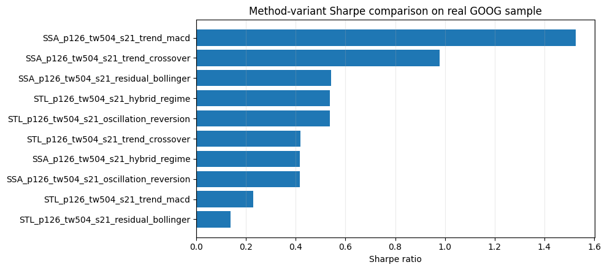

<!-- Generated by scripts/generate_column_notebook_pages.py; do not edit manually. -->
# Strategy Expansion 03 - Method-specific strategy variants

<div class="gallery-note notebook-transcript-note">
  <strong>Executed tutorial notebook.</strong> This page is generated from <a href="https://github.com/systems-mechanobiology/De-Time/blob/main/examples/notebooks/quant_trading/03_detime_method_specific_strategy_variants.ipynb"><code>examples/notebooks/quant_trading/03_detime_method_specific_strategy_variants.ipynb</code></a> and includes markdown cells, code cells, stdout, tables, and captured figures from the committed notebook.
</div>

## Tutorial Navigation

| Track | Tutorial notebook |
|---|---|
| Roadmap | [Tutorial 00 - Roadmap](00_decomposition_first_quant_trading_roadmap.md) |
| Strategy Lab | [01 Trend-Following Lab](01_detime_trend_following_strategy_lab.md) |
| Tutorial Sequence | [01 Real Market Data and Feature Factory](01_market_data_and_decomposition_feature_factory.md) |
| Tutorial Sequence | [02 Decomposition-aware MA and MACD](02_decomposition_aware_moving_average_macd.md) |
| Strategy Lab | [02 Oscillation-Reversion Lab](02_detime_oscillation_reversion_strategy_lab.md) |
| Strategy Expansion | **03 Method-Specific Variants** |
| Tutorial Sequence | [03 Residual Mean Reversion](03_residual_mean_reversion_rsi_bollinger.md) |
| Strategy Expansion | [04 Component Pair Trading](04_detime_component_pair_trading_cointegration.md) |
| Tutorial Sequence | [04 Donchian Breakout](04_turtle_donchian_breakout_volume_confirmation.md) |
| Tutorial Sequence | [05 Pair-Spread Stat-Arb](05_pairs_spread_decomposition_stat_arb.md) |
| Tutorial Sequence | [06 Cross-Sectional Rotation](06_cross_sectional_rotation_portfolio.md) |

## Executed Notebook

This notebook shows the core tutorial point: different decomposition methods and windows create different strategies because they produce different trend, cycle, and residual components. The trading rule is held mostly fixed; the decomposition front-end changes the signal.

## Strategy map

The notebook runs five decomposition-based strategy families:

- trend following from decomposed trend;
- oscillation reversion from residual z-score;
- residual Bollinger bands around trend + cycle fair value;
- MACD computed on the decomposed trend;
- dual-EMA crossover computed on the decomposed trend.

Each method/period/window combination is treated as one strategy variant.

<div class="notebook-cell">
<div class="notebook-input-label">In [1]</div>

```python
import matplotlib.pyplot as plt

from quant_trading.data import load_sample_goog_ohlcv
from quant_trading.strategy_lab import execution_price_panel
from quant_trading.strategy_method_variants import (
    DecompositionVariantSpec,
    collect_orders_and_trades,
    run_method_variant_grid,
)
```
</div>

<div class="notebook-cell">
<div class="notebook-input-label">In [2]</div>

```python
ohlcv = load_sample_goog_ohlcv(trim_start='2014-01-01')
symbol = 'GOOG'
close = ohlcv['Close'].rename(symbol).to_frame()
volume = ohlcv['Volume'].rename(symbol).to_frame()
execution_prices = execution_price_panel(ohlcv, field='Open', next_bar=True)
execution_prices.columns = [symbol]

close.tail()
```

<div class="gallery-out notebook-output">
<div class="notebook-output-label">text/html</div>
<div class="notebook-html-output">
<div>
<style scoped>
    .dataframe tbody tr th:only-of-type {
        vertical-align: middle;
    }

    .dataframe tbody tr th {
        vertical-align: top;
    }

    .dataframe thead th {
        text-align: right;
    }
</style>
<table border="1" class="dataframe">
  <thead>
    <tr style="text-align: right;">
      <th></th>
      <th>GOOG</th>
    </tr>
    <tr>
      <th>Date</th>
      <th></th>
    </tr>
  </thead>
  <tbody>
    <tr>
      <th>2017-12-26</th>
      <td>1056.739990</td>
    </tr>
    <tr>
      <th>2017-12-27</th>
      <td>1049.369995</td>
    </tr>
    <tr>
      <th>2017-12-28</th>
      <td>1048.140015</td>
    </tr>
    <tr>
      <th>2017-12-29</th>
      <td>1046.400024</td>
    </tr>
    <tr>
      <th>2018-01-02</th>
      <td>1065.000000</td>
    </tr>
  </tbody>
</table>
</div>
</div>
</div>
</div>

## Build a compact method grid

The grid below is intentionally small for a notebook. A full research run can add periods 21/42/63/126, shorter steps, and optional Wavelet/EMD/VMD variants.

<div class="notebook-cell">
<div class="notebook-input-label">In [3]</div>

```python
specs = [
    DecompositionVariantSpec('STL', period=42, train_window=126, step=126, z_window=63, role='fixed_period_medium_cycle'),
    DecompositionVariantSpec('SSA', period=42, train_window=126, step=126, z_window=63, role='subspace_medium_cycle'),
    DecompositionVariantSpec('STD', period=42, train_window=126, step=126, z_window=63, role='dispersion_medium_cycle'),
]

stats, results, spec_table, coverage, failed = run_method_variant_grid(
    close,
    volume,
    specs=specs,
    execution_prices=execution_prices,
    allow_short_trend=False,
    allow_short_reversion=True,
)

stats.head(20)
```

<div class="gallery-out notebook-output">
<div class="notebook-output-label">text/html</div>
<div class="notebook-html-output">
<div>
<style scoped>
    .dataframe tbody tr th:only-of-type {
        vertical-align: middle;
    }

    .dataframe tbody tr th {
        vertical-align: top;
    }

    .dataframe thead th {
        text-align: right;
    }
</style>
<table border="1" class="dataframe">
  <thead>
    <tr style="text-align: right;">
      <th></th>
      <th>strategy</th>
      <th>strategy_family</th>
      <th>decomposition_variant</th>
      <th>total_return</th>
      <th>cagr</th>
      <th>sharpe</th>
      <th>max_drawdown</th>
      <th>calmar</th>
      <th>volatility</th>
      <th>hit_rate</th>
      <th>...</th>
      <th>periods_per_year</th>
      <th>execution_model</th>
      <th>spec_method</th>
      <th>spec_period</th>
      <th>spec_train_window</th>
      <th>spec_step</th>
      <th>spec_z_window</th>
      <th>spec_label</th>
      <th>spec_role</th>
      <th>spec_name</th>
    </tr>
  </thead>
  <tbody>
    <tr>
      <th>0</th>
      <td>detime_SSA_p42_tw126_s126_residual_bollinger</td>
      <td>residual_bollinger</td>
      <td>SSA_p42_tw126_s126</td>
      <td>0.160924</td>
      <td>0.038009</td>
      <td>0.778688</td>
      <td>-0.071692</td>
      <td>0.530162</td>
      <td>0.049479</td>
      <td>0.068452</td>
      <td>...</td>
      <td>252.0</td>
      <td>signal_on_bar_t_fill_next_bar_open_or_proxy</td>
      <td>SSA</td>
      <td>42</td>
      <td>126</td>
      <td>126</td>
      <td>63</td>
      <td>None</td>
      <td>subspace_medium_cycle</td>
      <td>SSA_p42_tw126_s126</td>
    </tr>
    <tr>
      <th>1</th>
      <td>detime_STL_p42_tw126_s126_trend_following</td>
      <td>trend_following</td>
      <td>STL_p42_tw126_s126</td>
      <td>0.038382</td>
      <td>0.009460</td>
      <td>0.259828</td>
      <td>-0.060050</td>
      <td>0.157543</td>
      <td>0.039205</td>
      <td>0.131944</td>
      <td>...</td>
      <td>252.0</td>
      <td>signal_on_bar_t_fill_next_bar_open_or_proxy</td>
      <td>STL</td>
      <td>42</td>
      <td>126</td>
      <td>126</td>
      <td>63</td>
      <td>None</td>
      <td>fixed_period_medium_cycle</td>
      <td>STL_p42_tw126_s126</td>
    </tr>
    <tr>
      <th>2</th>
      <td>detime_STL_p42_tw126_s126_trend_crossover</td>
      <td>trend_crossover</td>
      <td>STL_p42_tw126_s126</td>
      <td>0.086823</td>
      <td>0.021033</td>
      <td>0.258085</td>
      <td>-0.148693</td>
      <td>0.141451</td>
      <td>0.100254</td>
      <td>0.131944</td>
      <td>...</td>
      <td>252.0</td>
      <td>signal_on_bar_t_fill_next_bar_open_or_proxy</td>
      <td>STL</td>
      <td>42</td>
      <td>126</td>
      <td>126</td>
      <td>63</td>
      <td>None</td>
      <td>fixed_period_medium_cycle</td>
      <td>STL_p42_tw126_s126</td>
    </tr>
    <tr>
      <th>3</th>
      <td>detime_SSA_p42_tw126_s126_trend_crossover</td>
      <td>trend_crossover</td>
      <td>SSA_p42_tw126_s126</td>
      <td>0.086823</td>
      <td>0.021033</td>
      <td>0.258085</td>
      <td>-0.148693</td>
      <td>0.141451</td>
      <td>0.100254</td>
      <td>0.131944</td>
      <td>...</td>
      <td>252.0</td>
      <td>signal_on_bar_t_fill_next_bar_open_or_proxy</td>
      <td>SSA</td>
      <td>42</td>
      <td>126</td>
      <td>126</td>
      <td>63</td>
      <td>None</td>
      <td>subspace_medium_cycle</td>
      <td>SSA_p42_tw126_s126</td>
    </tr>
    <tr>
      <th>4</th>
      <td>detime_STL_p42_tw126_s126_trend_macd</td>
      <td>trend_macd</td>
      <td>STL_p42_tw126_s126</td>
      <td>0.026480</td>
      <td>0.006555</td>
      <td>0.185995</td>
      <td>-0.077487</td>
      <td>0.084597</td>
      <td>0.039296</td>
      <td>0.018849</td>
      <td>...</td>
      <td>252.0</td>
      <td>signal_on_bar_t_fill_next_bar_open_or_proxy</td>
      <td>STL</td>
      <td>42</td>
      <td>126</td>
      <td>126</td>
      <td>63</td>
      <td>None</td>
      <td>fixed_period_medium_cycle</td>
      <td>STL_p42_tw126_s126</td>
    </tr>
    <tr>
      <th>5</th>
      <td>detime_SSA_p42_tw126_s126_trend_macd</td>
      <td>trend_macd</td>
      <td>SSA_p42_tw126_s126</td>
      <td>0.026480</td>
      <td>0.006555</td>
      <td>0.185995</td>
      <td>-0.077487</td>
      <td>0.084597</td>
      <td>0.039296</td>
      <td>0.018849</td>
      <td>...</td>
      <td>252.0</td>
      <td>signal_on_bar_t_fill_next_bar_open_or_proxy</td>
      <td>SSA</td>
      <td>42</td>
      <td>126</td>
      <td>126</td>
      <td>63</td>
      <td>None</td>
      <td>subspace_medium_cycle</td>
      <td>SSA_p42_tw126_s126</td>
    </tr>
    <tr>
      <th>6</th>
      <td>detime_STL_p42_tw126_s126_hybrid_regime</td>
      <td>hybrid_regime</td>
      <td>STL_p42_tw126_s126</td>
      <td>0.000000</td>
      <td>0.000000</td>
      <td>0.000000</td>
      <td>0.000000</td>
      <td>NaN</td>
      <td>0.000000</td>
      <td>0.000000</td>
      <td>...</td>
      <td>252.0</td>
      <td>signal_on_bar_t_fill_next_bar_open_or_proxy</td>
      <td>STL</td>
      <td>42</td>
      <td>126</td>
      <td>126</td>
      <td>63</td>
      <td>None</td>
      <td>fixed_period_medium_cycle</td>
      <td>STL_p42_tw126_s126</td>
    </tr>
    <tr>
      <th>7</th>
      <td>detime_STL_p42_tw126_s126_residual_bollinger</td>
      <td>residual_bollinger</td>
      <td>STL_p42_tw126_s126</td>
      <td>0.000000</td>
      <td>0.000000</td>
      <td>0.000000</td>
      <td>0.000000</td>
      <td>NaN</td>
      <td>0.000000</td>
      <td>0.000000</td>
      <td>...</td>
      <td>252.0</td>
      <td>signal_on_bar_t_fill_next_bar_open_or_proxy</td>
      <td>STL</td>
      <td>42</td>
      <td>126</td>
      <td>126</td>
      <td>63</td>
      <td>None</td>
      <td>fixed_period_medium_cycle</td>
      <td>STL_p42_tw126_s126</td>
    </tr>
    <tr>
      <th>8</th>
      <td>detime_SSA_p42_tw126_s126_trend_following</td>
      <td>trend_following</td>
      <td>SSA_p42_tw126_s126</td>
      <td>0.000000</td>
      <td>0.000000</td>
      <td>0.000000</td>
      <td>0.000000</td>
      <td>NaN</td>
      <td>0.000000</td>
      <td>0.000000</td>
      <td>...</td>
      <td>252.0</td>
      <td>signal_on_bar_t_fill_next_bar_open_or_proxy</td>
      <td>SSA</td>
      <td>42</td>
      <td>126</td>
      <td>126</td>
      <td>63</td>
      <td>None</td>
      <td>subspace_medium_cycle</td>
      <td>SSA_p42_tw126_s126</td>
    </tr>
    <tr>
      <th>9</th>
      <td>detime_SSA_p42_tw126_s126_oscillation_reversion</td>
      <td>oscillation_reversion</td>
      <td>SSA_p42_tw126_s126</td>
      <td>0.000000</td>
      <td>0.000000</td>
      <td>0.000000</td>
      <td>0.000000</td>
      <td>NaN</td>
      <td>0.000000</td>
      <td>0.000000</td>
      <td>...</td>
      <td>252.0</td>
      <td>signal_on_bar_t_fill_next_bar_open_or_proxy</td>
      <td>SSA</td>
      <td>42</td>
      <td>126</td>
      <td>126</td>
      <td>63</td>
      <td>None</td>
      <td>subspace_medium_cycle</td>
      <td>SSA_p42_tw126_s126</td>
    </tr>
    <tr>
      <th>10</th>
      <td>detime_SSA_p42_tw126_s126_hybrid_regime</td>
      <td>hybrid_regime</td>
      <td>SSA_p42_tw126_s126</td>
      <td>0.000000</td>
      <td>0.000000</td>
      <td>0.000000</td>
      <td>0.000000</td>
      <td>NaN</td>
      <td>0.000000</td>
      <td>0.000000</td>
      <td>...</td>
      <td>252.0</td>
      <td>signal_on_bar_t_fill_next_bar_open_or_proxy</td>
      <td>SSA</td>
      <td>42</td>
      <td>126</td>
      <td>126</td>
      <td>63</td>
      <td>None</td>
      <td>subspace_medium_cycle</td>
      <td>SSA_p42_tw126_s126</td>
    </tr>
    <tr>
      <th>11</th>
      <td>detime_STL_p42_tw126_s126_oscillation_reversion</td>
      <td>oscillation_reversion</td>
      <td>STL_p42_tw126_s126</td>
      <td>0.000000</td>
      <td>0.000000</td>
      <td>0.000000</td>
      <td>0.000000</td>
      <td>NaN</td>
      <td>0.000000</td>
      <td>0.000000</td>
      <td>...</td>
      <td>252.0</td>
      <td>signal_on_bar_t_fill_next_bar_open_or_proxy</td>
      <td>STL</td>
      <td>42</td>
      <td>126</td>
      <td>126</td>
      <td>63</td>
      <td>None</td>
      <td>fixed_period_medium_cycle</td>
      <td>STL_p42_tw126_s126</td>
    </tr>
    <tr>
      <th>12</th>
      <td>detime_STD_p42_tw126_s126_trend_following</td>
      <td>trend_following</td>
      <td>STD_p42_tw126_s126</td>
      <td>0.000000</td>
      <td>0.000000</td>
      <td>0.000000</td>
      <td>0.000000</td>
      <td>NaN</td>
      <td>0.000000</td>
      <td>0.000000</td>
      <td>...</td>
      <td>252.0</td>
      <td>signal_on_bar_t_fill_next_bar_open_or_proxy</td>
      <td>STD</td>
      <td>42</td>
      <td>126</td>
      <td>126</td>
      <td>63</td>
      <td>None</td>
      <td>dispersion_medium_cycle</td>
      <td>STD_p42_tw126_s126</td>
    </tr>
    <tr>
      <th>13</th>
      <td>detime_STD_p42_tw126_s126_oscillation_reversion</td>
      <td>oscillation_reversion</td>
      <td>STD_p42_tw126_s126</td>
      <td>0.000000</td>
      <td>0.000000</td>
      <td>0.000000</td>
      <td>0.000000</td>
      <td>NaN</td>
      <td>0.000000</td>
      <td>0.000000</td>
      <td>...</td>
      <td>252.0</td>
      <td>signal_on_bar_t_fill_next_bar_open_or_proxy</td>
      <td>STD</td>
      <td>42</td>
      <td>126</td>
      <td>126</td>
      <td>63</td>
      <td>None</td>
      <td>dispersion_medium_cycle</td>
      <td>STD_p42_tw126_s126</td>
    </tr>
    <tr>
      <th>14</th>
      <td>detime_STD_p42_tw126_s126_hybrid_regime</td>
      <td>hybrid_regime</td>
      <td>STD_p42_tw126_s126</td>
      <td>0.000000</td>
      <td>0.000000</td>
      <td>0.000000</td>
      <td>0.000000</td>
      <td>NaN</td>
      <td>0.000000</td>
      <td>0.000000</td>
      <td>...</td>
      <td>252.0</td>
      <td>signal_on_bar_t_fill_next_bar_open_or_proxy</td>
      <td>STD</td>
      <td>42</td>
      <td>126</td>
      <td>126</td>
      <td>63</td>
      <td>None</td>
      <td>dispersion_medium_cycle</td>
      <td>STD_p42_tw126_s126</td>
    </tr>
    <tr>
      <th>15</th>
      <td>detime_STD_p42_tw126_s126_residual_bollinger</td>
      <td>residual_bollinger</td>
      <td>STD_p42_tw126_s126</td>
      <td>0.000000</td>
      <td>0.000000</td>
      <td>0.000000</td>
      <td>0.000000</td>
      <td>NaN</td>
      <td>0.000000</td>
      <td>0.000000</td>
      <td>...</td>
      <td>252.0</td>
      <td>signal_on_bar_t_fill_next_bar_open_or_proxy</td>
      <td>STD</td>
      <td>42</td>
      <td>126</td>
      <td>126</td>
      <td>63</td>
      <td>None</td>
      <td>dispersion_medium_cycle</td>
      <td>STD_p42_tw126_s126</td>
    </tr>
    <tr>
      <th>16</th>
      <td>detime_STD_p42_tw126_s126_trend_macd</td>
      <td>trend_macd</td>
      <td>STD_p42_tw126_s126</td>
      <td>0.000000</td>
      <td>0.000000</td>
      <td>0.000000</td>
      <td>0.000000</td>
      <td>NaN</td>
      <td>0.000000</td>
      <td>0.000000</td>
      <td>...</td>
      <td>252.0</td>
      <td>signal_on_bar_t_fill_next_bar_open_or_proxy</td>
      <td>STD</td>
      <td>42</td>
      <td>126</td>
      <td>126</td>
      <td>63</td>
      <td>None</td>
      <td>dispersion_medium_cycle</td>
      <td>STD_p42_tw126_s126</td>
    </tr>
    <tr>
      <th>17</th>
      <td>detime_STD_p42_tw126_s126_trend_crossover</td>
      <td>trend_crossover</td>
      <td>STD_p42_tw126_s126</td>
      <td>0.000000</td>
      <td>0.000000</td>
      <td>0.000000</td>
      <td>0.000000</td>
      <td>NaN</td>
      <td>0.000000</td>
      <td>0.000000</td>
      <td>...</td>
      <td>252.0</td>
      <td>signal_on_bar_t_fill_next_bar_open_or_proxy</td>
      <td>STD</td>
      <td>42</td>
      <td>126</td>
      <td>126</td>
      <td>63</td>
      <td>None</td>
      <td>dispersion_medium_cycle</td>
      <td>STD_p42_tw126_s126</td>
    </tr>
  </tbody>
</table>
<p>18 rows × 29 columns</p>
</div>
</div>
</div>
</div>

<div class="notebook-cell">
<div class="notebook-input-label">In [4]</div>

```python
plot_stats = stats.sort_values("sharpe", ascending=True).tail(10).copy()
labels = plot_stats["strategy"].astype(str).str.replace("detime_", "", regex=False)
fig, ax = plt.subplots(figsize=(10, 4.5))
ax.barh(labels, plot_stats["sharpe"])
ax.axvline(0, color="black", linewidth=0.8)
ax.set_xlabel("Sharpe ratio")
ax.set_title("Method-variant Sharpe comparison on real GOOG sample")
ax.grid(True, axis="x", alpha=0.25)
plt.tight_layout()
plt.show()
```

<div class="gallery-out notebook-output">
<div class="notebook-output-label">image/png</div>

</div>
</div>

<div class="notebook-cell">
<div class="notebook-input-label">In [5]</div>

```python
orders, trades = collect_orders_and_trades(results)
print('orders:', len(orders))
print('round-trip trades:', len(trades))
trades.head()
```

<div class="gallery-out notebook-output">
<div class="notebook-output-label">stdout</div>
```text
orders: 18
round-trip trades: 7
```
<div class="notebook-output-label">text/html</div>
<div class="notebook-html-output">
<div>
<style scoped>
    .dataframe tbody tr th:only-of-type {
        vertical-align: middle;
    }

    .dataframe tbody tr th {
        vertical-align: top;
    }

    .dataframe thead th {
        text-align: right;
    }
</style>
<table border="1" class="dataframe">
  <thead>
    <tr style="text-align: right;">
      <th></th>
      <th>strategy</th>
      <th>asset</th>
      <th>side</th>
      <th>entry_signal_date</th>
      <th>entry_fill_date</th>
      <th>exit_signal_date</th>
      <th>exit_fill_date</th>
      <th>entry_price</th>
      <th>exit_price</th>
      <th>bars_held</th>
      <th>entry_weight</th>
      <th>directional_return</th>
      <th>approx_weighted_return_after_cost</th>
    </tr>
  </thead>
  <tbody>
    <tr>
      <th>0</th>
      <td>detime_STL_p42_tw126_s126_trend_following</td>
      <td>GOOG</td>
      <td>long</td>
      <td>2015-12-31</td>
      <td>2016-01-04</td>
      <td>2016-07-01</td>
      <td>2016-07-05</td>
      <td>743.00000</td>
      <td>696.059998</td>
      <td>126</td>
      <td>0.390457</td>
      <td>-0.063176</td>
      <td>-0.024941</td>
    </tr>
    <tr>
      <th>1</th>
      <td>detime_STL_p42_tw126_s126_trend_macd</td>
      <td>GOOG</td>
      <td>long</td>
      <td>2015-12-31</td>
      <td>2016-01-04</td>
      <td>2016-01-22</td>
      <td>2016-01-25</td>
      <td>743.00000</td>
      <td>723.580017</td>
      <td>14</td>
      <td>1.000000</td>
      <td>-0.026137</td>
      <td>-0.026837</td>
    </tr>
    <tr>
      <th>2</th>
      <td>detime_STL_p42_tw126_s126_trend_macd</td>
      <td>GOOG</td>
      <td>long</td>
      <td>2017-07-03</td>
      <td>2017-07-05</td>
      <td>2017-07-24</td>
      <td>2017-07-25</td>
      <td>901.76001</td>
      <td>953.809998</td>
      <td>14</td>
      <td>1.000000</td>
      <td>0.057720</td>
      <td>0.057020</td>
    </tr>
    <tr>
      <th>3</th>
      <td>detime_STL_p42_tw126_s126_trend_crossover</td>
      <td>GOOG</td>
      <td>long</td>
      <td>2015-12-31</td>
      <td>2016-01-04</td>
      <td>2016-07-01</td>
      <td>2016-07-05</td>
      <td>743.00000</td>
      <td>696.059998</td>
      <td>126</td>
      <td>1.000000</td>
      <td>-0.063176</td>
      <td>-0.063876</td>
    </tr>
    <tr>
      <th>4</th>
      <td>detime_SSA_p42_tw126_s126_trend_macd</td>
      <td>GOOG</td>
      <td>long</td>
      <td>2015-12-31</td>
      <td>2016-01-04</td>
      <td>2016-01-22</td>
      <td>2016-01-25</td>
      <td>743.00000</td>
      <td>723.580017</td>
      <td>14</td>
      <td>1.000000</td>
      <td>-0.026137</td>
      <td>-0.026837</td>
    </tr>
  </tbody>
</table>
</div>
</div>
</div>
</div>

<div class="notebook-cell">
<div class="notebook-input-label">In [6]</div>

```python
coverage.groupby(['method', 'variant', 'feature'])['coverage'].max().reset_index().head(20)
```

<div class="gallery-out notebook-output">
<div class="notebook-output-label">text/html</div>
<div class="notebook-html-output">
<div>
<style scoped>
    .dataframe tbody tr th:only-of-type {
        vertical-align: middle;
    }

    .dataframe tbody tr th {
        vertical-align: top;
    }

    .dataframe thead th {
        text-align: right;
    }
</style>
<table border="1" class="dataframe">
  <thead>
    <tr style="text-align: right;">
      <th></th>
      <th>method</th>
      <th>variant</th>
      <th>feature</th>
      <th>coverage</th>
    </tr>
  </thead>
  <tbody>
    <tr>
      <th>0</th>
      <td>SSA</td>
      <td>SSA_p42_tw126_s126</td>
      <td>component_stability</td>
      <td>0.875992</td>
    </tr>
    <tr>
      <th>1</th>
      <td>SSA</td>
      <td>SSA_p42_tw126_s126</td>
      <td>cycle</td>
      <td>0.875992</td>
    </tr>
    <tr>
      <th>2</th>
      <td>SSA</td>
      <td>SSA_p42_tw126_s126</td>
      <td>cycle_amplitude</td>
      <td>0.875992</td>
    </tr>
    <tr>
      <th>3</th>
      <td>SSA</td>
      <td>SSA_p42_tw126_s126</td>
      <td>cycle_position</td>
      <td>0.875992</td>
    </tr>
    <tr>
      <th>4</th>
      <td>SSA</td>
      <td>SSA_p42_tw126_s126</td>
      <td>cycle_slope</td>
      <td>0.875992</td>
    </tr>
    <tr>
      <th>5</th>
      <td>SSA</td>
      <td>SSA_p42_tw126_s126</td>
      <td>cycle_turn_up</td>
      <td>0.875992</td>
    </tr>
    <tr>
      <th>6</th>
      <td>SSA</td>
      <td>SSA_p42_tw126_s126</td>
      <td>cycle_z</td>
      <td>0.875992</td>
    </tr>
    <tr>
      <th>7</th>
      <td>SSA</td>
      <td>SSA_p42_tw126_s126</td>
      <td>reconstruction_error</td>
      <td>0.875992</td>
    </tr>
    <tr>
      <th>8</th>
      <td>SSA</td>
      <td>SSA_p42_tw126_s126</td>
      <td>residual</td>
      <td>0.875992</td>
    </tr>
    <tr>
      <th>9</th>
      <td>SSA</td>
      <td>SSA_p42_tw126_s126</td>
      <td>residual_abs_z</td>
      <td>0.875992</td>
    </tr>
    <tr>
      <th>10</th>
      <td>SSA</td>
      <td>SSA_p42_tw126_s126</td>
      <td>residual_vol</td>
      <td>0.875992</td>
    </tr>
    <tr>
      <th>11</th>
      <td>SSA</td>
      <td>SSA_p42_tw126_s126</td>
      <td>residual_z</td>
      <td>0.875992</td>
    </tr>
    <tr>
      <th>12</th>
      <td>SSA</td>
      <td>SSA_p42_tw126_s126</td>
      <td>selected_period</td>
      <td>0.875992</td>
    </tr>
    <tr>
      <th>13</th>
      <td>SSA</td>
      <td>SSA_p42_tw126_s126</td>
      <td>trend</td>
      <td>0.875992</td>
    </tr>
    <tr>
      <th>14</th>
      <td>SSA</td>
      <td>SSA_p42_tw126_s126</td>
      <td>trend_acceleration</td>
      <td>0.875992</td>
    </tr>
    <tr>
      <th>15</th>
      <td>SSA</td>
      <td>SSA_p42_tw126_s126</td>
      <td>trend_gap</td>
      <td>0.875992</td>
    </tr>
    <tr>
      <th>16</th>
      <td>SSA</td>
      <td>SSA_p42_tw126_s126</td>
      <td>trend_slope</td>
      <td>0.875992</td>
    </tr>
    <tr>
      <th>17</th>
      <td>SSA</td>
      <td>SSA_p42_tw126_s126</td>
      <td>trend_strength</td>
      <td>0.875992</td>
    </tr>
    <tr>
      <th>18</th>
      <td>SSA</td>
      <td>SSA_p42_tw126_s126</td>
      <td>volume_component_stability</td>
      <td>0.875992</td>
    </tr>
    <tr>
      <th>19</th>
      <td>SSA</td>
      <td>SSA_p42_tw126_s126</td>
      <td>volume_cycle</td>
      <td>0.875992</td>
    </tr>
  </tbody>
</table>
</div>
</div>
</div>
</div>

## Parameter interpretation

- `period` is the assumed cycle length. It plays a similar role to an indicator window.
- `train_window` controls how much recent history the decomposition sees. Short windows adapt quickly; long windows produce smoother components.
- `step` controls how often the decomposition is recomputed in walk-forward mode. Smaller steps are more responsive and more expensive.
- `z_window` controls residual normalization and residual-band sensitivity.
