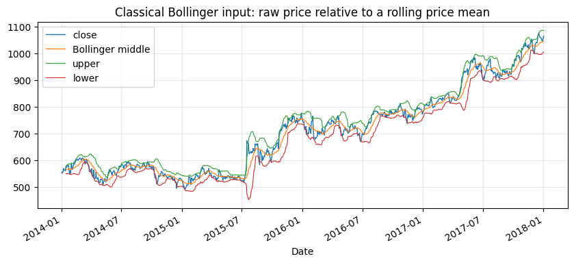
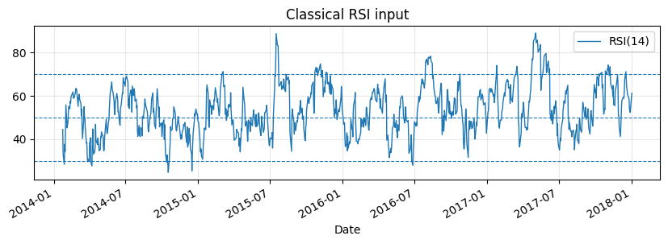
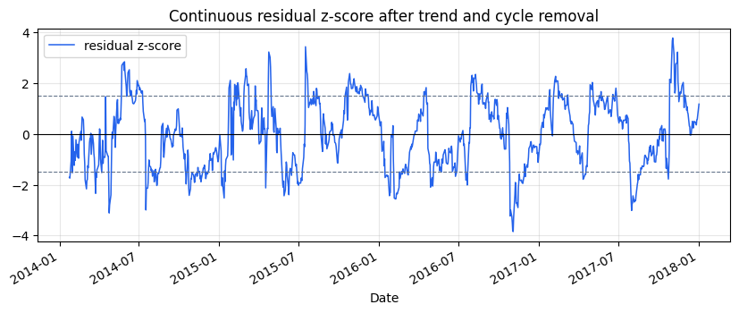
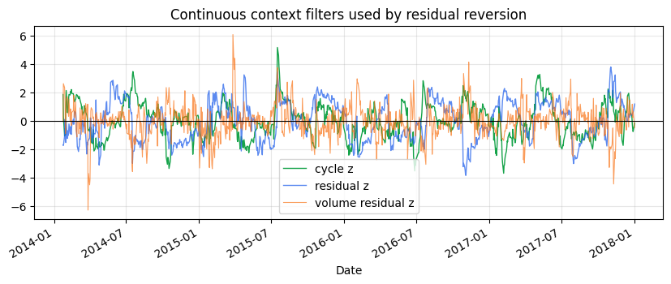
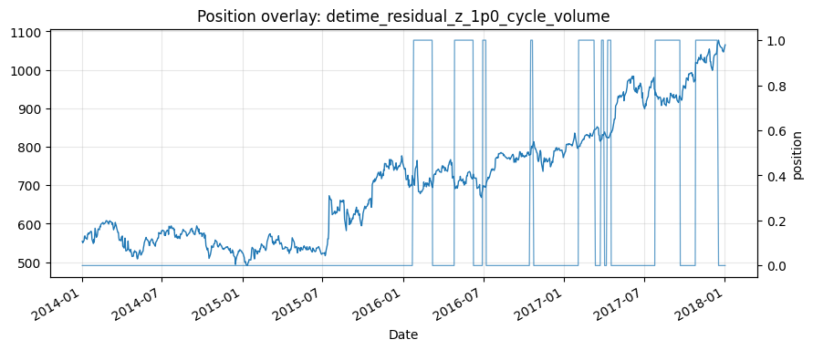

<!-- Generated by scripts/generate_column_notebook_pages.py; do not edit manually. -->
# Tutorial 03 - Residual mean reversion: RSI, Bollinger and residual bands

<div class="gallery-note notebook-transcript-note">
  <strong>Executed tutorial notebook.</strong> This page is generated from <a href="https://github.com/systems-mechanobiology/DeTime/blob/main/examples/notebooks/quant_trading/03_residual_mean_reversion_rsi_bollinger.ipynb"><code>examples/notebooks/quant_trading/03_residual_mean_reversion_rsi_bollinger.ipynb</code></a> and includes markdown cells, code cells, stdout, tables, and captured figures from the committed notebook.
</div>

## Tutorial Navigation

| Track | Tutorial notebook |
|---|---|
| Roadmap | [Tutorial 00 - Roadmap](00_decomposition_first_quant_trading_roadmap.md) |
| Strategy Lab | [01 Trend-Following Lab](01_detime_trend_following_strategy_lab.md) |
| Tutorial Sequence | [01 Real Market Data and Feature Factory](01_market_data_and_decomposition_feature_factory.md) |
| Tutorial Sequence | [02 Decomposition-aware MA and MACD](02_decomposition_aware_moving_average_macd.md) |
| Strategy Lab | [02 Oscillation-Reversion Lab](02_detime_oscillation_reversion_strategy_lab.md) |
| Strategy Expansion | [03 Method-Specific Variants](03_detime_method_specific_strategy_variants.md) |
| Tutorial Sequence | **03 Residual Mean Reversion** |
| Strategy Expansion | [04 Component Pair Trading](04_detime_component_pair_trading_cointegration.md) |
| Tutorial Sequence | [04 Donchian Breakout](04_turtle_donchian_breakout_volume_confirmation.md) |
| Tutorial Sequence | [05 Pair-Spread Stat-Arb](05_pairs_spread_decomposition_stat_arb.md) |
| Tutorial Sequence | [06 Cross-Sectional Rotation](06_cross_sectional_rotation_portfolio.md) |
| Native SSA Replay | [07 Native SSA High-Return / Low-Drawdown](07_native_ssa_high_return_low_drawdown_tutorial.md) |

## Executed Notebook

Classical mean reversion asks whether raw price is far from a rolling reference. The DeTime version asks a narrower question: after the current trend and cycle are removed, is the residual unusually cheap or expensive?

The examples keep the classical baselines visible: RSI, Bollinger, raw price z-score and APO. The decomposition-aware versions trade residual pressure and use cycle, trend and volume state as gates.

<div class="notebook-cell">
<div class="notebook-input-label">In [1]</div>

```python
from pathlib import Path

import matplotlib.pyplot as plt
import pandas as pd
from IPython.display import display

from examples.quant_trading.data import load_sample_goog_ohlcv, market_data_manifest, ohlcv_audit_report
from examples.quant_trading.features import build_feature_table, decompose_one_series, walkforward_decompose_ohlcv
from examples.quant_trading.classic_indicators import bollinger_bands, rsi
from examples.quant_trading.strategy_mean_reversion import (
    compare_mean_reversion_suites,
    make_classic_mean_reversion_weight_grid,
    make_detime_mean_reversion_weight_grid,
    run_classical_mean_reversion_baselines,
    run_detime_mean_reversion_baselines,
)
from examples.quant_trading.validation import compare_weight_strategies, turnover_report, write_run_audit, write_run_manifest

pd.set_option("display.max_columns", 30)
report_dir = Path("examples/quant_trading/reports")
report_dir.mkdir(parents=True, exist_ok=True)
```
</div>

## 1. Real OHLCV input

The notebook is executable without network access by using the bundled historical GOOG OHLCV export from the Learn Algorithmic Trading material. The live scripts use Yahoo Finance through `yfinance` when a network is available.

<div class="notebook-cell">
<div class="notebook-input-label">In [2]</div>

```python
ohlcv_single = load_sample_goog_ohlcv(trim_start="2014-01-01")
ticker = ohlcv_single.attrs.get("symbol", "GOOG")
ohlcv = {field: ohlcv_single[[field]].rename(columns={field: ticker}) for field in ["Open", "High", "Low", "Close", "Volume"]}
prices = ohlcv["Close"]
manifest = market_data_manifest(
    tickers=[ticker],
    start=str(prices.index.min().date()),
    end=str(prices.index.max().date()),
    interval="1d",
    source=ohlcv_single.attrs.get("source", "bundled real sample"),
)
audit = ohlcv_audit_report(ohlcv)
display(audit)
```

<div class="gallery-out notebook-output">
<div class="notebook-output-label">text/html</div>
<div class="notebook-html-output">
<div>
<style scoped>
    .dataframe tbody tr th:only-of-type {
        vertical-align: middle;
    }

    .dataframe tbody tr th {
        vertical-align: top;
    }

    .dataframe thead th {
        text-align: right;
    }
</style>
<table border="1" class="dataframe">
  <thead>
    <tr style="text-align: right;">
      <th></th>
      <th>ticker</th>
      <th>first_timestamp</th>
      <th>last_timestamp</th>
      <th>observations</th>
      <th>close_missing_ratio</th>
      <th>volume_missing_ratio</th>
      <th>zero_volume_ratio</th>
      <th>min_close</th>
      <th>max_close</th>
      <th>median_volume</th>
    </tr>
  </thead>
  <tbody>
    <tr>
      <th>0</th>
      <td>GOOG</td>
      <td>2014-01-02</td>
      <td>2018-01-02</td>
      <td>1008</td>
      <td>0.0</td>
      <td>0.0</td>
      <td>0.0</td>
      <td>491.201416</td>
      <td>1077.140015</td>
      <td>1624450.0</td>
    </tr>
  </tbody>
</table>
</div>
</div>
</div>
</div>

## 2. Classical baselines

These are intentionally simple. They show what the original tutorial style would usually teach before introducing decomposition.

<div class="notebook-cell">
<div class="notebook-input-label">In [3]</div>

```python
classic_weights = make_classic_mean_reversion_weight_grid(prices, allow_short=False)
classic_table, classic_results = compare_weight_strategies(prices, classic_weights, fee_bps=1.0, slippage_bps=2.0)
display(classic_table[["total_return", "cagr", "sharpe", "max_drawdown", "average_turnover"]].round(4))
```

<div class="gallery-out notebook-output">
<div class="notebook-output-label">text/html</div>
<div class="notebook-html-output">
<div>
<style scoped>
    .dataframe tbody tr th:only-of-type {
        vertical-align: middle;
    }

    .dataframe tbody tr th {
        vertical-align: top;
    }

    .dataframe thead th {
        text-align: right;
    }
</style>
<table border="1" class="dataframe">
  <thead>
    <tr style="text-align: right;">
      <th></th>
      <th>total_return</th>
      <th>cagr</th>
      <th>sharpe</th>
      <th>max_drawdown</th>
      <th>average_turnover</th>
    </tr>
    <tr>
      <th>strategy</th>
      <th></th>
      <th></th>
      <th></th>
      <th></th>
      <th></th>
    </tr>
  </thead>
  <tbody>
    <tr>
      <th>classic_rsi_14_reversion</th>
      <td>0.2044</td>
      <td>0.0476</td>
      <td>0.7005</td>
      <td>-0.1049</td>
      <td>0.0099</td>
    </tr>
    <tr>
      <th>classic_price_zscore_63_1p5z</th>
      <td>0.3026</td>
      <td>0.0683</td>
      <td>0.6916</td>
      <td>-0.1397</td>
      <td>0.0198</td>
    </tr>
    <tr>
      <th>classic_apo_10_40_reversion</th>
      <td>0.2409</td>
      <td>0.0554</td>
      <td>0.5102</td>
      <td>-0.1571</td>
      <td>0.0179</td>
    </tr>
    <tr>
      <th>classic_bollinger_20_2z</th>
      <td>0.1744</td>
      <td>0.0410</td>
      <td>0.4239</td>
      <td>-0.1769</td>
      <td>0.0317</td>
    </tr>
  </tbody>
</table>
</div>
</div>
</div>
</div>

<div class="notebook-cell">
<div class="notebook-input-label">In [4]</div>

```python
bands = bollinger_bands(prices, window=20, num_std=2.0)
raw_rsi = rsi(prices, window=14)
fig, ax = plt.subplots(figsize=(10, 4))
prices[ticker].plot(ax=ax, linewidth=1.0, label="close")
bands.middle[ticker].plot(ax=ax, linewidth=0.9, label="Bollinger middle")
bands.upper[ticker].plot(ax=ax, linewidth=0.8, label="upper")
bands.lower[ticker].plot(ax=ax, linewidth=0.8, label="lower")
ax.set_title("Classical Bollinger input: raw price relative to a rolling price mean")
ax.legend()
ax.grid(True, alpha=0.3)
plt.show()

fig, ax = plt.subplots(figsize=(10, 2.8))
raw_rsi[ticker].plot(ax=ax, linewidth=1.0, label="RSI(14)")
for level in (30, 50, 70):
    ax.axhline(level, linestyle="--", linewidth=0.8)
ax.set_title("Classical RSI input")
ax.legend()
ax.grid(True, alpha=0.3)
plt.show()
```

<div class="gallery-out notebook-output">
<div class="notebook-output-label">image/png</div>

<div class="notebook-output-label">image/png</div>

</div>
</div>

## 3. DeTime residual, cycle, trend and volume features

The feature factory uses walk-forward decomposition. The latest feature at each step is carried forward until the next training window closes, avoiding full-sample decomposition leakage.

<div class="notebook-cell">
<div class="notebook-input-label">In [5]</div>

```python
features = walkforward_decompose_ohlcv(
    ohlcv,
    method="STL",
    period="auto",
    period_candidates=(63, 126, 252),
    train_window=504,
    step=5,
    z_window=63,
)
feature_tail = build_feature_table(prices, features).tail(120)
display(feature_tail.tail(5).round(4))
feature_tail.to_csv(report_dir / "column_03_feature_table_tail.csv")
```

<div class="gallery-out notebook-output">
<div class="notebook-output-label">text/html</div>
<div class="notebook-html-output">
<div>
<style scoped>
    .dataframe tbody tr th:only-of-type {
        vertical-align: middle;
    }

    .dataframe tbody tr th {
        vertical-align: top;
    }

    .dataframe thead tr th {
        text-align: left;
    }

    .dataframe thead tr:last-of-type th {
        text-align: right;
    }
</style>
<table border="1" class="dataframe">
  <thead>
    <tr>
      <th></th>
      <th>component_stability</th>
      <th>cycle</th>
      <th>cycle_amplitude</th>
      <th>cycle_position</th>
      <th>cycle_slope</th>
      <th>cycle_turn_up</th>
      <th>cycle_z</th>
      <th>realized_vol_20</th>
      <th>reconstruction_error</th>
      <th>residual</th>
      <th>residual_abs_z</th>
      <th>residual_vol</th>
      <th>residual_z</th>
      <th>return_1d</th>
      <th>season</th>
      <th>...</th>
      <th>volume_cycle_turn_up</th>
      <th>volume_cycle_z</th>
      <th>volume_participation</th>
      <th>volume_reconstruction_error</th>
      <th>volume_residual</th>
      <th>volume_residual_abs_z</th>
      <th>volume_residual_vol</th>
      <th>volume_residual_z</th>
      <th>volume_selected_period</th>
      <th>volume_shock</th>
      <th>volume_trend</th>
      <th>volume_trend_acceleration</th>
      <th>volume_trend_gap</th>
      <th>volume_trend_slope</th>
      <th>volume_trend_strength</th>
    </tr>
    <tr>
      <th></th>
      <th>GOOG</th>
      <th>GOOG</th>
      <th>GOOG</th>
      <th>GOOG</th>
      <th>GOOG</th>
      <th>GOOG</th>
      <th>GOOG</th>
      <th>GOOG</th>
      <th>GOOG</th>
      <th>GOOG</th>
      <th>GOOG</th>
      <th>GOOG</th>
      <th>GOOG</th>
      <th>GOOG</th>
      <th>GOOG</th>
      <th>...</th>
      <th>GOOG</th>
      <th>GOOG</th>
      <th>GOOG</th>
      <th>GOOG</th>
      <th>GOOG</th>
      <th>GOOG</th>
      <th>GOOG</th>
      <th>GOOG</th>
      <th>GOOG</th>
      <th>GOOG</th>
      <th>GOOG</th>
      <th>GOOG</th>
      <th>GOOG</th>
      <th>GOOG</th>
      <th>GOOG</th>
    </tr>
    <tr>
      <th>Date</th>
      <th></th>
      <th></th>
      <th></th>
      <th></th>
      <th></th>
      <th></th>
      <th></th>
      <th></th>
      <th></th>
      <th></th>
      <th></th>
      <th></th>
      <th></th>
      <th></th>
      <th></th>
      <th></th>
      <th></th>
      <th></th>
      <th></th>
      <th></th>
      <th></th>
      <th></th>
      <th></th>
      <th></th>
      <th></th>
      <th></th>
      <th></th>
      <th></th>
      <th></th>
      <th></th>
      <th></th>
    </tr>
  </thead>
  <tbody>
    <tr>
      <th>2017-12-26</th>
      <td>0.9853</td>
      <td>0.0456</td>
      <td>0.0438</td>
      <td>1.0414</td>
      <td>-0.0051</td>
      <td>0.0</td>
      <td>0.6138</td>
      <td>0.1515</td>
      <td>0.0</td>
      <td>0.0004</td>
      <td>0.1109</td>
      <td>0.0149</td>
      <td>0.1109</td>
      <td>-0.0032</td>
      <td>0.0456</td>
      <td>...</td>
      <td>0.0</td>
      <td>-0.5708</td>
      <td>2.0</td>
      <td>0.0</td>
      <td>-0.2911</td>
      <td>2.3259</td>
      <td>0.1243</td>
      <td>-2.3259</td>
      <td>126.0</td>
      <td>2.3259</td>
      <td>14.0559</td>
      <td>-0.0</td>
      <td>-0.514</td>
      <td>-0.0011</td>
      <td>-0.0031</td>
    </tr>
    <tr>
      <th>2017-12-27</th>
      <td>0.9853</td>
      <td>0.0456</td>
      <td>0.0438</td>
      <td>1.0414</td>
      <td>-0.0051</td>
      <td>0.0</td>
      <td>0.6138</td>
      <td>0.1518</td>
      <td>0.0</td>
      <td>0.0004</td>
      <td>0.1109</td>
      <td>0.0149</td>
      <td>0.1109</td>
      <td>-0.0070</td>
      <td>0.0456</td>
      <td>...</td>
      <td>0.0</td>
      <td>-0.5708</td>
      <td>2.0</td>
      <td>0.0</td>
      <td>-0.2911</td>
      <td>2.3259</td>
      <td>0.1243</td>
      <td>-2.3259</td>
      <td>126.0</td>
      <td>2.3259</td>
      <td>14.0559</td>
      <td>-0.0</td>
      <td>-0.514</td>
      <td>-0.0011</td>
      <td>-0.0031</td>
    </tr>
    <tr>
      <th>2017-12-28</th>
      <td>0.9853</td>
      <td>0.0456</td>
      <td>0.0438</td>
      <td>1.0414</td>
      <td>-0.0051</td>
      <td>0.0</td>
      <td>0.6138</td>
      <td>0.1226</td>
      <td>0.0</td>
      <td>0.0004</td>
      <td>0.1109</td>
      <td>0.0149</td>
      <td>0.1109</td>
      <td>-0.0012</td>
      <td>0.0456</td>
      <td>...</td>
      <td>0.0</td>
      <td>-0.5708</td>
      <td>2.0</td>
      <td>0.0</td>
      <td>-0.2911</td>
      <td>2.3259</td>
      <td>0.1243</td>
      <td>-2.3259</td>
      <td>126.0</td>
      <td>2.3259</td>
      <td>14.0559</td>
      <td>-0.0</td>
      <td>-0.514</td>
      <td>-0.0011</td>
      <td>-0.0031</td>
    </tr>
    <tr>
      <th>2017-12-29</th>
      <td>0.9853</td>
      <td>0.0456</td>
      <td>0.0438</td>
      <td>1.0414</td>
      <td>-0.0051</td>
      <td>0.0</td>
      <td>0.6138</td>
      <td>0.1229</td>
      <td>0.0</td>
      <td>0.0004</td>
      <td>0.1109</td>
      <td>0.0149</td>
      <td>0.1109</td>
      <td>-0.0017</td>
      <td>0.0456</td>
      <td>...</td>
      <td>0.0</td>
      <td>-0.5708</td>
      <td>2.0</td>
      <td>0.0</td>
      <td>-0.2911</td>
      <td>2.3259</td>
      <td>0.1243</td>
      <td>-2.3259</td>
      <td>126.0</td>
      <td>2.3259</td>
      <td>14.0559</td>
      <td>-0.0</td>
      <td>-0.514</td>
      <td>-0.0011</td>
      <td>-0.0031</td>
    </tr>
    <tr>
      <th>2018-01-02</th>
      <td>0.9853</td>
      <td>0.0456</td>
      <td>0.0438</td>
      <td>1.0414</td>
      <td>-0.0051</td>
      <td>0.0</td>
      <td>0.6138</td>
      <td>0.1270</td>
      <td>0.0</td>
      <td>0.0004</td>
      <td>0.1109</td>
      <td>0.0149</td>
      <td>0.1109</td>
      <td>0.0178</td>
      <td>0.0456</td>
      <td>...</td>
      <td>0.0</td>
      <td>-0.5708</td>
      <td>2.0</td>
      <td>0.0</td>
      <td>-0.2911</td>
      <td>2.3259</td>
      <td>0.1243</td>
      <td>-2.3259</td>
      <td>126.0</td>
      <td>2.3259</td>
      <td>14.0559</td>
      <td>-0.0</td>
      <td>-0.514</td>
      <td>-0.0011</td>
      <td>-0.0031</td>
    </tr>
  </tbody>
</table>
<p>5 rows × 44 columns</p>
</div>
</div>
</div>
</div>

<div class="notebook-cell">
<div class="notebook-input-label">In [6]</div>

```python
diagnostic = decompose_one_series(
    prices[ticker],
    method="STL",
    period="auto",
    period_candidates=(63, 126, 252),
    z_window=63,
    transform="log",
)
volume_diagnostic = decompose_one_series(
    ohlcv["Volume"][ticker],
    method="STL",
    period=int(diagnostic.attrs.get("period", 126)),
    z_window=63,
    transform="log1p",
)

fig, ax = plt.subplots(figsize=(10, 3.5))
diagnostic["residual_z"].plot(ax=ax, linewidth=1.1, color="#2563eb", label="residual z-score")
for level in (-1.5, 0, 1.5):
    ax.axhline(level, linestyle="--" if level else "-", linewidth=0.8, color="black" if level == 0 else "#64748b")
ax.set_title("Continuous residual z-score after trend and cycle removal")
ax.legend()
ax.grid(True, alpha=0.3)
plt.show()

fig, ax = plt.subplots(figsize=(10, 3.5))
diagnostic["cycle_z"].plot(ax=ax, linewidth=1.0, color="#16a34a", label="cycle z")
diagnostic["residual_z"].plot(ax=ax, linewidth=1.0, color="#2563eb", alpha=0.75, label="residual z")
volume_diagnostic["residual_z"].plot(ax=ax, linewidth=0.8, color="#f97316", alpha=0.70, label="volume residual z")
ax.axhline(0, color="black", linewidth=0.8)
ax.set_title("Continuous context filters used by residual reversion")
ax.legend()
ax.grid(True, alpha=0.3)
plt.show()
```

<div class="gallery-out notebook-output">
<div class="notebook-output-label">image/png</div>

<div class="notebook-output-label">image/png</div>

</div>
</div>

## 4. Residual reversion strategies

The DeTime variants do not directly buy a lower band break. They require a negative residual, a non-broken trend state, a turning cycle and non-weak volume participation.

<div class="notebook-cell">
<div class="notebook-input-label">In [7]</div>

```python
detime_weights = make_detime_mean_reversion_weight_grid(prices, features, allow_short=False)
detime_table, detime_results = compare_weight_strategies(prices, detime_weights, fee_bps=1.0, slippage_bps=2.0)
display(detime_table[["total_return", "cagr", "sharpe", "max_drawdown", "average_turnover"]].round(4))
```

<div class="gallery-out notebook-output">
<div class="notebook-output-label">text/html</div>
<div class="notebook-html-output">
<div>
<style scoped>
    .dataframe tbody tr th:only-of-type {
        vertical-align: middle;
    }

    .dataframe tbody tr th {
        vertical-align: top;
    }

    .dataframe thead th {
        text-align: right;
    }
</style>
<table border="1" class="dataframe">
  <thead>
    <tr style="text-align: right;">
      <th></th>
      <th>total_return</th>
      <th>cagr</th>
      <th>sharpe</th>
      <th>max_drawdown</th>
      <th>average_turnover</th>
    </tr>
    <tr>
      <th>strategy</th>
      <th></th>
      <th></th>
      <th></th>
      <th></th>
      <th></th>
    </tr>
  </thead>
  <tbody>
    <tr>
      <th>detime_residual_rsi_14</th>
      <td>0.3032</td>
      <td>0.0685</td>
      <td>1.1070</td>
      <td>-0.0752</td>
      <td>0.0159</td>
    </tr>
    <tr>
      <th>detime_residual_band_1p25z</th>
      <td>0.2422</td>
      <td>0.0557</td>
      <td>0.7742</td>
      <td>-0.1132</td>
      <td>0.0159</td>
    </tr>
    <tr>
      <th>detime_residual_z_1p0_cycle_volume</th>
      <td>0.2243</td>
      <td>0.0519</td>
      <td>0.7333</td>
      <td>-0.1132</td>
      <td>0.0179</td>
    </tr>
    <tr>
      <th>detime_trend_pullback_residual</th>
      <td>0.2243</td>
      <td>0.0519</td>
      <td>0.7333</td>
      <td>-0.1132</td>
      <td>0.0179</td>
    </tr>
  </tbody>
</table>
</div>
</div>
</div>
</div>

<div class="notebook-cell">
<div class="notebook-input-label">In [8]</div>

```python
classical = run_classical_mean_reversion_baselines(prices, allow_short=False, fee_bps=1.0, slippage_bps=2.0)
detime = run_detime_mean_reversion_baselines(prices, features, allow_short=False, fee_bps=1.0, slippage_bps=2.0)
comparison = compare_mean_reversion_suites(classical, detime)
display(comparison[["strategy_group", "cagr", "sharpe", "max_drawdown", "average_turnover", "hit_rate"]].round(4))
comparison.to_csv(report_dir / "column_03_strategy_comparison.csv")
turnover_report({**classic_weights, **detime_weights}).to_csv(report_dir / "column_03_turnover_report.csv")
write_run_audit(report_dir, data_manifest=manifest, audit=audit, strategy_stats=comparison, prefix="column_03")
manifest_path = write_run_manifest(
    report_dir / "column_03_run_manifest.json",
    command="notebook:03_residual_mean_reversion_rsi_bollinger",
    dataset="bundled_real_GOOG",
    strategies=list(comparison.index),
    result_file=str(report_dir / "column_03_strategy_comparison.csv"),
)
manifest_path.as_posix()
```

<div class="gallery-out notebook-output">
<div class="notebook-output-label">text/html</div>
<div class="notebook-html-output">
<div>
<style scoped>
    .dataframe tbody tr th:only-of-type {
        vertical-align: middle;
    }

    .dataframe tbody tr th {
        vertical-align: top;
    }

    .dataframe thead th {
        text-align: right;
    }
</style>
<table border="1" class="dataframe">
  <thead>
    <tr style="text-align: right;">
      <th></th>
      <th>strategy_group</th>
      <th>cagr</th>
      <th>sharpe</th>
      <th>max_drawdown</th>
      <th>average_turnover</th>
      <th>hit_rate</th>
    </tr>
    <tr>
      <th>strategy</th>
      <th></th>
      <th></th>
      <th></th>
      <th></th>
      <th></th>
      <th></th>
    </tr>
  </thead>
  <tbody>
    <tr>
      <th>detime_residual_rsi_14</th>
      <td>detime_residual_mean_reversion</td>
      <td>0.0685</td>
      <td>1.1070</td>
      <td>-0.0752</td>
      <td>0.0159</td>
      <td>0.0992</td>
    </tr>
    <tr>
      <th>detime_residual_band_1p25z</th>
      <td>detime_residual_mean_reversion</td>
      <td>0.0557</td>
      <td>0.7742</td>
      <td>-0.1132</td>
      <td>0.0159</td>
      <td>0.1002</td>
    </tr>
    <tr>
      <th>detime_residual_z_1p0_cycle_volume</th>
      <td>detime_residual_mean_reversion</td>
      <td>0.0519</td>
      <td>0.7333</td>
      <td>-0.1132</td>
      <td>0.0179</td>
      <td>0.0992</td>
    </tr>
    <tr>
      <th>detime_trend_pullback_residual</th>
      <td>detime_residual_mean_reversion</td>
      <td>0.0519</td>
      <td>0.7333</td>
      <td>-0.1132</td>
      <td>0.0179</td>
      <td>0.0992</td>
    </tr>
    <tr>
      <th>classic_rsi_14_reversion</th>
      <td>classical_mean_reversion</td>
      <td>0.0476</td>
      <td>0.7005</td>
      <td>-0.1049</td>
      <td>0.0099</td>
      <td>0.0427</td>
    </tr>
    <tr>
      <th>classic_price_zscore_63_1p5z</th>
      <td>classical_mean_reversion</td>
      <td>0.0683</td>
      <td>0.6916</td>
      <td>-0.1397</td>
      <td>0.0198</td>
      <td>0.1220</td>
    </tr>
    <tr>
      <th>classic_apo_10_40_reversion</th>
      <td>classical_mean_reversion</td>
      <td>0.0554</td>
      <td>0.5102</td>
      <td>-0.1571</td>
      <td>0.0179</td>
      <td>0.1647</td>
    </tr>
    <tr>
      <th>classic_bollinger_20_2z</th>
      <td>classical_mean_reversion</td>
      <td>0.0410</td>
      <td>0.4239</td>
      <td>-0.1769</td>
      <td>0.0317</td>
      <td>0.0992</td>
    </tr>
  </tbody>
</table>
</div>
</div>
<div class="notebook-output-label">text/plain</div>
```text
'examples/quant_trading/reports/column_03_run_manifest.json'
```
</div>
</div>

<div class="notebook-cell">
<div class="notebook-input-label">In [9]</div>

```python
chosen = "detime_residual_z_1p0_cycle_volume"
fig, ax1 = plt.subplots(figsize=(10, 4))
prices[ticker].plot(ax=ax1, linewidth=1.0, label="close")
ax1.set_title(f"Position overlay: {chosen}")
ax2 = ax1.twinx()
detime_weights[chosen][ticker].plot(ax=ax2, linewidth=0.9, alpha=0.7, label="position")
ax2.set_ylabel("position")
ax1.grid(True, alpha=0.3)
plt.show()
```

<div class="gallery-out notebook-output">
<div class="notebook-output-label">image/png</div>

</div>
</div>

## Takeaway

Mean reversion needs a target. Raw price bands mix trend, cycle and residual. Residual reversion narrows the trade to the part left over after the current structure has been extracted, while volume and stability filters reduce trades in weak states.
