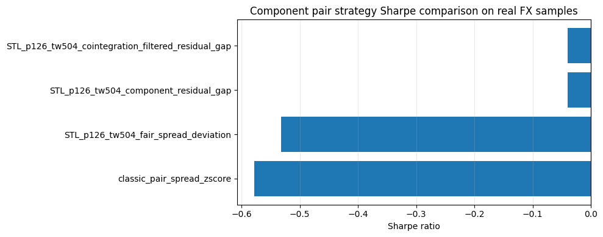

<!-- Generated by scripts/generate_column_notebook_pages.py; do not edit manually. -->
# Strategy Expansion 04 - Component pair trading and cointegration

<div class="gallery-note notebook-transcript-note">
  <strong>Executed tutorial notebook.</strong> This page is generated from <a href="https://github.com/systems-mechanobiology/DeTime/blob/main/examples/notebooks/quant_trading/04_detime_component_pair_trading_cointegration.ipynb"><code>examples/notebooks/quant_trading/04_detime_component_pair_trading_cointegration.ipynb</code></a> and includes markdown cells, code cells, stdout, tables, and captured figures from the committed notebook.
</div>

## Tutorial Navigation

| Track | Tutorial notebook |
|---|---|
| Roadmap | [Tutorial 00 - Roadmap](00_decomposition_first_quant_trading_roadmap.md) |
| Strategy Lab | [01 Trend-Following Lab](01_detime_trend_following_strategy_lab.md) |
| Tutorial Sequence | [01 Real Market Data and Feature Factory](01_market_data_and_decomposition_feature_factory.md) |
| Tutorial Sequence | [02 Decomposition-aware MA and MACD](02_decomposition_aware_moving_average_macd.md) |
| Strategy Lab | [02 Oscillation-Reversion Lab](02_detime_oscillation_reversion_strategy_lab.md) |
| Strategy Expansion | [03 Method-Specific Variants](03_detime_method_specific_strategy_variants.md) |
| Tutorial Sequence | [03 Residual Mean Reversion](03_residual_mean_reversion_rsi_bollinger.md) |
| Strategy Expansion | **04 Component Pair Trading** |
| Tutorial Sequence | [04 Donchian Breakout](04_turtle_donchian_breakout_volume_confirmation.md) |
| Tutorial Sequence | [05 Pair-Spread Stat-Arb](05_pairs_spread_decomposition_stat_arb.md) |
| Tutorial Sequence | [06 Cross-Sectional Rotation](06_cross_sectional_rotation_portfolio.md) |
| Native SSA Replay | [07 Native SSA High-Return / Low-Drawdown](07_native_ssa_high_return_low_drawdown_tutorial.md) |

## Executed Notebook

This notebook turns pair trading into component relationship trading. A pair is interesting when its trend and cycle components are similar enough, while the residual gap creates the temporary tradable deviation.

## Component pair hypothesis

For assets A and B, the decomposition-first pair hypothesis is:

```text
trend_A ≈ beta * trend_B
cycle_A ≈ beta * cycle_B
residual_A - beta * residual_B is the tradable gap
```

The notebook also reports Engle-Granger and ADF diagnostics for cointegration and spread stationarity.

<div class="notebook-cell">
<div class="notebook-input-label">In [1]</div>

```python
import matplotlib.pyplot as plt

from quant_trading.data import load_bundled_real_ohlcv_panel, ohlcv_panel_to_field
from quant_trading.strategy_component_pairs import (
    ComponentPairConfig,
    collect_pair_orders_and_trades,
    run_component_pair_suite,
)
```
</div>

<div class="notebook-cell">
<div class="notebook-input-label">In [2]</div>

```python
pairs = [('AUDUSD=X', 'NZDUSD=X'), ('EURUSD=X', 'GBPUSD=X'), ('CADUSD=X', 'CHFUSD=X')]
assets = sorted({x for pair in pairs for x in pair})
panel = load_bundled_real_ohlcv_panel(assets, min_observations=180)
close = ohlcv_panel_to_field(panel, 'Close')
volume = ohlcv_panel_to_field(panel, 'Volume')
execution_prices = ohlcv_panel_to_field(panel, 'Open').shift(-1).reindex_like(close).ffill()
close.tail()
```

<div class="gallery-out notebook-output">
<div class="notebook-output-label">text/html</div>
<div class="notebook-html-output">
<div>
<style scoped>
    .dataframe tbody tr th:only-of-type {
        vertical-align: middle;
    }

    .dataframe tbody tr th {
        vertical-align: top;
    }

    .dataframe thead th {
        text-align: right;
    }
</style>
<table border="1" class="dataframe">
  <thead>
    <tr style="text-align: right;">
      <th></th>
      <th>AUDUSD=X</th>
      <th>CADUSD=X</th>
      <th>CHFUSD=X</th>
      <th>EURUSD=X</th>
      <th>GBPUSD=X</th>
      <th>NZDUSD=X</th>
    </tr>
    <tr>
      <th>Date</th>
      <th></th>
      <th></th>
      <th></th>
      <th></th>
      <th></th>
      <th></th>
    </tr>
  </thead>
  <tbody>
    <tr>
      <th>2017-12-27</th>
      <td>0.773043</td>
      <td>0.788208</td>
      <td>1.010407</td>
      <td>1.185789</td>
      <td>1.337471</td>
      <td>0.703250</td>
    </tr>
    <tr>
      <th>2017-12-28</th>
      <td>0.777484</td>
      <td>0.790533</td>
      <td>1.014405</td>
      <td>1.190079</td>
      <td>1.340393</td>
      <td>0.706969</td>
    </tr>
    <tr>
      <th>2017-12-29</th>
      <td>0.779429</td>
      <td>0.795830</td>
      <td>1.021764</td>
      <td>1.194172</td>
      <td>1.344086</td>
      <td>0.709341</td>
    </tr>
    <tr>
      <th>2018-01-01</th>
      <td>0.780214</td>
      <td>0.794862</td>
      <td>1.026979</td>
      <td>1.200495</td>
      <td>1.351607</td>
      <td>0.711389</td>
    </tr>
    <tr>
      <th>2018-01-02</th>
      <td>0.780104</td>
      <td>0.796495</td>
      <td>1.025936</td>
      <td>1.201158</td>
      <td>1.351132</td>
      <td>0.708818</td>
    </tr>
  </tbody>
</table>
</div>
</div>
</div>
</div>

<div class="notebook-cell">
<div class="notebook-input-label">In [3]</div>

```python
config = ComponentPairConfig(
    method='STL',
    period=126,
    train_window=504,
    step=21,
    z_window=63,
    require_cointegration=False,
)

stats, results, diagnostics, feature_snapshot = run_component_pair_suite(
    close,
    pairs,
    volumes=volume,
    config=config,
    execution_prices=execution_prices,
)

stats
```

<div class="gallery-out notebook-output">
<div class="notebook-output-label">text/html</div>
<div class="notebook-html-output">
<div>
<style scoped>
    .dataframe tbody tr th:only-of-type {
        vertical-align: middle;
    }

    .dataframe tbody tr th {
        vertical-align: top;
    }

    .dataframe thead th {
        text-align: right;
    }
</style>
<table border="1" class="dataframe">
  <thead>
    <tr style="text-align: right;">
      <th></th>
      <th>strategy</th>
      <th>strategy_family</th>
      <th>total_return</th>
      <th>cagr</th>
      <th>sharpe</th>
      <th>max_drawdown</th>
      <th>calmar</th>
      <th>volatility</th>
      <th>hit_rate</th>
      <th>trade_win_rate</th>
      <th>...</th>
      <th>config_entry_z</th>
      <th>config_exit_z</th>
      <th>config_min_trend_corr</th>
      <th>config_min_cycle_corr</th>
      <th>config_max_fair_spread_trend_abs</th>
      <th>config_max_cointegration_pvalue</th>
      <th>config_require_cointegration</th>
      <th>config_allow_short</th>
      <th>config_max_gross</th>
      <th>config_name</th>
    </tr>
  </thead>
  <tbody>
    <tr>
      <th>1</th>
      <td>detime_STL_p126_tw504_component_residual_gap</td>
      <td>component_residual_gap</td>
      <td>-0.005429</td>
      <td>-0.001314</td>
      <td>-0.039448</td>
      <td>-0.040129</td>
      <td>-0.032754</td>
      <td>0.025256</td>
      <td>0.162033</td>
      <td>0.468750</td>
      <td>...</td>
      <td>1.5</td>
      <td>0.25</td>
      <td>0.5</td>
      <td>0.25</td>
      <td>0.0025</td>
      <td>0.1</td>
      <td>False</td>
      <td>True</td>
      <td>1.0</td>
      <td>STL_p126_tw504</td>
    </tr>
    <tr>
      <th>3</th>
      <td>detime_STL_p126_tw504_cointegration_filtered_r...</td>
      <td>cointegration_filtered_residual_gap</td>
      <td>-0.005429</td>
      <td>-0.001314</td>
      <td>-0.039448</td>
      <td>-0.040129</td>
      <td>-0.032754</td>
      <td>0.025256</td>
      <td>0.162033</td>
      <td>0.468750</td>
      <td>...</td>
      <td>1.5</td>
      <td>0.25</td>
      <td>0.5</td>
      <td>0.25</td>
      <td>0.0025</td>
      <td>0.1</td>
      <td>False</td>
      <td>True</td>
      <td>1.0</td>
      <td>STL_p126_tw504</td>
    </tr>
    <tr>
      <th>2</th>
      <td>detime_STL_p126_tw504_fair_spread_deviation</td>
      <td>fair_spread_deviation</td>
      <td>-0.054478</td>
      <td>-0.013443</td>
      <td>-0.532199</td>
      <td>-0.066059</td>
      <td>-0.203509</td>
      <td>0.024851</td>
      <td>0.168744</td>
      <td>0.534091</td>
      <td>...</td>
      <td>1.5</td>
      <td>0.25</td>
      <td>0.5</td>
      <td>0.25</td>
      <td>0.0025</td>
      <td>0.1</td>
      <td>False</td>
      <td>True</td>
      <td>1.0</td>
      <td>STL_p126_tw504</td>
    </tr>
    <tr>
      <th>0</th>
      <td>classic_pair_spread_zscore</td>
      <td>classic_pair_spread_zscore</td>
      <td>-0.090993</td>
      <td>-0.022787</td>
      <td>-0.578682</td>
      <td>-0.136457</td>
      <td>-0.166987</td>
      <td>0.038546</td>
      <td>0.477469</td>
      <td>0.568966</td>
      <td>...</td>
      <td>1.5</td>
      <td>0.25</td>
      <td>0.5</td>
      <td>0.25</td>
      <td>0.0025</td>
      <td>0.1</td>
      <td>False</td>
      <td>True</td>
      <td>1.0</td>
      <td>STL_p126_tw504</td>
    </tr>
  </tbody>
</table>
<p>4 rows × 37 columns</p>
</div>
</div>
</div>
</div>

<div class="notebook-cell">
<div class="notebook-input-label">In [4]</div>

```python
plot_stats = stats.sort_values("sharpe", ascending=True).copy()
labels = plot_stats["strategy"].astype(str).str.replace("detime_", "", regex=False)
fig, ax = plt.subplots(figsize=(10, 4))
ax.barh(labels, plot_stats["sharpe"])
ax.axvline(0, color="black", linewidth=0.8)
ax.set_xlabel("Sharpe ratio")
ax.set_title("Component pair strategy Sharpe comparison on real FX samples")
ax.grid(True, axis="x", alpha=0.25)
plt.tight_layout()
plt.show()
```

<div class="gallery-out notebook-output">
<div class="notebook-output-label">image/png</div>

</div>
</div>

## Read the diagnostics

- `latest_trend_corr` measures whether the two decomposed trends are currently similar.
- `latest_cycle_corr` measures whether their cycles are currently aligned.
- `raw_price_coint_pvalue` is the Engle-Granger test p-value on log prices.
- `fair_value_coint_pvalue` applies the same idea to trend + cycle fair values.
- `raw_spread_adf_pvalue`, `fair_spread_adf_pvalue`, and `residual_gap_adf_pvalue` test whether the relevant spread is stationary enough for a mean-reversion hypothesis.

<div class="notebook-cell">
<div class="notebook-input-label">In [5]</div>

```python
diagnostics
```

<div class="gallery-out notebook-output">
<div class="notebook-output-label">text/html</div>
<div class="notebook-html-output">
<div>
<style scoped>
    .dataframe tbody tr th:only-of-type {
        vertical-align: middle;
    }

    .dataframe tbody tr th {
        vertical-align: top;
    }

    .dataframe thead th {
        text-align: right;
    }
</style>
<table border="1" class="dataframe">
  <thead>
    <tr style="text-align: right;">
      <th></th>
      <th>pair</th>
      <th>method_variant</th>
      <th>date</th>
      <th>latest_beta</th>
      <th>latest_return_corr</th>
      <th>latest_trend_corr</th>
      <th>latest_cycle_corr</th>
      <th>latest_residual_corr</th>
      <th>latest_raw_spread</th>
      <th>latest_fair_spread</th>
      <th>...</th>
      <th>fair_spread_adf_valid</th>
      <th>fair_spread_adf_reason</th>
      <th>residual_gap_adf_test</th>
      <th>residual_gap_adf_statistic</th>
      <th>residual_gap_adf_pvalue</th>
      <th>residual_gap_adf_critical_1pct</th>
      <th>residual_gap_adf_critical_5pct</th>
      <th>residual_gap_adf_critical_10pct</th>
      <th>residual_gap_adf_valid</th>
      <th>residual_gap_adf_reason</th>
    </tr>
  </thead>
  <tbody>
    <tr>
      <th>0</th>
      <td>AUDUSD=X/NZDUSD=X</td>
      <td>STL_p126_tw504</td>
      <td>2018-01-02</td>
      <td>0.509809</td>
      <td>0.632244</td>
      <td>0.781036</td>
      <td>0.893991</td>
      <td>0.868270</td>
      <td>-0.072874</td>
      <td>-0.089448</td>
      <td>...</td>
      <td>True</td>
      <td></td>
      <td>adf</td>
      <td>-3.870877</td>
      <td>0.002260</td>
      <td>-3.436641</td>
      <td>-2.864318</td>
      <td>-2.568249</td>
      <td>True</td>
      <td></td>
    </tr>
    <tr>
      <th>1</th>
      <td>EURUSD=X/GBPUSD=X</td>
      <td>STL_p126_tw504</td>
      <td>2018-01-02</td>
      <td>0.406596</td>
      <td>0.446730</td>
      <td>0.959134</td>
      <td>0.710493</td>
      <td>0.414906</td>
      <td>0.060924</td>
      <td>0.052337</td>
      <td>...</td>
      <td>True</td>
      <td></td>
      <td>adf</td>
      <td>-2.719558</td>
      <td>0.070715</td>
      <td>-3.436771</td>
      <td>-2.864375</td>
      <td>-2.568279</td>
      <td>True</td>
      <td></td>
    </tr>
    <tr>
      <th>2</th>
      <td>CADUSD=X/CHFUSD=X</td>
      <td>STL_p126_tw504</td>
      <td>2018-01-02</td>
      <td>0.422316</td>
      <td>0.403466</td>
      <td>0.505531</td>
      <td>0.755836</td>
      <td>0.524348</td>
      <td>-0.238348</td>
      <td>-0.248651</td>
      <td>...</td>
      <td>True</td>
      <td></td>
      <td>adf</td>
      <td>-3.022754</td>
      <td>0.032823</td>
      <td>-3.436641</td>
      <td>-2.864318</td>
      <td>-2.568249</td>
      <td>True</td>
      <td></td>
    </tr>
  </tbody>
</table>
<p>3 rows × 54 columns</p>
</div>
</div>
</div>
</div>

<div class="notebook-cell">
<div class="notebook-input-label">In [6]</div>

```python
orders, trades = collect_pair_orders_and_trades(results)
print('orders:', len(orders))
print('round-trip trades:', len(trades))
trades.head()
```

<div class="gallery-out notebook-output">
<div class="notebook-output-label">stdout</div>
```text
orders: 7332
round-trip trades: 210
```
<div class="notebook-output-label">text/html</div>
<div class="notebook-html-output">
<div>
<style scoped>
    .dataframe tbody tr th:only-of-type {
        vertical-align: middle;
    }

    .dataframe tbody tr th {
        vertical-align: top;
    }

    .dataframe thead th {
        text-align: right;
    }
</style>
<table border="1" class="dataframe">
  <thead>
    <tr style="text-align: right;">
      <th></th>
      <th>strategy</th>
      <th>asset</th>
      <th>side</th>
      <th>entry_signal_date</th>
      <th>entry_fill_date</th>
      <th>exit_signal_date</th>
      <th>exit_fill_date</th>
      <th>entry_price</th>
      <th>exit_price</th>
      <th>bars_held</th>
      <th>entry_weight</th>
      <th>directional_return</th>
      <th>approx_weighted_return_after_cost</th>
    </tr>
  </thead>
  <tbody>
    <tr>
      <th>0</th>
      <td>classic_pair_spread_zscore</td>
      <td>AUDUSD=X</td>
      <td>long</td>
      <td>2014-03-13</td>
      <td>2014-03-14</td>
      <td>2014-08-28</td>
      <td>2014-08-29</td>
      <td>0.903016</td>
      <td>0.935016</td>
      <td>120</td>
      <td>0.166667</td>
      <td>0.035437</td>
      <td>0.005789</td>
    </tr>
    <tr>
      <th>1</th>
      <td>classic_pair_spread_zscore</td>
      <td>AUDUSD=X</td>
      <td>long</td>
      <td>2014-09-10</td>
      <td>2014-09-11</td>
      <td>2015-04-29</td>
      <td>2015-04-30</td>
      <td>0.915667</td>
      <td>0.799488</td>
      <td>165</td>
      <td>0.316258</td>
      <td>-0.126879</td>
      <td>-0.040348</td>
    </tr>
    <tr>
      <th>2</th>
      <td>classic_pair_spread_zscore</td>
      <td>AUDUSD=X</td>
      <td>short</td>
      <td>2015-05-14</td>
      <td>2015-05-15</td>
      <td>2015-07-28</td>
      <td>2015-07-29</td>
      <td>0.808473</td>
      <td>0.734808</td>
      <td>53</td>
      <td>-0.296715</td>
      <td>0.091116</td>
      <td>0.026828</td>
    </tr>
    <tr>
      <th>3</th>
      <td>classic_pair_spread_zscore</td>
      <td>AUDUSD=X</td>
      <td>long</td>
      <td>2015-09-04</td>
      <td>2015-09-07</td>
      <td>2015-12-03</td>
      <td>2015-12-04</td>
      <td>0.693577</td>
      <td>0.733192</td>
      <td>64</td>
      <td>0.205421</td>
      <td>0.057117</td>
      <td>0.011589</td>
    </tr>
    <tr>
      <th>4</th>
      <td>classic_pair_spread_zscore</td>
      <td>AUDUSD=X</td>
      <td>short</td>
      <td>2016-02-09</td>
      <td>2016-02-10</td>
      <td>2016-05-19</td>
      <td>2016-05-20</td>
      <td>0.706614</td>
      <td>0.723223</td>
      <td>72</td>
      <td>-0.194131</td>
      <td>-0.023505</td>
      <td>-0.004699</td>
    </tr>
  </tbody>
</table>
</div>
</div>
</div>
</div>

## Strategy variants

The suite compares a classical raw spread z-score baseline with three decomposition-first variants:

- `component_residual_gap`: trades residual_z differences when trend and cycle are similar;
- `fair_spread_deviation`: trades price spread deviation from the decomposed trend+cycle relationship;
- `cointegration_filtered_residual_gap`: requires cointegration/stationarity diagnostics before trading residual gaps.
