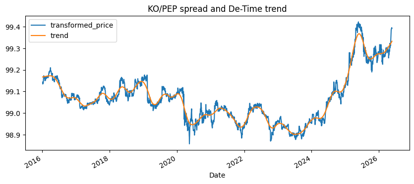

<!-- Generated by scripts/generate_column_notebook_pages.py; do not edit manually. -->
# Pairs Trading with Spread Residual and Cycle Analysis

<div class="gallery-note notebook-transcript-note">
  <strong>Rendered notebook transcript.</strong> This page is generated from <a href="https://github.com/systems-mechanobiology/De-Time/blob/main/examples/notebooks/quant_trading/04_pairs_trading_residual_cycle.ipynb"><code>examples/notebooks/quant_trading/04_pairs_trading_residual_cycle.ipynb</code></a> and includes code cells plus captured outputs from the committed notebook.
</div>

Pairs trading usually starts with a spread z-score. De-Time can help separate spread trend drift from residual mean reversion. A spread that trends persistently is often a broken relative-value trade, not a cheap entry.

<div class="notebook-cell">
<div class="notebook-input-label">In [1]</div>

```python
from pathlib import Path
import sys

ROOT = Path.cwd()
while ROOT != ROOT.parent and not (ROOT / "pyproject.toml").exists():
    ROOT = ROOT.parent
for path in [ROOT / "src", ROOT / "examples"]:
    if str(path) not in sys.path:
        sys.path.insert(0, str(path))

import matplotlib.pyplot as plt
import numpy as np
import pandas as pd

from quant_trading.data import fetch_yahoo_prices, fetch_yahoo_ohlcv, data_audit_report, DEFAULT_UNIVERSES
from quant_trading.features import decompose_one_series, walkforward_decompose, build_feature_table
from quant_trading.signals import (
    trend_pullback_signals,
    residual_mean_reversion_signals,
    turtle_donchian_signals,
    pair_trading_weights,
    cross_sectional_rotation_weights,
    residual_stress_filter,
)
from quant_trading.backtest import backtest_weights, backtest_long_short_signals, summarize_returns
```
</div>

<div class="notebook-cell">
<div class="notebook-input-label">In [2]</div>

```python
pair_prices = fetch_yahoo_prices(["KO", "PEP"], start="2016-01-01", cache_dir=ROOT / "examples" / "quant_trading" / "data" / "cache")
weights = pair_trading_weights(pair_prices["KO"], pair_prices["PEP"], lookback=120, entry_z=1.5, exit_z=0.25)
result = backtest_weights(pair_prices, weights, fee_bps=1.0, slippage_bps=2.0)
result.stats_frame()
```

<div class="gallery-out notebook-output">
<div class="notebook-output-label">text/html</div>
<div class="notebook-html-output">
<div>
<style scoped>
    .dataframe tbody tr th:only-of-type {
        vertical-align: middle;
    }

    .dataframe tbody tr th {
        vertical-align: top;
    }

    .dataframe thead th {
        text-align: right;
    }
</style>
<table border="1" class="dataframe">
  <thead>
    <tr style="text-align: right;">
      <th></th>
      <th>value</th>
    </tr>
  </thead>
  <tbody>
    <tr>
      <th>total_return</th>
      <td>0.082358</td>
    </tr>
    <tr>
      <th>cagr</th>
      <td>0.007665</td>
    </tr>
    <tr>
      <th>volatility</th>
      <td>0.064502</td>
    </tr>
    <tr>
      <th>sharpe</th>
      <td>0.150697</td>
    </tr>
    <tr>
      <th>max_drawdown</th>
      <td>-0.195764</td>
    </tr>
    <tr>
      <th>calmar</th>
      <td>0.039152</td>
    </tr>
    <tr>
      <th>hit_rate</th>
      <td>0.351838</td>
    </tr>
    <tr>
      <th>average_turnover</th>
      <td>0.021288</td>
    </tr>
    <tr>
      <th>average_gross_exposure</th>
      <td>0.707887</td>
    </tr>
    <tr>
      <th>fee_bps</th>
      <td>1.000000</td>
    </tr>
    <tr>
      <th>slippage_bps</th>
      <td>2.000000</td>
    </tr>
    <tr>
      <th>periods_per_year</th>
      <td>252.000000</td>
    </tr>
  </tbody>
</table>
</div>
</div>
</div>
</div>

<div class="notebook-cell">
<div class="notebook-input-label">In [3]</div>

```python
spread = np.log(pair_prices["KO"]) - np.log(pair_prices["PEP"])
spread_frame = decompose_one_series(spread.add(100.0), method="STL", period=63, use_log_price=False)
spread_frame[["transformed_price", "trend", "residual", "residual_z"]].tail()
```

<div class="gallery-out notebook-output">
<div class="notebook-output-label">text/html</div>
<div class="notebook-html-output">
<div>
<style scoped>
    .dataframe tbody tr th:only-of-type {
        vertical-align: middle;
    }

    .dataframe tbody tr th {
        vertical-align: top;
    }

    .dataframe thead th {
        text-align: right;
    }
</style>
<table border="1" class="dataframe">
  <thead>
    <tr style="text-align: right;">
      <th></th>
      <th>transformed_price</th>
      <th>trend</th>
      <th>residual</th>
      <th>residual_z</th>
    </tr>
    <tr>
      <th>Date</th>
      <th></th>
      <th></th>
      <th></th>
      <th></th>
    </tr>
  </thead>
  <tbody>
    <tr>
      <th>2026-05-18</th>
      <td>99.392566</td>
      <td>99.328071</td>
      <td>0.016120</td>
      <td>1.401474</td>
    </tr>
    <tr>
      <th>2026-05-19</th>
      <td>99.392644</td>
      <td>99.329103</td>
      <td>0.022717</td>
      <td>1.769487</td>
    </tr>
    <tr>
      <th>2026-05-20</th>
      <td>99.395326</td>
      <td>99.330141</td>
      <td>0.029684</td>
      <td>2.133987</td>
    </tr>
    <tr>
      <th>2026-05-21</th>
      <td>99.393607</td>
      <td>99.331185</td>
      <td>0.025161</td>
      <td>1.775436</td>
    </tr>
    <tr>
      <th>2026-05-22</th>
      <td>99.391160</td>
      <td>99.332235</td>
      <td>0.027908</td>
      <td>1.902002</td>
    </tr>
  </tbody>
</table>
</div>
</div>
</div>
</div>

<div class="notebook-cell">
<div class="notebook-input-label">In [4]</div>

```python
spread_frame[["transformed_price", "trend"]].plot(figsize=(10, 4), title="KO/PEP spread and De-Time trend")
plt.show()
```

<div class="gallery-out notebook-output">
<div class="notebook-output-label">image/png</div>

</div>
</div>

## Visualization: spread residual bands and weights

Residual bands show where the pair is stretched; target weights show how the backtest responds.

<div class="notebook-cell">
<div class="notebook-input-label">In [5]</div>

```python
fig, axes = plt.subplots(3, 1, figsize=(10, 7), sharex=False)
spread_frame[["transformed_price", "trend"]].plot(ax=axes[0], title="KO/PEP spread and De-Time trend")
spread_frame["residual_z"].plot(ax=axes[1], color="tab:red", title="KO/PEP residual z-score")
for level, style in [(1.5, "--"), (-1.5, "--"), (0.25, ":"), (-0.25, ":")]:
    axes[1].axhline(level, color="0.35", linestyle=style, linewidth=0.8)
weights.tail(504).plot(ax=axes[2], title="KO/PEP target weights")
axes[0].set_xlabel("")
axes[1].set_xlabel("")
axes[2].set_ylabel("weight")
plt.tight_layout()
plt.show()
```

<div class="gallery-out notebook-output">
<div class="notebook-output-label">image/png</div>

</div>
</div>
