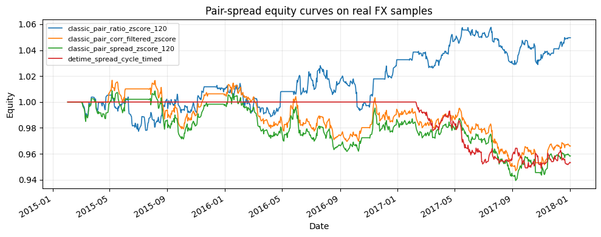

<!-- Generated by scripts/generate_column_notebook_pages.py; do not edit manually. -->
# Tutorial 05 - Pair spread decomposition and stat-arb

<div class="gallery-note notebook-transcript-note">
  <strong>Executed tutorial notebook.</strong> This page is generated from <a href="https://github.com/systems-mechanobiology/De-Time/blob/main/examples/notebooks/quant_trading/05_pairs_spread_decomposition_stat_arb.ipynb"><code>examples/notebooks/quant_trading/05_pairs_spread_decomposition_stat_arb.ipynb</code></a> and includes markdown cells, code cells, stdout, tables, and captured figures from the committed notebook.
</div>

## Tutorial Navigation

| Track | Tutorial notebook |
|---|---|
| Roadmap | [Tutorial 00 - Roadmap](00_decomposition_first_quant_trading_roadmap.md) |
| Strategy Lab | [01 Trend-Following Lab](01_detime_trend_following_strategy_lab.md) |
| Tutorial Sequence | [01 Real Market Data and Feature Factory](01_market_data_and_decomposition_feature_factory.md) |
| Tutorial Sequence | [02 Decomposition-aware MA and MACD](02_decomposition_aware_moving_average_macd.md) |
| Strategy Lab | [02 Oscillation-Reversion Lab](02_detime_oscillation_reversion_strategy_lab.md) |
| Strategy Expansion | [03 Method-Specific Variants](03_detime_method_specific_strategy_variants.md) |
| Tutorial Sequence | [03 Residual Mean Reversion](03_residual_mean_reversion_rsi_bollinger.md) |
| Strategy Expansion | [04 Component Pair Trading](04_detime_component_pair_trading_cointegration.md) |
| Tutorial Sequence | [04 Donchian Breakout](04_turtle_donchian_breakout_volume_confirmation.md) |
| Tutorial Sequence | **05 Pair-Spread Stat-Arb** |
| Tutorial Sequence | [06 Cross-Sectional Rotation](06_cross_sectional_rotation_portfolio.md) |
| Native SSA Replay | [07 Native SSA High-Return / Low-Drawdown](07_native_ssa_high_return_low_drawdown_tutorial.md) |

## Executed Notebook

This notebook rewrites pairs trading around spread structure: rolling hedge ratio, spread trend drift, cycle timing and residual deviation.

<div class="notebook-cell">
<div class="notebook-input-label">In [1]</div>

```python
import matplotlib.pyplot as plt
import pandas as pd

from quant_trading.data import load_bundled_real_ohlcv_panel, ohlcv_audit_report
from quant_trading.strategy_pairs import (
    walkforward_pair_spread_features, pair_diagnostics, pair_feature_snapshot,
    make_classic_pair_weight_grid, make_detime_pair_weight_grid,
    compare_pair_suites, run_classical_pair_baselines, run_detime_pair_baselines,
)
from quant_trading.validation import turnover_report, compare_weight_strategies
```
</div>

## 1. Load real offline market data

<div class="notebook-cell">
<div class="notebook-input-label">In [2]</div>

```python
tickers = ["AUDUSD=X", "NZDUSD=X", "EURUSD=X", "GBPUSD=X"]
pairs = [("AUDUSD=X", "NZDUSD=X"), ("EURUSD=X", "GBPUSD=X")]
ohlcv = load_bundled_real_ohlcv_panel(tickers, min_observations=120)
ohlcv = {field: table.tail(520).copy() for field, table in ohlcv.items()}
prices = ohlcv["Close"]
ohlcv_audit_report(ohlcv)
```

<div class="gallery-out notebook-output">
<div class="notebook-output-label">text/html</div>
<div class="notebook-html-output">
<div>
<style scoped>
    .dataframe tbody tr th:only-of-type {
        vertical-align: middle;
    }

    .dataframe tbody tr th {
        vertical-align: top;
    }

    .dataframe thead th {
        text-align: right;
    }
</style>
<table border="1" class="dataframe">
  <thead>
    <tr style="text-align: right;">
      <th></th>
      <th>ticker</th>
      <th>first_timestamp</th>
      <th>last_timestamp</th>
      <th>observations</th>
      <th>close_missing_ratio</th>
      <th>volume_missing_ratio</th>
      <th>zero_volume_ratio</th>
      <th>min_close</th>
      <th>max_close</th>
      <th>median_volume</th>
    </tr>
  </thead>
  <tbody>
    <tr>
      <th>0</th>
      <td>AUDUSD=X</td>
      <td>2016-01-04</td>
      <td>2018-01-02</td>
      <td>520</td>
      <td>0.0</td>
      <td>0.0</td>
      <td>1.0</td>
      <td>0.686106</td>
      <td>0.805802</td>
      <td>0.0</td>
    </tr>
    <tr>
      <th>1</th>
      <td>NZDUSD=X</td>
      <td>2016-01-04</td>
      <td>2018-01-02</td>
      <td>520</td>
      <td>0.0</td>
      <td>0.0</td>
      <td>1.0</td>
      <td>0.640287</td>
      <td>0.752570</td>
      <td>0.0</td>
    </tr>
    <tr>
      <th>2</th>
      <td>EURUSD=X</td>
      <td>2016-01-04</td>
      <td>2018-01-02</td>
      <td>520</td>
      <td>0.0</td>
      <td>0.0</td>
      <td>1.0</td>
      <td>1.039047</td>
      <td>1.202906</td>
      <td>0.0</td>
    </tr>
    <tr>
      <th>3</th>
      <td>GBPUSD=X</td>
      <td>2016-01-04</td>
      <td>2018-01-02</td>
      <td>520</td>
      <td>0.0</td>
      <td>0.0</td>
      <td>1.0</td>
      <td>1.203935</td>
      <td>1.478940</td>
      <td>0.0</td>
    </tr>
  </tbody>
</table>
</div>
</div>
</div>
</div>

## 2. Build walk-forward spread decomposition features

<div class="notebook-cell">
<div class="notebook-input-label">In [3]</div>

```python
spread_features, spread_panel, beta_panel, pair_specs = walkforward_pair_spread_features(
    prices, pairs, hedge_window=90, method="STL", period=42, train_window=180, step=252, z_window=42
)
spread_panel.tail()
```

<div class="gallery-out notebook-output">
<div class="notebook-output-label">text/html</div>
<div class="notebook-html-output">
<div>
<style scoped>
    .dataframe tbody tr th:only-of-type {
        vertical-align: middle;
    }

    .dataframe tbody tr th {
        vertical-align: top;
    }

    .dataframe thead th {
        text-align: right;
    }
</style>
<table border="1" class="dataframe">
  <thead>
    <tr style="text-align: right;">
      <th></th>
      <th>AUDUSD=X__NZDUSD=X</th>
      <th>EURUSD=X__GBPUSD=X</th>
    </tr>
    <tr>
      <th>Date</th>
      <th></th>
      <th></th>
    </tr>
  </thead>
  <tbody>
    <tr>
      <th>2017-12-27</th>
      <td>-0.100258</td>
      <td>0.060945</td>
    </tr>
    <tr>
      <th>2017-12-28</th>
      <td>-0.094383</td>
      <td>0.064674</td>
    </tr>
    <tr>
      <th>2017-12-29</th>
      <td>-0.090705</td>
      <td>0.064913</td>
    </tr>
    <tr>
      <th>2018-01-01</th>
      <td>-0.090874</td>
      <td>0.066027</td>
    </tr>
    <tr>
      <th>2018-01-02</th>
      <td>-0.092184</td>
      <td>0.076336</td>
    </tr>
  </tbody>
</table>
</div>
</div>
</div>
</div>

<div class="notebook-cell">
<div class="notebook-input-label">In [4]</div>

```python
pair_diagnostics(prices, pair_specs, hedge_window=90)
```

<div class="gallery-out notebook-output">
<div class="notebook-output-label">text/html</div>
<div class="notebook-html-output">
<div>
<style scoped>
    .dataframe tbody tr th:only-of-type {
        vertical-align: middle;
    }

    .dataframe tbody tr th {
        vertical-align: top;
    }

    .dataframe thead th {
        text-align: right;
    }
</style>
<table border="1" class="dataframe">
  <thead>
    <tr style="text-align: right;">
      <th></th>
      <th>pair</th>
      <th>date</th>
      <th>spread</th>
      <th>beta</th>
      <th>pair_corr_120</th>
      <th>spread_trend_slope</th>
      <th>spread_cycle_slope</th>
      <th>spread_residual_z</th>
      <th>spread_residual_abs_z</th>
      <th>volume_liquidity_ok</th>
    </tr>
  </thead>
  <tbody>
    <tr>
      <th>0</th>
      <td>AUDUSD=X/NZDUSD=X</td>
      <td>2018-01-02</td>
      <td>-0.092184</td>
      <td>0.453700</td>
      <td>0.632244</td>
      <td>-0.000730</td>
      <td>-0.000847</td>
      <td>-0.929979</td>
      <td>0.929979</td>
      <td>True</td>
    </tr>
    <tr>
      <th>1</th>
      <td>EURUSD=X/GBPUSD=X</td>
      <td>2018-01-02</td>
      <td>0.076336</td>
      <td>0.355382</td>
      <td>0.446730</td>
      <td>0.000247</td>
      <td>-0.000303</td>
      <td>0.614364</td>
      <td>0.614364</td>
      <td>True</td>
    </tr>
  </tbody>
</table>
</div>
</div>
</div>
</div>

<div class="notebook-cell">
<div class="notebook-input-label">In [5]</div>

```python
snapshot = pair_feature_snapshot(spread_features, tail=2)
snapshot.query("feature in ['trend_slope', 'cycle_slope', 'residual_z', 'residual_abs_z']").tail(16)
```

<div class="gallery-out notebook-output">
<div class="notebook-output-label">text/html</div>
<div class="notebook-html-output">
<div>
<style scoped>
    .dataframe tbody tr th:only-of-type {
        vertical-align: middle;
    }

    .dataframe tbody tr th {
        vertical-align: top;
    }

    .dataframe thead th {
        text-align: right;
    }
</style>
<table border="1" class="dataframe">
  <thead>
    <tr style="text-align: right;">
      <th></th>
      <th>date</th>
      <th>pair</th>
      <th>feature</th>
      <th>value</th>
    </tr>
  </thead>
  <tbody>
    <tr>
      <th>0</th>
      <td>2018-01-01</td>
      <td>AUDUSD=X__NZDUSD=X</td>
      <td>trend_slope</td>
      <td>0.000559</td>
    </tr>
    <tr>
      <th>1</th>
      <td>2018-01-01</td>
      <td>EURUSD=X__GBPUSD=X</td>
      <td>trend_slope</td>
      <td>0.000787</td>
    </tr>
    <tr>
      <th>2</th>
      <td>2018-01-02</td>
      <td>AUDUSD=X__NZDUSD=X</td>
      <td>trend_slope</td>
      <td>0.000559</td>
    </tr>
    <tr>
      <th>3</th>
      <td>2018-01-02</td>
      <td>EURUSD=X__GBPUSD=X</td>
      <td>trend_slope</td>
      <td>0.000787</td>
    </tr>
    <tr>
      <th>32</th>
      <td>2018-01-01</td>
      <td>AUDUSD=X__NZDUSD=X</td>
      <td>residual_abs_z</td>
      <td>0.475670</td>
    </tr>
    <tr>
      <th>33</th>
      <td>2018-01-01</td>
      <td>EURUSD=X__GBPUSD=X</td>
      <td>residual_abs_z</td>
      <td>0.055528</td>
    </tr>
    <tr>
      <th>34</th>
      <td>2018-01-02</td>
      <td>AUDUSD=X__NZDUSD=X</td>
      <td>residual_abs_z</td>
      <td>0.475670</td>
    </tr>
    <tr>
      <th>35</th>
      <td>2018-01-02</td>
      <td>EURUSD=X__GBPUSD=X</td>
      <td>residual_abs_z</td>
      <td>0.055528</td>
    </tr>
    <tr>
      <th>36</th>
      <td>2018-01-01</td>
      <td>AUDUSD=X__NZDUSD=X</td>
      <td>residual_z</td>
      <td>-0.475670</td>
    </tr>
    <tr>
      <th>37</th>
      <td>2018-01-01</td>
      <td>EURUSD=X__GBPUSD=X</td>
      <td>residual_z</td>
      <td>-0.055528</td>
    </tr>
    <tr>
      <th>38</th>
      <td>2018-01-02</td>
      <td>AUDUSD=X__NZDUSD=X</td>
      <td>residual_z</td>
      <td>-0.475670</td>
    </tr>
    <tr>
      <th>39</th>
      <td>2018-01-02</td>
      <td>EURUSD=X__GBPUSD=X</td>
      <td>residual_z</td>
      <td>-0.055528</td>
    </tr>
    <tr>
      <th>52</th>
      <td>2018-01-01</td>
      <td>AUDUSD=X__NZDUSD=X</td>
      <td>cycle_slope</td>
      <td>0.003932</td>
    </tr>
    <tr>
      <th>53</th>
      <td>2018-01-01</td>
      <td>EURUSD=X__GBPUSD=X</td>
      <td>cycle_slope</td>
      <td>0.000410</td>
    </tr>
    <tr>
      <th>54</th>
      <td>2018-01-02</td>
      <td>AUDUSD=X__NZDUSD=X</td>
      <td>cycle_slope</td>
      <td>0.003932</td>
    </tr>
    <tr>
      <th>55</th>
      <td>2018-01-02</td>
      <td>EURUSD=X__GBPUSD=X</td>
      <td>cycle_slope</td>
      <td>0.000410</td>
    </tr>
  </tbody>
</table>
</div>
</div>
</div>
</div>

## 3. Backtest classical baselines and De-Time rewrites

<div class="notebook-cell">
<div class="notebook-input-label">In [6]</div>

```python
classic_weights = make_classic_pair_weight_grid(prices, pairs=pairs, lookback=90)
detime_weights = make_detime_pair_weight_grid(prices, pair_specs, spread_features, spread_panel=spread_panel, beta_panel=beta_panel)
all_weights = {**classic_weights, **detime_weights}
comparison, results = compare_weight_strategies(prices, all_weights, fee_bps=1.0, slippage_bps=2.0)
comparison.insert(0, "strategy_group", ["detime_pair" if str(idx).startswith("detime") else "classical_pair" for idx in comparison.index])
comparison[["strategy_group", "cagr", "sharpe", "max_drawdown", "average_turnover"]].round(4)
```

<div class="gallery-out notebook-output">
<div class="notebook-output-label">text/html</div>
<div class="notebook-html-output">
<div>
<style scoped>
    .dataframe tbody tr th:only-of-type {
        vertical-align: middle;
    }

    .dataframe tbody tr th {
        vertical-align: top;
    }

    .dataframe thead th {
        text-align: right;
    }
</style>
<table border="1" class="dataframe">
  <thead>
    <tr style="text-align: right;">
      <th></th>
      <th>strategy_group</th>
      <th>cagr</th>
      <th>sharpe</th>
      <th>max_drawdown</th>
      <th>average_turnover</th>
    </tr>
    <tr>
      <th>strategy</th>
      <th></th>
      <th></th>
      <th></th>
      <th></th>
      <th></th>
    </tr>
  </thead>
  <tbody>
    <tr>
      <th>classic_pair_ratio_zscore_120</th>
      <td>classical_pair</td>
      <td>0.0215</td>
      <td>0.6203</td>
      <td>-0.0338</td>
      <td>0.0635</td>
    </tr>
    <tr>
      <th>detime_spread_trend_drift_blocker</th>
      <td>detime_pair</td>
      <td>0.0130</td>
      <td>0.4671</td>
      <td>-0.0275</td>
      <td>0.0058</td>
    </tr>
    <tr>
      <th>detime_spread_residual_z</th>
      <td>detime_pair</td>
      <td>0.0000</td>
      <td>0.0000</td>
      <td>0.0000</td>
      <td>0.0000</td>
    </tr>
    <tr>
      <th>detime_spread_cycle_timed</th>
      <td>detime_pair</td>
      <td>0.0000</td>
      <td>0.0000</td>
      <td>0.0000</td>
      <td>0.0000</td>
    </tr>
    <tr>
      <th>classic_pair_spread_zscore_120</th>
      <td>classical_pair</td>
      <td>-0.0160</td>
      <td>-0.4592</td>
      <td>-0.0596</td>
      <td>0.0519</td>
    </tr>
    <tr>
      <th>classic_pair_corr_filtered_zscore</th>
      <td>classical_pair</td>
      <td>-0.0169</td>
      <td>-0.5181</td>
      <td>-0.0563</td>
      <td>0.0473</td>
    </tr>
  </tbody>
</table>
</div>
</div>
</div>
</div>

<div class="notebook-cell">
<div class="notebook-input-label">In [7]</div>

```python
leaders = comparison.sort_values("sharpe", ascending=False).head(4).index
fig, ax = plt.subplots(figsize=(10, 4))
for name in leaders:
    results[name].equity.plot(ax=ax, linewidth=1.2, label=name)
ax.set_title("Pair-spread equity curves on real FX samples")
ax.set_ylabel("Equity")
ax.legend(loc="best", fontsize=8)
ax.grid(True, alpha=0.25)
plt.tight_layout()
plt.show()
```

<div class="gallery-out notebook-output">
<div class="notebook-output-label">image/png</div>

</div>
</div>

<div class="notebook-cell">
<div class="notebook-input-label">In [8]</div>

```python
turnover_report(all_weights).round(4)
```

<div class="gallery-out notebook-output">
<div class="notebook-output-label">text/html</div>
<div class="notebook-html-output">
<div>
<style scoped>
    .dataframe tbody tr th:only-of-type {
        vertical-align: middle;
    }

    .dataframe tbody tr th {
        vertical-align: top;
    }

    .dataframe thead th {
        text-align: right;
    }
</style>
<table border="1" class="dataframe">
  <thead>
    <tr style="text-align: right;">
      <th></th>
      <th>average_turnover</th>
      <th>median_turnover</th>
      <th>max_turnover</th>
      <th>average_gross_exposure</th>
    </tr>
    <tr>
      <th>strategy</th>
      <th></th>
      <th></th>
      <th></th>
      <th></th>
    </tr>
  </thead>
  <tbody>
    <tr>
      <th>classic_pair_spread_zscore_120</th>
      <td>0.0519</td>
      <td>0.0035</td>
      <td>2.0</td>
      <td>0.9135</td>
    </tr>
    <tr>
      <th>classic_pair_corr_filtered_zscore</th>
      <td>0.0473</td>
      <td>0.0032</td>
      <td>2.0</td>
      <td>0.8481</td>
    </tr>
    <tr>
      <th>classic_pair_ratio_zscore_120</th>
      <td>0.0635</td>
      <td>0.0000</td>
      <td>1.0</td>
      <td>0.8019</td>
    </tr>
    <tr>
      <th>detime_spread_residual_z</th>
      <td>0.0000</td>
      <td>0.0000</td>
      <td>0.0</td>
      <td>0.0000</td>
    </tr>
    <tr>
      <th>detime_spread_cycle_timed</th>
      <td>0.0000</td>
      <td>0.0000</td>
      <td>0.0</td>
      <td>0.0000</td>
    </tr>
    <tr>
      <th>detime_spread_trend_drift_blocker</th>
      <td>0.0058</td>
      <td>0.0012</td>
      <td>1.0</td>
      <td>0.6558</td>
    </tr>
  </tbody>
</table>
</div>
</div>
</div>
</div>

## 4. Live-data extension

Run `run_column_05_pairs_spread_decomposition.py` without `--use-bundled-sample` and pass pairs such as `KO:PEP`, `XOM:CVX`, `MA:V`, or `SPY:QQQ`.
