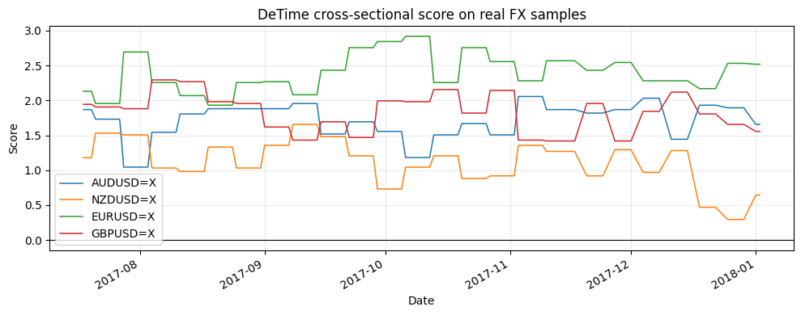
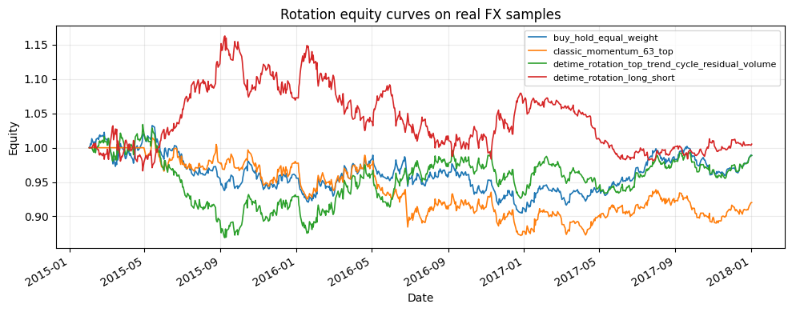

<!-- Generated by scripts/generate_column_notebook_pages.py; do not edit manually. -->
# Tutorial 06 - Cross-sectional rotation and portfolio construction

<div class="gallery-note notebook-transcript-note">
  <strong>Executed tutorial notebook.</strong> This page is generated from <a href="https://github.com/systems-mechanobiology/De-Time/blob/main/examples/notebooks/quant_trading/06_cross_sectional_rotation_portfolio.ipynb"><code>examples/notebooks/quant_trading/06_cross_sectional_rotation_portfolio.ipynb</code></a> and includes markdown cells, code cells, stdout, tables, and captured figures from the committed notebook.
</div>

## Tutorial Navigation

| Track | Tutorial notebook |
|---|---|
| Roadmap | [Tutorial 00 - Roadmap](00_decomposition_first_quant_trading_roadmap.md) |
| Strategy Lab | [01 Trend-Following Lab](01_detime_trend_following_strategy_lab.md) |
| Tutorial Sequence | [01 Real Market Data and Feature Factory](01_market_data_and_decomposition_feature_factory.md) |
| Tutorial Sequence | [02 Decomposition-aware MA and MACD](02_decomposition_aware_moving_average_macd.md) |
| Strategy Lab | [02 Oscillation-Reversion Lab](02_detime_oscillation_reversion_strategy_lab.md) |
| Strategy Expansion | [03 Method-Specific Variants](03_detime_method_specific_strategy_variants.md) |
| Tutorial Sequence | [03 Residual Mean Reversion](03_residual_mean_reversion_rsi_bollinger.md) |
| Strategy Expansion | [04 Component Pair Trading](04_detime_component_pair_trading_cointegration.md) |
| Tutorial Sequence | [04 Donchian Breakout](04_turtle_donchian_breakout_volume_confirmation.md) |
| Tutorial Sequence | [05 Pair-Spread Stat-Arb](05_pairs_spread_decomposition_stat_arb.md) |
| Tutorial Sequence | **06 Cross-Sectional Rotation** |

## Executed Notebook

This notebook turns De-Time features into a portfolio ranking language: trend decides direction, cycle adjusts timing, residual controls overextension and volume/reconstruction features control reliability.

<div class="notebook-cell">
<div class="notebook-input-label">In [1]</div>

```python
import matplotlib.pyplot as plt
import pandas as pd

from quant_trading.data import load_bundled_real_ohlcv_panel, ohlcv_audit_report
from quant_trading.features import walkforward_decompose_ohlcv
from quant_trading.decomposition_features import feature_coverage_report, build_feature_table
from quant_trading.strategy_baselines import buy_and_hold_weights
from quant_trading.strategy_rotation import (
    classic_momentum_rotation_weights, detime_cross_sectional_score,
    detime_long_short_rotation_weights, detime_rotation_weights,
    rotation_diagnostic_table, volume_availability,
)
from quant_trading.validation import compare_weight_strategies, turnover_report
```
</div>

## 1. Load real offline market data

<div class="notebook-cell">
<div class="notebook-input-label">In [2]</div>

```python
tickers = ["AUDUSD=X", "NZDUSD=X", "EURUSD=X", "GBPUSD=X"]
ohlcv = load_bundled_real_ohlcv_panel(tickers, min_observations=120)
ohlcv = {field: table.tail(280).copy() for field, table in ohlcv.items()}
prices = ohlcv["Close"]
volumes = ohlcv.get("Volume")
print("volume_available:", volume_availability(volumes))
ohlcv_audit_report(ohlcv)
```

<div class="gallery-out notebook-output">
<div class="notebook-output-label">stdout</div>
```text
volume_available: False
```
<div class="notebook-output-label">text/html</div>
<div class="notebook-html-output">
<div>
<style scoped>
    .dataframe tbody tr th:only-of-type {
        vertical-align: middle;
    }

    .dataframe tbody tr th {
        vertical-align: top;
    }

    .dataframe thead th {
        text-align: right;
    }
</style>
<table border="1" class="dataframe">
  <thead>
    <tr style="text-align: right;">
      <th></th>
      <th>ticker</th>
      <th>first_timestamp</th>
      <th>last_timestamp</th>
      <th>observations</th>
      <th>close_missing_ratio</th>
      <th>volume_missing_ratio</th>
      <th>zero_volume_ratio</th>
      <th>min_close</th>
      <th>max_close</th>
      <th>median_volume</th>
    </tr>
  </thead>
  <tbody>
    <tr>
      <th>0</th>
      <td>AUDUSD=X</td>
      <td>2016-12-05</td>
      <td>2018-01-02</td>
      <td>280</td>
      <td>0.0</td>
      <td>0.0</td>
      <td>1.0</td>
      <td>0.717927</td>
      <td>0.805802</td>
      <td>0.0</td>
    </tr>
    <tr>
      <th>1</th>
      <td>NZDUSD=X</td>
      <td>2016-12-05</td>
      <td>2018-01-02</td>
      <td>280</td>
      <td>0.0</td>
      <td>0.0</td>
      <td>1.0</td>
      <td>0.680101</td>
      <td>0.752570</td>
      <td>0.0</td>
    </tr>
    <tr>
      <th>2</th>
      <td>EURUSD=X</td>
      <td>2016-12-05</td>
      <td>2018-01-02</td>
      <td>280</td>
      <td>0.0</td>
      <td>0.0</td>
      <td>1.0</td>
      <td>1.039047</td>
      <td>1.202906</td>
      <td>0.0</td>
    </tr>
    <tr>
      <th>3</th>
      <td>GBPUSD=X</td>
      <td>2016-12-05</td>
      <td>2018-01-02</td>
      <td>280</td>
      <td>0.0</td>
      <td>0.0</td>
      <td>1.0</td>
      <td>1.203935</td>
      <td>1.357976</td>
      <td>0.0</td>
    </tr>
  </tbody>
</table>
</div>
</div>
</div>
</div>

## 2. Build walk-forward asset features

<div class="notebook-cell">
<div class="notebook-input-label">In [3]</div>

```python
features = walkforward_decompose_ohlcv(
    ohlcv, method="STL", period=42, train_window=180, step=252, z_window=42
)
feature_coverage_report(features).query("feature in ['trend_slope', 'trend_strength', 'cycle_slope', 'residual_z', 'residual_abs_z', 'volume_participation']").head(18)
```

<div class="gallery-out notebook-output">
<div class="notebook-output-label">text/html</div>
<div class="notebook-html-output">
<div>
<style scoped>
    .dataframe tbody tr th:only-of-type {
        vertical-align: middle;
    }

    .dataframe tbody tr th {
        vertical-align: top;
    }

    .dataframe thead th {
        text-align: right;
    }
</style>
<table border="1" class="dataframe">
  <thead>
    <tr style="text-align: right;">
      <th></th>
      <th>feature</th>
      <th>asset</th>
      <th>observations</th>
      <th>non_null</th>
      <th>coverage</th>
      <th>first_valid</th>
      <th>last_valid</th>
    </tr>
  </thead>
  <tbody>
    <tr>
      <th>12</th>
      <td>trend_slope</td>
      <td>AUDUSD=X</td>
      <td>280</td>
      <td>101</td>
      <td>0.360714</td>
      <td>2017-08-14</td>
      <td>2018-01-02</td>
    </tr>
    <tr>
      <th>13</th>
      <td>trend_slope</td>
      <td>NZDUSD=X</td>
      <td>280</td>
      <td>101</td>
      <td>0.360714</td>
      <td>2017-08-14</td>
      <td>2018-01-02</td>
    </tr>
    <tr>
      <th>14</th>
      <td>trend_slope</td>
      <td>EURUSD=X</td>
      <td>280</td>
      <td>101</td>
      <td>0.360714</td>
      <td>2017-08-14</td>
      <td>2018-01-02</td>
    </tr>
    <tr>
      <th>15</th>
      <td>trend_slope</td>
      <td>GBPUSD=X</td>
      <td>280</td>
      <td>101</td>
      <td>0.360714</td>
      <td>2017-08-14</td>
      <td>2018-01-02</td>
    </tr>
    <tr>
      <th>20</th>
      <td>trend_strength</td>
      <td>AUDUSD=X</td>
      <td>280</td>
      <td>101</td>
      <td>0.360714</td>
      <td>2017-08-14</td>
      <td>2018-01-02</td>
    </tr>
    <tr>
      <th>21</th>
      <td>trend_strength</td>
      <td>NZDUSD=X</td>
      <td>280</td>
      <td>101</td>
      <td>0.360714</td>
      <td>2017-08-14</td>
      <td>2018-01-02</td>
    </tr>
    <tr>
      <th>22</th>
      <td>trend_strength</td>
      <td>EURUSD=X</td>
      <td>280</td>
      <td>101</td>
      <td>0.360714</td>
      <td>2017-08-14</td>
      <td>2018-01-02</td>
    </tr>
    <tr>
      <th>23</th>
      <td>trend_strength</td>
      <td>GBPUSD=X</td>
      <td>280</td>
      <td>101</td>
      <td>0.360714</td>
      <td>2017-08-14</td>
      <td>2018-01-02</td>
    </tr>
    <tr>
      <th>32</th>
      <td>cycle_slope</td>
      <td>AUDUSD=X</td>
      <td>280</td>
      <td>101</td>
      <td>0.360714</td>
      <td>2017-08-14</td>
      <td>2018-01-02</td>
    </tr>
    <tr>
      <th>33</th>
      <td>cycle_slope</td>
      <td>NZDUSD=X</td>
      <td>280</td>
      <td>101</td>
      <td>0.360714</td>
      <td>2017-08-14</td>
      <td>2018-01-02</td>
    </tr>
    <tr>
      <th>34</th>
      <td>cycle_slope</td>
      <td>EURUSD=X</td>
      <td>280</td>
      <td>101</td>
      <td>0.360714</td>
      <td>2017-08-14</td>
      <td>2018-01-02</td>
    </tr>
    <tr>
      <th>35</th>
      <td>cycle_slope</td>
      <td>GBPUSD=X</td>
      <td>280</td>
      <td>101</td>
      <td>0.360714</td>
      <td>2017-08-14</td>
      <td>2018-01-02</td>
    </tr>
    <tr>
      <th>48</th>
      <td>residual_z</td>
      <td>AUDUSD=X</td>
      <td>280</td>
      <td>101</td>
      <td>0.360714</td>
      <td>2017-08-14</td>
      <td>2018-01-02</td>
    </tr>
    <tr>
      <th>49</th>
      <td>residual_z</td>
      <td>NZDUSD=X</td>
      <td>280</td>
      <td>101</td>
      <td>0.360714</td>
      <td>2017-08-14</td>
      <td>2018-01-02</td>
    </tr>
    <tr>
      <th>50</th>
      <td>residual_z</td>
      <td>EURUSD=X</td>
      <td>280</td>
      <td>101</td>
      <td>0.360714</td>
      <td>2017-08-14</td>
      <td>2018-01-02</td>
    </tr>
    <tr>
      <th>51</th>
      <td>residual_z</td>
      <td>GBPUSD=X</td>
      <td>280</td>
      <td>101</td>
      <td>0.360714</td>
      <td>2017-08-14</td>
      <td>2018-01-02</td>
    </tr>
    <tr>
      <th>52</th>
      <td>residual_abs_z</td>
      <td>AUDUSD=X</td>
      <td>280</td>
      <td>101</td>
      <td>0.360714</td>
      <td>2017-08-14</td>
      <td>2018-01-02</td>
    </tr>
    <tr>
      <th>53</th>
      <td>residual_abs_z</td>
      <td>NZDUSD=X</td>
      <td>280</td>
      <td>101</td>
      <td>0.360714</td>
      <td>2017-08-14</td>
      <td>2018-01-02</td>
    </tr>
  </tbody>
</table>
</div>
</div>
</div>
</div>

<div class="notebook-cell">
<div class="notebook-input-label">In [4]</div>

```python
build_feature_table(prices, features).tail(3).iloc[:, :12].round(4)
```

<div class="gallery-out notebook-output">
<div class="notebook-output-label">text/html</div>
<div class="notebook-html-output">
<div>
<style scoped>
    .dataframe tbody tr th:only-of-type {
        vertical-align: middle;
    }

    .dataframe tbody tr th {
        vertical-align: top;
    }

    .dataframe thead tr th {
        text-align: left;
    }

    .dataframe thead tr:last-of-type th {
        text-align: right;
    }
</style>
<table border="1" class="dataframe">
  <thead>
    <tr>
      <th></th>
      <th colspan="4" halign="left">component_stability</th>
      <th colspan="4" halign="left">cycle</th>
      <th colspan="4" halign="left">cycle_amplitude</th>
    </tr>
    <tr>
      <th></th>
      <th>AUDUSD=X</th>
      <th>EURUSD=X</th>
      <th>GBPUSD=X</th>
      <th>NZDUSD=X</th>
      <th>AUDUSD=X</th>
      <th>EURUSD=X</th>
      <th>GBPUSD=X</th>
      <th>NZDUSD=X</th>
      <th>AUDUSD=X</th>
      <th>EURUSD=X</th>
      <th>GBPUSD=X</th>
      <th>NZDUSD=X</th>
    </tr>
    <tr>
      <th>Date</th>
      <th></th>
      <th></th>
      <th></th>
      <th></th>
      <th></th>
      <th></th>
      <th></th>
      <th></th>
      <th></th>
      <th></th>
      <th></th>
      <th></th>
    </tr>
  </thead>
  <tbody>
    <tr>
      <th>2017-12-29</th>
      <td>0.9957</td>
      <td>0.9971</td>
      <td>0.9952</td>
      <td>0.9949</td>
      <td>-0.0068</td>
      <td>0.0028</td>
      <td>-0.0089</td>
      <td>-0.015</td>
      <td>0.0102</td>
      <td>0.0086</td>
      <td>0.0091</td>
      <td>0.0108</td>
    </tr>
    <tr>
      <th>2018-01-01</th>
      <td>0.9957</td>
      <td>0.9971</td>
      <td>0.9952</td>
      <td>0.9949</td>
      <td>-0.0068</td>
      <td>0.0028</td>
      <td>-0.0089</td>
      <td>-0.015</td>
      <td>0.0102</td>
      <td>0.0086</td>
      <td>0.0091</td>
      <td>0.0108</td>
    </tr>
    <tr>
      <th>2018-01-02</th>
      <td>0.9957</td>
      <td>0.9971</td>
      <td>0.9952</td>
      <td>0.9949</td>
      <td>-0.0068</td>
      <td>0.0028</td>
      <td>-0.0089</td>
      <td>-0.015</td>
      <td>0.0102</td>
      <td>0.0086</td>
      <td>0.0091</td>
      <td>0.0108</td>
    </tr>
  </tbody>
</table>
</div>
</div>
</div>
</div>

## 3. Inspect the De-Time rotation score

<div class="notebook-cell">
<div class="notebook-input-label">In [5]</div>

```python
score = detime_cross_sectional_score(prices, features)
score.tail(5).round(3)
```

<div class="gallery-out notebook-output">
<div class="notebook-output-label">text/html</div>
<div class="notebook-html-output">
<div>
<style scoped>
    .dataframe tbody tr th:only-of-type {
        vertical-align: middle;
    }

    .dataframe tbody tr th {
        vertical-align: top;
    }

    .dataframe thead th {
        text-align: right;
    }
</style>
<table border="1" class="dataframe">
  <thead>
    <tr style="text-align: right;">
      <th></th>
      <th>AUDUSD=X</th>
      <th>NZDUSD=X</th>
      <th>EURUSD=X</th>
      <th>GBPUSD=X</th>
    </tr>
    <tr>
      <th>Date</th>
      <th></th>
      <th></th>
      <th></th>
      <th></th>
    </tr>
  </thead>
  <tbody>
    <tr>
      <th>2017-12-27</th>
      <td>2.356</td>
      <td>1.256</td>
      <td>2.481</td>
      <td>1.031</td>
    </tr>
    <tr>
      <th>2017-12-28</th>
      <td>2.356</td>
      <td>1.256</td>
      <td>2.481</td>
      <td>1.031</td>
    </tr>
    <tr>
      <th>2017-12-29</th>
      <td>2.356</td>
      <td>1.256</td>
      <td>2.481</td>
      <td>1.031</td>
    </tr>
    <tr>
      <th>2018-01-01</th>
      <td>2.356</td>
      <td>1.256</td>
      <td>2.481</td>
      <td>1.031</td>
    </tr>
    <tr>
      <th>2018-01-02</th>
      <td>2.356</td>
      <td>1.256</td>
      <td>2.481</td>
      <td>1.031</td>
    </tr>
  </tbody>
</table>
</div>
</div>
</div>
</div>

<div class="notebook-cell">
<div class="notebook-input-label">In [6]</div>

```python
fig, ax = plt.subplots(figsize=(10, 4))
score.tail(120).plot(ax=ax, linewidth=1.1)
ax.axhline(0, color="black", linewidth=0.8)
ax.set_title("De-Time cross-sectional score on real FX samples")
ax.set_ylabel("Score")
ax.grid(True, alpha=0.25)
plt.tight_layout()
plt.show()
```

<div class="gallery-out notebook-output">
<div class="notebook-output-label">image/png</div>

</div>
</div>

<div class="notebook-cell">
<div class="notebook-input-label">In [7]</div>

```python
rotation_diagnostic_table(prices, features, tail=2).round(4)
```

<div class="gallery-out notebook-output">
<div class="notebook-output-label">text/html</div>
<div class="notebook-html-output">
<div>
<style scoped>
    .dataframe tbody tr th:only-of-type {
        vertical-align: middle;
    }

    .dataframe tbody tr th {
        vertical-align: top;
    }

    .dataframe thead th {
        text-align: right;
    }
</style>
<table border="1" class="dataframe">
  <thead>
    <tr style="text-align: right;">
      <th></th>
      <th>date</th>
      <th>asset</th>
      <th>score</th>
      <th>trend_strength</th>
      <th>cycle_slope</th>
      <th>residual_z</th>
      <th>volume_participation</th>
    </tr>
  </thead>
  <tbody>
    <tr>
      <th>0</th>
      <td>2018-01-01</td>
      <td>EURUSD=X</td>
      <td>2.4812</td>
      <td>0.2403</td>
      <td>0.0007</td>
      <td>0.9507</td>
      <td>1.25</td>
    </tr>
    <tr>
      <th>1</th>
      <td>2018-01-01</td>
      <td>AUDUSD=X</td>
      <td>2.3562</td>
      <td>0.2955</td>
      <td>-0.0003</td>
      <td>-1.0228</td>
      <td>1.25</td>
    </tr>
    <tr>
      <th>2</th>
      <td>2018-01-01</td>
      <td>NZDUSD=X</td>
      <td>1.2562</td>
      <td>0.1906</td>
      <td>-0.0007</td>
      <td>-2.3371</td>
      <td>1.25</td>
    </tr>
    <tr>
      <th>3</th>
      <td>2018-01-01</td>
      <td>GBPUSD=X</td>
      <td>1.0313</td>
      <td>0.1049</td>
      <td>0.0006</td>
      <td>0.9669</td>
      <td>1.25</td>
    </tr>
    <tr>
      <th>4</th>
      <td>2018-01-02</td>
      <td>EURUSD=X</td>
      <td>2.4812</td>
      <td>0.2403</td>
      <td>0.0007</td>
      <td>0.9507</td>
      <td>1.25</td>
    </tr>
    <tr>
      <th>5</th>
      <td>2018-01-02</td>
      <td>AUDUSD=X</td>
      <td>2.3562</td>
      <td>0.2955</td>
      <td>-0.0003</td>
      <td>-1.0228</td>
      <td>1.25</td>
    </tr>
    <tr>
      <th>6</th>
      <td>2018-01-02</td>
      <td>NZDUSD=X</td>
      <td>1.2562</td>
      <td>0.1906</td>
      <td>-0.0007</td>
      <td>-2.3371</td>
      <td>1.25</td>
    </tr>
    <tr>
      <th>7</th>
      <td>2018-01-02</td>
      <td>GBPUSD=X</td>
      <td>1.0313</td>
      <td>0.1049</td>
      <td>0.0006</td>
      <td>0.9669</td>
      <td>1.25</td>
    </tr>
  </tbody>
</table>
</div>
</div>
</div>
</div>

## 4. Backtest a compact rotation suite

<div class="notebook-cell">
<div class="notebook-input-label">In [8]</div>

```python
strategies = {
    "buy_hold_equal_weight": buy_and_hold_weights(prices),
    "classic_momentum_63_top": classic_momentum_rotation_weights(prices, lookback=63, top_n=2, rebalance_freq="W-FRI", vol_target=None),
    "detime_rotation_top_trend_cycle_residual_volume": detime_rotation_weights(prices, features, top_n=2, rebalance_freq="W-FRI", vol_target=None),
    "detime_rotation_long_short": detime_long_short_rotation_weights(prices, features, top_n=2, bottom_n=2),
}
comparison, results = compare_weight_strategies(prices, strategies, fee_bps=1.0, slippage_bps=2.0)
comparison[["total_return", "sharpe", "max_drawdown", "average_turnover"]].round(4)
```

<div class="gallery-out notebook-output">
<div class="notebook-output-label">text/html</div>
<div class="notebook-html-output">
<div>
<style scoped>
    .dataframe tbody tr th:only-of-type {
        vertical-align: middle;
    }

    .dataframe tbody tr th {
        vertical-align: top;
    }

    .dataframe thead th {
        text-align: right;
    }
</style>
<table border="1" class="dataframe">
  <thead>
    <tr style="text-align: right;">
      <th></th>
      <th>total_return</th>
      <th>sharpe</th>
      <th>max_drawdown</th>
      <th>average_turnover</th>
    </tr>
    <tr>
      <th>strategy</th>
      <th></th>
      <th></th>
      <th></th>
      <th></th>
    </tr>
  </thead>
  <tbody>
    <tr>
      <th>buy_hold_equal_weight</th>
      <td>0.0624</td>
      <td>0.9200</td>
      <td>-0.0428</td>
      <td>0.0000</td>
    </tr>
    <tr>
      <th>classic_momentum_63_top</th>
      <td>0.0356</td>
      <td>0.5964</td>
      <td>-0.0518</td>
      <td>0.0464</td>
    </tr>
    <tr>
      <th>detime_rotation_top_trend_cycle_residual_volume</th>
      <td>0.0429</td>
      <td>0.5756</td>
      <td>-0.0533</td>
      <td>0.0071</td>
    </tr>
    <tr>
      <th>detime_rotation_long_short</th>
      <td>-0.0729</td>
      <td>-0.7004</td>
      <td>-0.1366</td>
      <td>0.0162</td>
    </tr>
  </tbody>
</table>
</div>
</div>
</div>
</div>

<div class="notebook-cell">
<div class="notebook-input-label">In [9]</div>

```python
fig, ax = plt.subplots(figsize=(10, 4))
for name, result in results.items():
    result.equity.plot(ax=ax, linewidth=1.2, label=name)
ax.set_title("Rotation equity curves on real FX samples")
ax.set_ylabel("Equity")
ax.legend(loc="best", fontsize=8)
ax.grid(True, alpha=0.25)
plt.tight_layout()
plt.show()
```

<div class="gallery-out notebook-output">
<div class="notebook-output-label">image/png</div>

</div>
</div>

<div class="notebook-cell">
<div class="notebook-input-label">In [10]</div>

```python
turnover_report(strategies).round(4)
```

<div class="gallery-out notebook-output">
<div class="notebook-output-label">text/html</div>
<div class="notebook-html-output">
<div>
<style scoped>
    .dataframe tbody tr th:only-of-type {
        vertical-align: middle;
    }

    .dataframe tbody tr th {
        vertical-align: top;
    }

    .dataframe thead th {
        text-align: right;
    }
</style>
<table border="1" class="dataframe">
  <thead>
    <tr style="text-align: right;">
      <th></th>
      <th>average_turnover</th>
      <th>median_turnover</th>
      <th>max_turnover</th>
      <th>average_gross_exposure</th>
    </tr>
    <tr>
      <th>strategy</th>
      <th></th>
      <th></th>
      <th></th>
      <th></th>
    </tr>
  </thead>
  <tbody>
    <tr>
      <th>buy_hold_equal_weight</th>
      <td>0.0000</td>
      <td>0.0</td>
      <td>0.00</td>
      <td>1.0000</td>
    </tr>
    <tr>
      <th>classic_momentum_63_top</th>
      <td>0.0464</td>
      <td>0.0</td>
      <td>1.00</td>
      <td>0.7714</td>
    </tr>
    <tr>
      <th>detime_rotation_top_trend_cycle_residual_volume</th>
      <td>0.0071</td>
      <td>0.0</td>
      <td>1.00</td>
      <td>0.9857</td>
    </tr>
    <tr>
      <th>detime_rotation_long_short</th>
      <td>0.0162</td>
      <td>0.0</td>
      <td>2.25</td>
      <td>1.4384</td>
    </tr>
  </tbody>
</table>
</div>
</div>
</div>
</div>

## 5. Live-data extension

Run `run_column_06_cross_sectional_rotation.py` without `--use-bundled-sample` to use sector ETFs and real equity/ETF volume. In the bundled FX sample, raw volume is unavailable, so volume is neutral rather than invented.
